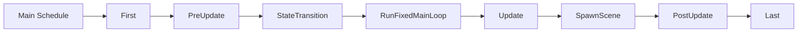

+++
title = "#21624 Include SpawnScene in docs for Main schedule"
date = "2025-10-25T00:00:00"
draft = false
template = "pull_request_page.html"
in_search_index = true

[taxonomies]
list_display = ["show"]

[extra]
current_language = "en"
available_languages = {"en" = { name = "English", url = "/pull_request/bevy/2025-10/pr-21624-en-20251025" }, "zh-cn" = { name = "中文", url = "/pull_request/bevy/2025-10/pr-21624-zh-cn-20251025" }}
labels = ["C-Docs", "D-Trivial", "A-Scenes", "A-App"]
+++

# Title
Include SpawnScene in docs for Main schedule

## Basic Information
- **Title**: Include SpawnScene in docs for Main schedule
- **PR Link**: https://github.com/bevyengine/bevy/pull/21624
- **Author**: andrewhickman
- **Status**: MERGED
- **Labels**: C-Docs, D-Trivial, S-Ready-For-Final-Review, A-Scenes, A-App
- **Created**: 2025-10-21T19:43:57Z
- **Merged**: 2025-10-25T02:49:15Z
- **Merged By**: alice-i-cecile

## Description Translation
# Objective

Currently the docs for [`SpawnScene`](https://docs.rs/bevy/latest/bevy/app/struct.SpawnScene.html) link to the [`Main`](https://docs.rs/bevy/latest/bevy/prelude/struct.Main.html) schedule, but those docs don't mention when it runs.

## Solution

Updates docs to include this information, based on the schedule ordering defined here:

https://github.com/bevyengine/bevy/blob/78d940cbfe177e3585fe19145e73c76172f4085e/crates/bevy_app/src/main_schedule.rs#L222-L224

## The Story of This Pull Request

This PR addresses a documentation gap in Bevy's scheduling system. The problem was straightforward: while the `SpawnScene` schedule's documentation referenced the `Main` schedule, the `Main` schedule documentation itself didn't mention when `SpawnScene` executes within the schedule order.

The issue stemmed from incomplete documentation coverage. In Bevy's architecture, schedules define the execution order of systems, and understanding when each schedule runs is crucial for developers building games and applications. The `SpawnScene` schedule handles scene spawning operations, which need to occur at a specific point in the frame lifecycle.

The solution approach was direct and practical - update the documentation to reflect the actual execution order defined in the codebase. The developer referenced the existing schedule ordering in `main_schedule.rs` where `SpawnScene` is explicitly placed between `Update` and `PostUpdate` schedules.

The implementation involved two simple but important documentation updates. First, the `Main` schedule documentation now includes `SpawnScene` in its list of child schedules, providing a complete picture of the execution flow. Second, the `SpawnScene` documentation itself was enhanced to explicitly state its position relative to neighboring schedules.

This change improves the developer experience by providing accurate and complete information about the scheduling system. When working with Bevy's ECS architecture, understanding schedule execution order is essential for proper system organization and avoiding timing-related bugs. The updated documentation helps developers understand when scene spawning occurs relative to other game logic updates and post-processing operations.

The technical insight here is that documentation accuracy is particularly important in scheduling systems where execution order directly affects system behavior and data dependencies. By aligning the documentation with the actual implementation, this PR reduces potential confusion and helps developers make informed decisions about where to place their systems.

## Visual Representation



## Key Files Changed

**File: `crates/bevy_app/src/main_schedule.rs`**

This file contains the schedule definitions and documentation for Bevy's main execution schedule. The changes improve documentation accuracy by including the `SpawnScene` schedule in the documented execution order.

**Key Changes:**
1. Added `SpawnScene` to the `Main` schedule documentation
2. Enhanced `SpawnScene` documentation with explicit timing information

```rust
// Before:
/// * [`RunFixedMainLoop`]
///     * This will run [`FixedMain`] zero to many times, based on how much time has elapsed.
/// * [`Update`]
/// * [`PostUpdate`]
/// * [`Last`]

// After:
/// * [`RunFixedMainLoop`]
///     * This will run [`FixedMain`] zero to many times, based on how much time has elapsed.
/// * [`Update`]
/// * [`SpawnScene`]
/// * [`PostUpdate`]
/// * [`Last`]
```

```rust
// Before:
/// The schedule that contains scene spawning.
///
/// See the [`Main`] schedule for some details about how schedules are run.

// After:
/// The schedule that contains scene spawning.
///
/// This runs after [`Update`] and before [`PostUpdate`]. See the [`Main`] schedule for more details about how schedules are run.
```

## Further Reading

- [Bevy Schedules Documentation](https://bevyengine.org/learn/book/getting-started/schedules/)
- [Bevy ECS System Ordering](https://bevyengine.org/learn/book/getting-started/ecs/#system-ordering)
- [Bevy Scenes Documentation](https://bevyengine.org/learn/book/getting-started/scenes/)

# Full Code Diff
```diff
diff --git a/crates/bevy_app/src/main_schedule.rs b/crates/bevy_app/src/main_schedule.rs
index 73e94badaf858..363e0c0c67b4c 100644
--- a/crates/bevy_app/src/main_schedule.rs
+++ b/crates/bevy_app/src/main_schedule.rs
@@ -33,6 +33,7 @@ use bevy_ecs::{
 /// * [`RunFixedMainLoop`]
 ///     * This will run [`FixedMain`] zero to many times, based on how much time has elapsed.
 /// * [`Update`]
+/// * [`SpawnScene`]
 /// * [`PostUpdate`]
 /// * [`Last`]
 ///
@@ -173,7 +174,7 @@ pub struct Update;
 
 /// The schedule that contains scene spawning.
 ///
-/// See the [`Main`] schedule for some details about how schedules are run.
+/// This runs after [`Update`] and before [`PostUpdate`]. See the [`Main`] schedule for more details about how schedules are run.
 #[derive(ScheduleLabel, Clone, Debug, PartialEq, Eq, Hash, Default)]
 pub struct SpawnScene;
```