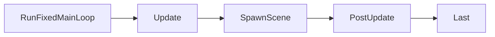

+++
title = "#21624 Include SpawnScene in docs for Main schedule"
date = "2025-10-25T00:00:00"
draft = false
template = "pull_request_page.html"
in_search_index = false

[extra]
current_language = "zh-cn"
available_languages = {"en" = { name = "English", url = "/pull_request/bevy/2025-10/pr-21624-en-20251025" }, "zh-cn" = { name = "中文", url = "/pull_request/bevy/2025-10/pr-21624-zh-cn-20251025" }}
labels = ["C-Docs", "D-Trivial", "A-Scenes", "A-App"]
+++

# Title
Include SpawnScene in docs for Main schedule

## Basic Information
- **Title**: Include SpawnScene in docs for Main schedule
- **PR Link**: https://github.com/bevyengine/bevy/pull/21624
- **Author**: andrewhickman
- **Status**: MERGED
- **Labels**: C-Docs, D-Trivial, S-Ready-For-Final-Review, A-Scenes, A-App
- **Created**: 2025-10-21T19:43:57Z
- **Merged**: 2025-10-25T02:49:15Z
- **Merged By**: alice-i-cecile

## Description Translation
# Objective

目前 [`SpawnScene`](https://docs.rs/bevy/latest/bevy/app/struct.SpawnScene.html) 的文档链接到了 [`Main`](https://docs.rs/bevy/latest/bevy/prelude/struct.Main.html) 调度器，但这些文档没有说明它何时运行。

## Solution

根据此处定义的调度顺序更新文档：

https://github.com/bevyengine/bevy/blob/78d940cbfe177e3585fe19145e73c76172f4085e/crates/bevy_app/src/main_schedule.rs#L222-L224

## The Story of This Pull Request

这是一个典型的文档维护问题。开发者 andrewhickman 发现 Bevy 引擎中 `SpawnScene` 调度器的文档存在信息不完整的问题。

问题的核心在于：虽然 `SpawnScene` 的文档正确地将用户引导至 `Main` 调度器的文档，但 `Main` 调度器的文档本身没有完整列出所有包含的调度阶段。具体来说，文档中缺少了 `SpawnScene` 阶段在调度顺序中的位置说明。

在 Bevy 的调度系统中，`Main` 调度器包含了多个按顺序执行的阶段。从代码实现可以看到实际的执行顺序是：

```rust
// 实际的调度顺序
RunFixedMainLoop → Update → SpawnScene → PostUpdate → Last
```

然而，在修改前的文档中，`Main` 调度器的文档只列出了：
- `RunFixedMainLoop`
- `Update` 
- `PostUpdate`
- `Last`

缺少了 `SpawnScene` 阶段。这种文档与实现的不一致可能会给开发者带来困惑，特别是当他们需要理解场景生成在整体执行流程中的确切位置时。

解决方案直接而有效：在 `Main` 调度器的文档注释中添加缺失的 `SpawnScene` 条目。同时，为了提供更清晰的上下文，还在 `SpawnScene` 自身的文档中明确说明了它在调度顺序中的具体位置 - 在 `Update` 之后、`PostUpdate` 之前运行。

这种修改虽然简单，但对于框架的可用性很重要。在游戏引擎这样的复杂系统中，准确的调度顺序文档对于开发者正确理解系统执行流程、避免竞态条件至关重要。特别是对于场景生成这样的关键操作，明确其执行时机可以帮助开发者更好地安排相关系统的执行顺序。

从工程角度看，这个 PR 展示了良好的开源项目维护实践：即使是很小的文档问题也值得修复，因为清晰的文档能够显著降低新用户的学习成本和现有用户的开发效率。

## Visual Representation



## Key Files Changed

### `crates/bevy_app/src/main_schedule.rs` (+2/-1)

这个文件包含了 Bevy 应用主调度器的定义和相关文档。修改主要涉及两个地方的文档注释：

1. 在 `Main` 调度器的文档中添加 `SpawnScene` 到执行顺序列表中
2. 在 `SpawnScene` 调度器的文档中明确其执行时机

```rust
// 修改前：
/// * [`RunFixedMainLoop`]
///     * This will run [`FixedMain`] zero to many times, based on how much time has elapsed.
/// * [`Update`]
/// * [`PostUpdate`]
/// * [`Last`]

// 修改后：
/// * [`RunFixedMainLoop`]
///     * This will run [`FixedMain`] zero to many times, based on how much time has elapsed.
/// * [`Update`]
/// * [`SpawnScene`]
/// * [`PostUpdate`]
/// * [`Last`]
```

```rust
// 修改前：
/// The schedule that contains scene spawning.
///
/// See the [`Main`] schedule for some details about how schedules are run.

// 修改后：
/// The schedule that contains scene spawning.
///
/// This runs after [`Update`] and before [`PostUpdate`]. See the [`Main`] schedule for more details about how schedules are run.
```

这些修改确保了文档与代码实现的一致性，为开发者提供了准确的调度顺序信息。

## Further Reading

- [Bevy Schedules Documentation](https://bevyengine.org/learn/quick-start/next-steps/schedules/)
- [Bevy ECS System Ordering](https://bevyengine.org/learn/quick-start/next-steps/system-ordering/)
- [Rust Documentation Comments Guide](https://doc.rust-lang.org/rustdoc/how-to-write-documentation.html)