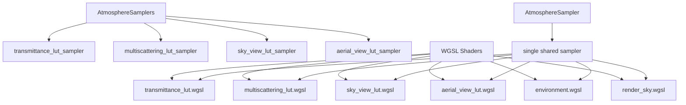

+++
title = "#21625 Atmosphere bindings cleanup"
date = "2025-10-29T00:00:00"
draft = false
template = "pull_request_page.html"
in_search_index = true

[taxonomies]
list_display = ["show"]

[extra]
current_language = "en"
available_languages = {"en" = { name = "English", url = "/pull_request/bevy/2025-10/pr-21625-en-20251029" }, "zh-cn" = { name = "中文", url = "/pull_request/bevy/2025-10/pr-21625-zh-cn-20251029" }}
labels = ["A-Rendering", "C-Code-Quality", "D-Straightforward"]
+++

# Title
Atmosphere bindings cleanup

## Basic Information
- **Title**: Atmosphere bindings cleanup
- **PR Link**: https://github.com/bevyengine/bevy/pull/21625
- **Author**: ecoskey
- **Status**: MERGED
- **Labels**: A-Rendering, C-Code-Quality, S-Ready-For-Final-Review, D-Straightforward
- **Created**: 2025-10-21T21:37:08Z
- **Merged**: 2025-10-29T19:31:42Z
- **Merged By**: alice-i-cecile

## Description Translation
Depends on #20838 

# Objective

There's some redundant sampler bindings in the atmosphere code

## Solution

Remove them

## Testing

Ran the example

## The Story of This Pull Request

This PR addresses a straightforward but important optimization in Bevy's atmospheric rendering system. The core issue was redundant sampler bindings across multiple lookup tables (LUTs) used for atmospheric scattering calculations. Each LUT - transmittance, multiscattering, sky view, and aerial view - was using its own dedicated sampler, even though they all shared identical sampling parameters.

The implementation approach was systematic and consistent. The developer consolidated four separate samplers into a single shared `AtmosphereSampler` resource. This required coordinated changes across multiple components:

In the bind group layout definitions, the individual sampler bindings at indices 9, 11, 13, and 15 were replaced with a single shared sampler at binding 12. The texture bindings were reorganized to use consecutive indices (8-11) for better grouping.

The Rust code saw significant simplification. The previous `AtmosphereSamplers` struct containing four separate samplers was replaced with a single `AtmosphereSampler` that uses the `Deref` trait for easy access. All bind group preparation functions were updated to reference this single sampler rather than the individual ones.

The WGSL shader code was updated consistently across all compute and render shaders. Each shader that previously referenced individual samplers (`transmittance_lut_sampler`, `multiscattering_lut_sampler`, etc.) now uses the unified `atmosphere_lut_sampler`. The binding indices for storage textures and depth textures were also updated from 16 to 13 to maintain consistency with the new binding layout.

This change demonstrates good engineering practice in reducing redundancy and simplifying the binding model. By using a single sampler for all atmospheric LUTs, the code becomes more maintainable and reduces the GPU binding overhead. The consistent sampling parameters (linear filtering with nearest mipmapping) across all LUTs made this consolidation possible without affecting visual quality.

## Visual Representation



## Key Files Changed

### `crates/bevy_pbr/src/atmosphere/resources.rs` (+74/-105)

This file saw the most significant changes, replacing the multi-sampler approach with a single unified sampler:

```rust
// Before:
#[derive(Resource)]
pub struct AtmosphereSamplers {
    pub transmittance_lut: Sampler,
    pub multiscattering_lut: Sampler,
    pub sky_view_lut: Sampler,
    pub aerial_view_lut: Sampler,
}

// After:
#[derive(Resource, Deref)]
pub struct AtmosphereSampler(Sampler);
```

The bind group preparation functions were updated to use the single sampler:

```rust
// Before:
(9, &samplers.transmittance_lut),
(11, &samplers.multiscattering_lut),

// After:
(12, &**atmosphere_sampler),
```

### `crates/bevy_pbr/src/atmosphere/environment.rs` (+18/-23)

Updated the environment map probe system to use the new binding model:

```rust
// Before:
(9, sampler(SamplerBindingType::Filtering)),
(11, sampler(SamplerBindingType::Filtering)),
(13, sampler(SamplerBindingType::Filtering)),
(15, sampler(SamplerBindingType::Filtering)),

// After:
(12, sampler(SamplerBindingType::Filtering)),
```

### `crates/bevy_pbr/src/atmosphere/bindings.wgsl` (+4/-7)

Consolidated the sampler bindings in the WGSL interface:

```rust
// Before:
@group(0) @binding(9) var transmittance_lut_sampler: sampler;
@group(0) @binding(11) var multiscattering_lut_sampler: sampler;
@group(0) @binding(13) var sky_view_lut_sampler: sampler;
@group(0) @binding(15) var aerial_view_lut_sampler: sampler;

// After:
@group(0) @binding(12) var atmosphere_lut_sampler: sampler;
```

### `crates/bevy_pbr/src/atmosphere/functions.wgsl` (+7/-8)

Updated all sampling functions to use the unified sampler:

```rust
// Before:
return textureSampleLevel(transmittance_lut, transmittance_lut_sampler, uv, 0.0).rgb;

// After:
return textureSampleLevel(transmittance_lut, atmosphere_lut_sampler, uv, 0.0).rgb;
```

### `crates/bevy_pbr/src/atmosphere/mod.rs` (+2/-2)

Updated the plugin to register the new sampler resource:

```rust
// Before:
.init_resource::<AtmosphereSamplers>()

// After:
.init_resource::<AtmosphereSampler>()
```

## Further Reading

- [WebGPU Bind Group Best Practices](https://github.com/gpuweb/gpuweb/wiki/Bind-Group-Limits)
- [Bevy Rendering Architecture](https://bevyengine.org/learn/quick-start/getting-started/systems/)
- [WGSL Sampler Documentation](https://www.w3.org/TR/WGSL/#sampler-types)
- [Atmospheric Scattering Theory](https://developer.nvidia.com/gpugems/gpugems2/part-ii-shading-lighting-and-shadows/chapter-16-accurate-atmospheric-scattering)

# Full Code Diff
[Full diff content as provided in the original request]