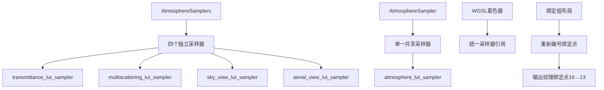

+++
title = "#21625 Atmosphere bindings cleanup"
date = "2025-10-29T00:00:00"
draft = false
template = "pull_request_page.html"
in_search_index = false

[extra]
current_language = "zh-cn"
available_languages = {"en" = { name = "English", url = "/pull_request/bevy/2025-10/pr-21625-en-20251029" }, "zh-cn" = { name = "中文", url = "/pull_request/bevy/2025-10/pr-21625-zh-cn-20251029" }}
labels = ["A-Rendering", "C-Code-Quality", "D-Straightforward"]
+++

# Atmosphere bindings cleanup

## Basic Information
- **Title**: Atmosphere bindings cleanup
- **PR Link**: https://github.com/bevyengine/bevy/pull/21625
- **Author**: ecoskey
- **Status**: MERGED
- **Labels**: A-Rendering, C-Code-Quality, S-Ready-For-Final-Review, D-Straightforward
- **Created**: 2025-10-21T21:37:08Z
- **Merged**: 2025-10-29T19:31:42Z
- **Merged By**: alice-i-cecile

## Description Translation
依赖于 #20838

# Objective

大气层代码中存在一些冗余的采样器绑定

## Solution

移除它们

## Testing

运行了示例

## The Story of This Pull Request

这个PR源于对Bevy引擎大气渲染系统中资源绑定的优化需求。在分析代码时，开发者发现大气渲染管线中存在着多个重复的采样器绑定，这些绑定在功能上是相同的，但却被分配了不同的绑定槽位。

问题的核心在于大气渲染使用了多个查找表（LUTs）：透射率查找表（transmittance LUT）、多重散射查找表（multiscattering LUT）、天空视图查找表（sky view LUT）和空中视图查找表（aerial view LUT）。原本每个查找表都有自己独立的采样器绑定，但这些采样器的配置参数完全相同——都使用线性过滤（Linear filtering）和最近邻mipmap过滤（Nearest mipmap filtering）。

从工程角度看，维护多个功能相同的采样器带来了不必要的复杂性。每个采样器都需要单独创建、管理和绑定到GPU，这增加了代码维护负担和潜在的绑定槽位浪费。在渲染系统中，绑定槽位是有限资源，合理分配这些资源对于系统扩展性很重要。

解决方案很直接：将所有大气查找表共享一个统一的采样器。这个重构涉及多个层面的修改：

首先，在资源层面，将原来的`AtmosphereSamplers`结构体（包含四个独立采样器）简化为单一的`AtmosphereSampler`。这个变化不仅减少了资源创建的开销，也简化了后续的绑定管理。

```rust
// 修改前：
pub struct AtmosphereSamplers {
    pub transmittance_lut: Sampler,
    pub multiscattering_lut: Sampler,
    pub sky_view_lut: Sampler,
    pub aerial_view_lut: Sampler,
}

// 修改后：
pub struct AtmosphereSampler(Sampler);
```

其次，在绑定组布局定义中，重新组织了绑定槽位的分配。原本分散在多个槽位的采样器现在统一使用绑定点12，而纹理绑定点也相应进行了重新编号，形成了更清晰的绑定结构。

在着色器层面，所有WGSL文件中的采样器引用都更新为使用新的统一采样器`atmosphere_lut_sampler`。例如在`functions.wgsl`中：

```wgsl
// 修改前：
fn sample_transmittance_lut(r: f32, mu: f32) -> vec3<f32> {
    let uv = transmittance_lut_r_mu_to_uv(r, mu);
    return textureSampleLevel(transmittance_lut, transmittance_lut_sampler, uv, 0.0).rgb;
}

// 修改后：
fn sample_transmittance_lut(r: f32, mu: f32) -> vec3<f32> {
    let uv = transmittance_lut_r_mu_to_uv(r, mu);
    return textureSampleLevel(transmittance_lut, atmosphere_lut_sampler, uv, 0.0).rgb;
}
```

这个重构还带来了绑定点编号的优化。由于移除了冗余采样器，输出纹理的绑定点从16统一调整为13，这使得绑定点使用更加紧凑。

从技术角度看，这种优化是安全的，因为所有大气查找表确实需要相同的采样行为——线性插值用于平滑的颜色过渡，同时避免mipmap带来的额外计算开销。这种采样配置对于大气渲染中连续的、平滑的颜色渐变是最合适的。

这次重构展示了良好的代码质量改进实践：识别并消除冗余，简化系统架构，同时保持功能不变。通过运行示例测试验证了修改的正确性，确保大气渲染效果没有受到影响。

## Visual Representation



## Key Files Changed

### `crates/bevy_pbr/src/atmosphere/resources.rs` (+74/-105)
这是最主要的修改文件，重构了采样器资源管理和绑定组创建。

**关键修改：**
```rust
// 采样器资源重构
// 修改前：
#[derive(Resource)]
pub struct AtmosphereSamplers {
    pub transmittance_lut: Sampler,
    pub multiscattering_lut: Sampler,
    pub sky_view_lut: Sampler,
    pub aerial_view_lut: Sampler,
}

// 修改后：
#[derive(Resource, Deref)]
pub struct AtmosphereSampler(Sampler);
```

**绑定组布局重构：**
```rust
// 绑定点重新组织
// 修改前布局包含多个独立的采样器绑定点
(8, texture_2d(TextureSampleType::default())),
(9, sampler(SamplerBindingType::Filtering)),
(10, texture_2d(TextureSampleType::default())),
(11, sampler(SamplerBindingType::Filtering)),

// 修改后统一为共享采样器
(8, texture_2d(TextureSampleType::default())), // transmittance
(9, texture_2d(TextureSampleType::default())), // multiscattering
(12, sampler(SamplerBindingType::Filtering)),
```

### `crates/bevy_pbr/src/atmosphere/bindings.wgsl` (+4/-7)
统一了WGSL绑定声明。

```wgsl
// 修改前：
@group(0) @binding(8) var transmittance_lut: texture_2d<f32>;
@group(0) @binding(9) var transmittance_lut_sampler: sampler;
@group(0) @binding(10) var multiscattering_lut: texture_2d<f32>;
@group(0) @binding(11) var multiscattering_lut_sampler: sampler;

// 修改后：
@group(0) @binding(8) var transmittance_lut: texture_2d<f32>;
@group(0) @binding(9) var multiscattering_lut: texture_2d<f32>;
@group(0) @binding(12) var atmosphere_lut_sampler: sampler;
```

### `crates/bevy_pbr/src/atmosphere/functions.wgsl` (+7/-8)
更新了所有采样函数使用统一的采样器。

```wgsl
// 所有采样函数都改为使用 atmosphere_lut_sampler
fn sample_transmittance_lut(r: f32, mu: f32) -> vec3<f32> {
    let uv = transmittance_lut_r_mu_to_uv(r, mu);
    return textureSampleLevel(transmittance_lut, atmosphere_lut_sampler, uv, 0.0).rgb;
}
```

### 其他WGSL文件
多个计算着色器文件更新了输出纹理的绑定点编号，从16改为13，以反映绑定槽位的重新分配。

## Further Reading

- [WebGPU Bind Group Layout Best Practices](https://gpuweb.github.io/gpuweb/#bind-group-layout-creation)
- [Bevy Rendering Architecture](https://bevyengine.org/learn/quick-start/getting-started/systems/)
- [WGSL Sampler Documentation](https://gpuweb.github.io/gpuweb/wgsl/#sampler-types)