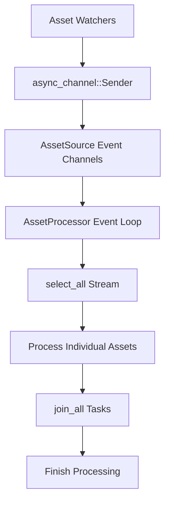

+++
title = "#21626 Allow the asset processor to run single-threaded."
date = "2025-10-22T00:00:00"
draft = false
template = "pull_request_page.html"
in_search_index = true

[taxonomies]
list_display = ["show"]

[extra]
current_language = "en"
available_languages = {"en" = { name = "English", url = "/pull_request/bevy/2025-10/pr-21626-en-20251022" }, "zh-cn" = { name = "中文", url = "/pull_request/bevy/2025-10/pr-21626-zh-cn-20251022" }}
labels = ["C-Bug", "A-Assets", "O-Web", "C-Usability", "C-Testing", "M-Migration-Guide", "O-Embedded"]
+++

# Allow the asset processor to run single-threaded.

## Basic Information
- **Title**: Allow the asset processor to run single-threaded.
- **PR Link**: https://github.com/bevyengine/bevy/pull/21626
- **Author**: andriyDev
- **Status**: MERGED
- **Labels**: C-Bug, A-Assets, O-Web, C-Usability, S-Ready-For-Final-Review, C-Testing, M-Migration-Guide, O-Embedded
- **Created**: 2025-10-21T22:03:16Z
- **Merged**: 2025-10-22T22:04:14Z
- **Merged By**: alice-i-cecile

## Description Translation
# Objective

- Allow the asset processor to run single-threaded so that asset processor tests can run in single-threaded mode too!

## Solution

- Make asset hot reloading use an async channel for events instead of a crossbeam channel (which requires blocking).
- Have asset processing first find all the assets it wants to process, then join all those processing tasks together.
- Make the asset processing listening loop await on a stream of async channels instead of "spin-polling" (spin-lock but with polling). This should make asset processing consume less CPU!

## Testing

- Tested asset processing in single threaded! It works!

## The Story of This Pull Request

The asset processor in Bevy had a fundamental limitation: it couldn't run in single-threaded environments. This was problematic for testing scenarios and WebAssembly targets where multi-threading isn't available or desirable. The core issue stemmed from the processor's reliance on blocking operations and crossbeam channels, which require multi-threading support.

The developer identified that the asset processor was using `crossbeam_channel` for handling asset hot-reloading events, which inherently blocks threads. In single-threaded environments, this blocking behavior would prevent other tasks from executing, effectively freezing the application. The solution involved replacing these blocking channels with non-blocking async alternatives.

The implementation approach had three main components. First, the asset hot reloading system was migrated from `crossbeam_channel` to `async_channel`. This change required updating all asset watchers - both file system watchers and embedded asset watchers - to use the new async channel interface:

```rust
// Before (in file_watcher.rs):
use crossbeam_channel::Sender;
self.sender.send(event).unwrap();

// After:
use async_channel::Sender;
self.sender.send_blocking(event).unwrap();
```

Second, the asset processing workflow was restructured. Previously, the processor would spawn tasks immediately when discovering assets to process. The new approach collects all processing tasks first, then uses `join_all` to await their completion:

```rust
// Before:
IoTaskPool::get().scope(|scope| {
    self.process_assets_internal(scope, source, PathBuf::from(""))
        .await
        .unwrap();
});

// After:
let mut tasks = vec![];
self.process_assets_internal(source, PathBuf::from(""), &mut tasks)
    .await
    .unwrap();
join_all(tasks).await;
```

Third, the event listening loop was redesigned to avoid "spin-polling" behavior. Instead of continuously checking for events in a tight loop, the new implementation uses `futures_util::stream::select_all` to await events from multiple sources efficiently:

```rust
// New event processing using async streams
let mut all_receiver = select_all(source_receivers);
while let Some((source_id, event)) = all_receiver.next().await {
    self.handle_asset_source_event(self.data.sources.get(source_id).unwrap(), event)
        .await;
}
```

These changes required adding new dependencies (`async-channel` and `futures-util`) and removing the `crossbeam-channel` dependency from the asset watcher components. The processor's threading model was also simplified - instead of spawning a dedicated thread, it now runs as an async task on the IO task pool.

The impact of these changes is significant. The asset processor can now run in single-threaded environments, enabling better testing and WebAssembly support. Additionally, the CPU consumption during idle periods is reduced because the event loop no longer uses busy-waiting. The migration guide was updated to help users adapt to the channel API changes.

## Visual Representation



## Key Files Changed

### `crates/bevy_asset/src/processor/mod.rs` (+75/-65)
This is the core implementation change that enables single-threaded operation. The main modifications include:

- Converting `process_assets()` and `listen_for_source_change_events()` to async functions
- Replacing thread-based execution with async task spawning
- Implementing efficient event streaming with `select_all`
- Restructuring asset processing to use task collection and `join_all`

```rust
// Key change: Async asset processing
pub async fn process_assets(&self) {
    let mut tasks = vec![];
    self.initialize().await.unwrap();
    for source in self.sources().iter_processed() {
        self.process_assets_internal(source, PathBuf::from(""), &mut tasks)
            .await
            .unwrap();
    }
    join_all(tasks).await;
    self.finish_processing_assets().await;
}
```

### `crates/bevy_asset/src/io/source.rs` (+13/-16)
Updated the asset source system to use async channels instead of crossbeam channels:

```rust
// Before:
let (sender, receiver) = crossbeam_channel::unbounded();

// After:
let (sender, receiver) = async_channel::unbounded();
```

### `crates/bevy_asset/src/processor/tests.rs` (+19/-52)
Refactored tests to work with the new async processor and added helper functions:

```rust
// New test helper function
fn run_app_until_finished_processing(app: &mut App) {
    run_app_until(app, |world| {
        if bevy_tasks::block_on(world.resource::<AssetProcessor>().get_state())
            == ProcessorState::Finished
        {
            Some(())
        } else {
            None
        }
    });
}
```

### `release-content/migration-guides/asset_watcher_async_sender.md` (+12/-0)
Added migration guide for the channel API change:

```markdown
Previously, when creating an asset source, `AssetSourceBuilder::with_watcher` would provide users
with a `crossbeam_channel::Sender`. Now, this has been changed to `async_channel::Sender`.

If you were previously calling `sender.send(AssetSourceEvent::ModifiedAsset("hello".into()))`, now
it would be `sender.send_blocking(AssetSourceEvent::ModifiedAsset("hello".into()))`.
```

### `crates/bevy_asset/src/lib.rs` (+5/-5)
Updated test code to use the new async channel types and removed crossbeam channel usage.

## Further Reading

- [async-channel documentation](https://docs.rs/async-channel/) - For understanding the async channel API
- [futures-util select_all](https://docs.rs/futures-util/latest/futures_util/stream/fn.select_all.html) - For stream combination patterns
- [Bevy Tasks System](https://bevyengine.org/learn/quick-start/introduction/#tasks) - For understanding Bevy's async task execution
- [Migration Guide](https://github.com/bevyengine/bevy/pull/21626/files#diff-60b1383e5c23f60b1383e5c23f) - Complete migration instructions