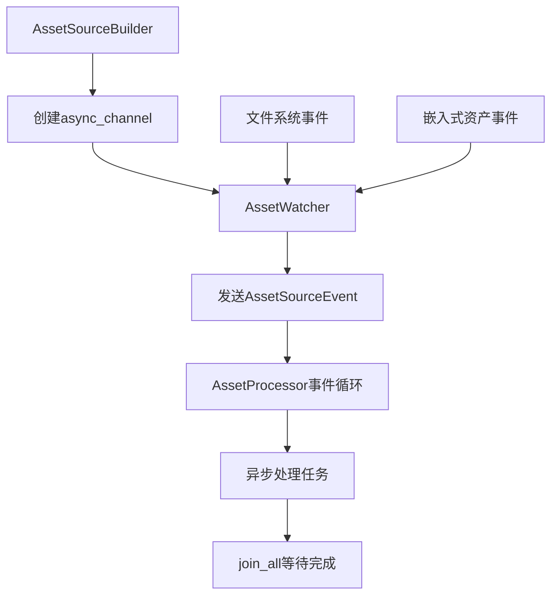

+++
title = "#21626 Allow the asset processor to run single-threaded."
date = "2025-10-22T00:00:00"
draft = false
template = "pull_request_page.html"
in_search_index = false

[extra]
current_language = "zh-cn"
available_languages = {"en" = { name = "English", url = "/pull_request/bevy/2025-10/pr-21626-en-20251022" }, "zh-cn" = { name = "中文", url = "/pull_request/bevy/2025-10/pr-21626-zh-cn-20251022" }}
+++

# 允许资产处理器单线程运行

## 基本信息
- **标题**: Allow the asset processor to run single-threaded.
- **PR链接**: https://github.com/bevyengine/bevy/pull/21626  
- **作者**: andriyDev
- **状态**: 已合并
- **标签**: C-Bug, A-Assets, O-Web, C-Usability, S-Ready-For-Final-Review, C-Testing, M-Migration-Guide, O-Embedded
- **创建时间**: 2025-10-21T22:03:16Z
- **合并时间**: 2025-10-22T22:04:14Z
- **合并者**: alice-i-cecile

## 描述翻译
# 目标

- 允许资产处理器单线程运行，以便资产处理器测试也可以在单线程模式下运行！

## 解决方案

- 将资产热重载使用异步通道替换crossbeam通道（需要阻塞）。
- 让资产处理首先找到所有要处理的资产，然后将所有这些处理任务连接在一起。
- 让资产处理监听循环等待异步通道流，而不是"轮询自旋"（spin-lock但使用轮询）。这应该使资产处理消耗更少的CPU！

## 测试

- 在单线程中测试了资产处理！它可以工作！

## 这个Pull Request的故事

这个PR的核心问题是资产处理器在多线程环境中的限制。在Bevy引擎中，资产处理器负责将源资产（如纹理、模型等）转换为优化的运行时格式。然而，原来的实现依赖于多线程特性，导致在单线程环境（如WebAssembly或禁用多线程的测试环境）中无法正常工作。

**问题根源在于阻塞操作**。原来的实现使用`crossbeam_channel`来处理资产事件，这个通道在接收端需要阻塞等待。在单线程环境中，这种阻塞会冻结整个应用，因为只有一个线程来处理所有任务。

开发者采取的解决方案是**用异步通道替换阻塞通道**。具体来说，将`crossbeam_channel`替换为`async_channel`，这样在单线程环境中，事件处理可以通过异步任务调度来避免阻塞。

在实现过程中，开发者重构了资产处理的核心逻辑。原来的`process_assets`方法使用同步的线程池范围（scope）来并行处理资产：

```rust
// 修改前：使用阻塞的线程池范围
IoTaskPool::get().scope(|scope| {
    scope.spawn(async move {
        // 处理逻辑
    });
});
```

修改后采用异步任务收集和批量等待的方式：

```rust
// 修改后：使用异步任务收集
let mut tasks = vec![];
self.process_assets_internal(source, PathBuf::from(""), &mut tasks)
    .await
    .unwrap();

join_all(tasks).await;
```

这种改变的关键优势在于：
1. **单线程兼容性**：异步任务可以在单线程运行时中通过时间分片处理，避免阻塞
2. **更好的CPU利用率**：原来的"轮询自旋"方式会持续消耗CPU，而异步等待在无事件时可以让出CPU

事件监听循环也进行了重要重构。原来的实现使用`try_iter()`来轮询通道：

```rust
// 修改前：轮询方式
for event in receiver.try_iter() {
    // 处理事件
}
```

修改后使用`futures_util::select_all`来异步等待多个事件源：

```rust
// 修改后：异步流处理
let mut all_receiver = select_all(source_receivers);
while let Some((source_id, event)) = all_receiver.next().await {
    // 处理事件
}
```

这种改变显著改善了CPU使用效率，因为异步等待在无事件时不会消耗CPU周期。

**技术洞察**：这个PR展示了从同步阻塞模型向异步非阻塞模型的转换。关键的技术决策包括：
- 使用`async_channel`替代`crossbeam_channel`来避免阻塞
- 用`futures_util::join_all`替代线程池范围来管理并发任务
- 使用流选择器（stream selector）来高效处理多个事件源

这个修改的影响是深远的：
1. **测试能力**：现在可以在单线程环境中测试资产处理逻辑
2. **WebAssembly支持**：为WASM环境下的资产处理铺平了道路
3. **性能改进**：减少了不必要的CPU消耗
4. **代码简化**：移除了大量平台特定的条件编译代码

## 可视化表示



## 关键文件变更

### `crates/bevy_asset/src/processor/mod.rs` (+75/-65)
这是最核心的修改文件，重构了资产处理器的核心逻辑。

**主要变更**：
- 将阻塞的线程池范围替换为异步任务收集
- 重构事件监听循环使用异步流处理
- 移除多线程特定的条件编译

```rust
// 关键变更：处理资产的方法签名
// 修改前：
async fn process_assets_internal<'scope>(
    &'scope self,
    scope: &'scope bevy_tasks::Scope<'scope, '_, ()>,
    source: &'scope AssetSource,
    path: PathBuf,
) -> Result<(), AssetReaderError>

// 修改后：
async fn process_assets_internal<'scope>(
    &'scope self,
    source: &'scope AssetSource,
    path: PathBuf,
    tasks: &mut Vec<BoxedFuture<'scope, ()>>,
) -> Result<(), AssetReaderError>
```

### `crates/bevy_asset/src/io/source.rs` (+13/-16)
修改了资产源的事件通道类型。

**主要变更**：
- 将`crossbeam_channel::Sender`替换为`async_channel::Sender`
- 更新相关的类型签名和工厂方法

```rust
// 修改前：
pub watcher: Option<
    Box<
        dyn FnMut(crossbeam_channel::Sender<AssetSourceEvent>) -> Option<Box<dyn AssetWatcher>>
            + Send
            + Sync,
    >,
>

// 修改后：
pub watcher: Option<
    Box<
        dyn FnMut(async_channel::Sender<AssetSourceEvent>) -> Option<Box<dyn AssetWatcher>>
            + Send
            + Sync,
    >,
>
```

### `crates/bevy_asset/src/processor/tests.rs` (+19/-52)
更新测试以支持单线程运行。

**主要变更**：
- 添加了`run_app_until_finished_processing`辅助函数
- 简化了测试中的等待逻辑

```rust
// 新增的测试辅助函数
fn run_app_until_finished_processing(app: &mut App) {
    run_app_until(app, |world| {
        if bevy_tasks::block_on(world.resource::<AssetProcessor>().get_state())
            == ProcessorState::Finished
        {
            Some(())
        } else {
            None
        }
    });
}
```

### `release-content/migration-guides/asset_watcher_async_sender.md` (+12/-0)
新增迁移指南，说明API变更。

**内容**：
- 解释了从`crossbeam_channel::Sender`到`async_channel::Sender`的变更
- 提供了迁移示例

### `crates/bevy_asset/src/lib.rs` (+5/-5)
更新测试中的通道使用。

**主要变更**：
- 在测试中将`crossbeam_channel::Sender`替换为`async_channel::Sender`
- 使用`send_blocking`方法发送事件

## 进一步阅读

- [async-channel文档](https://docs.rs/async-channel/) - 了解使用的异步通道实现
- [Bevy资产系统指南](https://bevyengine.org/learn/books/assets/) - 理解Bevy资产处理的基本概念
- [Rust异步编程](https://rust-lang.github.io/async-book/) - 掌握异步编程的基础知识
- [futures-util库](https://docs.rs/futures-util/) - 了解使用的异步工具函数

# 完整代码差异
由于代码差异较长，这里提供关键片段的总结：

**依赖变更**：
- 添加了`async-channel`和`futures-util`依赖
- 移除了开发依赖中的`async-channel`（现在作为正式依赖）

**核心逻辑变更**：
- 资产处理器现在完全基于异步任务
- 事件处理从轮询改为异步等待
- 移除了多线程特定的条件编译分支

**API变更**：
- 所有资产监视器现在使用`async_channel::Sender`
- 发送事件时使用`send_blocking`方法

这个PR成功地将资产处理器从多线程限制中解放出来，使其能够在更广泛的环境中运行，同时提高了代码的简洁性和性能。