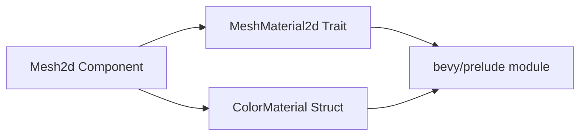

+++
title = "#21627 fix dead links in Mesh2d doc comment"
date = "2025-10-22T00:00:00"
draft = false
template = "pull_request_page.html"
in_search_index = true

[taxonomies]
list_display = ["show"]

[extra]
current_language = "en"
available_languages = {"en" = { name = "English", url = "/pull_request/bevy/2025-10/pr-21627-en-20251022" }, "zh-cn" = { name = "中文", url = "/pull_request/bevy/2025-10/pr-21627-zh-cn-20251022" }}
labels = ["C-Docs", "D-Trivial", "A-Rendering"]
+++

# Title
fix dead links in Mesh2d doc comment

## Basic Information
- **Title**: fix dead links in Mesh2d doc comment
- **PR Link**: https://github.com/bevyengine/bevy/pull/21627
- **Author**: mersenne-twister
- **Status**: MERGED
- **Labels**: C-Docs, D-Trivial, A-Rendering, S-Ready-For-Final-Review
- **Created**: 2025-10-21T23:27:25Z
- **Merged**: 2025-10-22T00:18:44Z
- **Merged By**: alice-i-cecile

## Description Translation
at some point, the things it was pointing to were moved from bevy/sprite to bevy/prelude, so fix the link to point there

## The Story of This Pull Request

This PR addresses a straightforward but important documentation issue in the Bevy engine's mesh component system. The problem was discovered in the documentation comments for the `Mesh2d` component, where two reference links were pointing to outdated locations in the codebase.

The core issue stemmed from a previous architectural reorganization where certain rendering components were moved from the `bevy/sprite` module to the `bevy/prelude` module. While the code itself was properly relocated, the documentation links weren't updated to reflect these changes, resulting in dead links that would 404 when users tried to access them.

The solution approach was direct and minimal - update the URL paths in the doc comments from `bevy/sprite` to `bevy/prelude` while preserving all other aspects of the documentation. This type of fix is particularly important in a game engine like Bevy where accurate documentation is crucial for developers trying to understand how to properly use rendering components.

From a technical perspective, the dead links were affecting two key structs referenced in the `Mesh2d` documentation:
- `MeshMaterial2d`: The trait that defines 2D mesh materials
- `ColorMaterial`: A commonly used implementation of `MeshMaterial2d`

The implementation required only two simple line changes in the doc comments, but these small fixes have significant impact on developer experience. When working with Bevy's rendering system, developers frequently need to reference these material types to understand how to properly configure and use 2D meshes.

The changes demonstrate an important maintenance practice in large codebases: keeping documentation synchronized with code reorganization. Even though this was a trivial change from a code perspective, it maintains the integrity of the documentation ecosystem and ensures developers can easily navigate to the relevant type definitions.

## Visual Representation



## Key Files Changed

### `crates/bevy_mesh/src/components.rs` (+2/-2)

This file contains the `Mesh2d` component definition and its associated documentation. The changes update the documentation links to point to the correct module location.

**Key Changes:**
```rust
// Before:
/// [`MeshMaterial2d`]: <https://docs.rs/bevy/latest/bevy/sprite/struct.MeshMaterial2d.html>
/// [`ColorMaterial`]: <https://docs.rs/bevy/latest/bevy/sprite/struct.ColorMaterial.html>

// After:
/// [`MeshMaterial2d`]: <https://docs.rs/bevy/latest/bevy/prelude/struct.MeshMaterial2d.html>
/// [`ColorMaterial`]: <https://docs.rs/bevy/latest/bevy/prelude/struct.ColorMaterial.html>
```

The changes update the module path in the documentation links from `bevy/sprite` to `bevy/prelude`, fixing the dead links while maintaining the same reference structure and documentation format.

## Further Reading

- [Rust Documentation Comments](https://doc.rust-lang.org/rustdoc/how-to-write-documentation.html) - Official guide on writing effective documentation in Rust
- [Bevy Prelude Module](https://docs.rs/bevy/latest/bevy/prelude/index.html) - Documentation for Bevy's prelude module containing commonly used types
- [Bevy Mesh2d Documentation](https://docs.rs/bevy/latest/bevy/mesh/struct.Mesh2d.html) - Current documentation for the Mesh2d component

# Full Code Diff
```diff
diff --git a/crates/bevy_mesh/src/components.rs b/crates/bevy_mesh/src/components.rs
index 4c5df0496fd78..feb1f522a438a 100644
--- a/crates/bevy_mesh/src/components.rs
+++ b/crates/bevy_mesh/src/components.rs
@@ -12,8 +12,8 @@ use derive_more::derive::From;
 
 /// A component for 2D meshes. Requires a [`MeshMaterial2d`] to be rendered, commonly using a [`ColorMaterial`].
 ///
-/// [`MeshMaterial2d`]: <https://docs.rs/bevy/latest/bevy/sprite/struct.MeshMaterial2d.html>
-/// [`ColorMaterial`]: <https://docs.rs/bevy/latest/bevy/sprite/struct.ColorMaterial.html>
+/// [`MeshMaterial2d`]: <https://docs.rs/bevy/latest/bevy/prelude/struct.MeshMaterial2d.html>
+/// [`ColorMaterial`]: <https://docs.rs/bevy/latest/bevy/prelude/struct.ColorMaterial.html>
 ///
 /// # Example
 ///
```