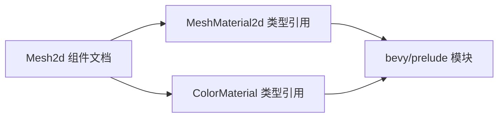

+++
title = "#21627 fix dead links in Mesh2d doc comment"
date = "2025-10-22T00:00:00"
draft = false
template = "pull_request_page.html"
in_search_index = false

[extra]
current_language = "zh-cn"
available_languages = {"en" = { name = "English", url = "/pull_request/bevy/2025-10/pr-21627-en-20251022" }, "zh-cn" = { name = "中文", url = "/pull_request/bevy/2025-10/pr-21627-zh-cn-20251022" }}
+++

# 修复 Mesh2d 文档注释中的死链接

## 基本信息
- **标题**: fix dead links in Mesh2d doc comment
- **PR 链接**: https://github.com/bevyengine/bevy/pull/21627
- **作者**: mersenne-twister
- **状态**: 已合并
- **标签**: C-Docs, D-Trivial, A-Rendering, S-Ready-For-Final-Review
- **创建时间**: 2025-10-21T23:27:25Z
- **合并时间**: 2025-10-22T00:18:44Z
- **合并者**: alice-i-cecile

## 描述翻译
在某个时间点，文档中引用的内容从 bevy/sprite 移动到了 bevy/prelude，因此修复链接指向新的位置。

## 这个拉取请求的故事

这个拉取请求解决了一个典型的文档维护问题：API 引用链接失效。在 Bevy 游戏引擎的开发过程中，随着代码库的演进和重构，模块结构会发生变化，这会导致文档中的链接指向错误的位置。

问题的根源在于 `Mesh2d` 组件文档注释中的两个类型引用链接。`MeshMaterial2d` 和 `ColorMaterial` 这两个类型原本位于 `bevy::sprite` 模块中，但在某个重构过程中被移动到了 `bevy::prelude` 模块。这种模块重组在大型项目中很常见，特别是当某些类型变得足够基础，需要被包含在预导入模块中时。

开发者 mersenne-twister 发现了这个问题并提供了一个直接的解决方案：更新文档链接指向正确的位置。这种修复虽然简单，但对用户体验很重要，因为死链接会破坏文档的可读性和实用性。

从技术实现角度看，这个修复涉及修改 Rust 文档注释中的链接。Rust 使用特殊的文档注释语法 `///`，支持使用方括号语法 `[`...`]` 创建内联链接。链接目标使用尖括号 `<`...`>` 指定，指向 docs.rs 上的具体类型文档。

修复的核心是将链接路径从：
- `https://docs.rs/bevy/latest/bevy/sprite/struct.MeshMaterial2d.html`
- `https://docs.rs/bevy/latest/bevy/sprite/struct.ColorMaterial.html`

改为：
- `https://docs.rs/bevy/latest/bevy/prelude/struct.MeshMaterial2d.html`  
- `https://docs.rs/bevy/latest/bevy/prelude/struct.ColorMaterial.html`

这种类型的文档维护工作在开源项目中很重要。虽然不直接影响代码功能，但保持文档的准确性对于新开发者的入门体验和现有开发者的工作效率都至关重要。死链接会给试图理解 API 用法的开发者造成困惑，特别是当他们点击链接期望获得更多信息时。

这个修复展示了良好的开源项目维护实践：即使是很小的问题，只要影响用户体验，就值得及时修复。标签中的 "D-Trivial" 和 "C-Docs" 准确地反映了这个更改的性质 - 这是一个简单的文档修复。

## 可视化表示



## 关键文件更改

**crates/bevy_mesh/src/components.rs** (+2/-2)

这个文件包含了主要的修改，更新了 `Mesh2d` 结构体的文档注释中的链接：

```rust
// 文件: crates/bevy_mesh/src/components.rs
// 修改前:
/// [`MeshMaterial2d`]: <https://docs.rs/bevy/latest/bevy/sprite/struct.MeshMaterial2d.html>
/// [`ColorMaterial`]: <https://docs.rs/bevy/latest/bevy/sprite/struct.ColorMaterial.html>

// 修改后:
/// [`MeshMaterial2d`]: <https://docs.rs/bevy/latest/bevy/prelude/struct.MeshMaterial2d.html>
/// [`ColorMaterial`]: <https://docs.rs/bevy/latest/bevy/prelude/struct.ColorMaterial.html>
```

这些更改将文档链接从旧的 `bevy/sprite` 路径更新到新的 `bevy/prelude` 路径，确保开发者点击链接时能够正确跳转到相关类型的文档页面。

## 延伸阅读

对于想要了解更多相关概念的读者，建议参考：

- [Rust 文档注释指南](https://doc.rust-lang.org/rustdoc/how-to-write-documentation.html)
- [Bevy 引擎官方文档](https://bevyengine.org/learn/)
- [docs.rs 平台](https://docs.rs/) - Rust 生态系统的文档托管服务

# 完整代码差异

```diff
diff --git a/crates/bevy_mesh/src/components.rs b/crates/bevy_mesh/src/components.rs
index 4c5df0496fd78..feb1f522a438a 100644
--- a/crates/bevy_mesh/src/components.rs
+++ b/crates/bevy_mesh/src/components.rs
@@ -12,8 +12,8 @@ use derive_more::derive::From;
 
 /// A component for 2D meshes. Requires a [`MeshMaterial2d`] to be rendered, commonly using a [`ColorMaterial`].
 ///
-/// [`MeshMaterial2d`]: <https://docs.rs/bevy/latest/bevy/sprite/struct.MeshMaterial2d.html>
-/// [`ColorMaterial`]: <https://docs.rs/bevy/latest/bevy/sprite/struct.ColorMaterial.html>
+/// [`MeshMaterial2d`]: <https://docs.rs/bevy/latest/bevy/prelude/struct.MeshMaterial2d.html>
+/// [`ColorMaterial`]: <https://docs.rs/bevy/latest/bevy/prelude/struct.ColorMaterial.html>
 ///
 /// # Example
 ///
```