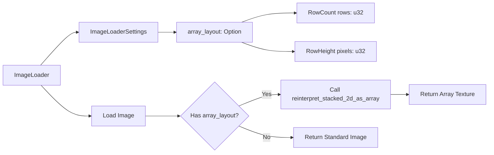

+++
title = "#21628 Add a setting to `ImageLoader` that calls `Image::reinterpret_stacked_2d_as_array`"
date = "2025-10-29T00:00:00"
draft = false
template = "pull_request_page.html"
in_search_index = true

[taxonomies]
list_display = ["show"]

[extra]
current_language = "en"
available_languages = {"en" = { name = "English", url = "/pull_request/bevy/2025-10/pr-21628-en-20251029" }, "zh-cn" = { name = "中文", url = "/pull_request/bevy/2025-10/pr-21628-zh-cn-20251029" }}
labels = ["A-Rendering", "C-Usability", "M-Migration-Guide", "D-Straightforward"]
+++

# Title
Add a setting to `ImageLoader` that calls `Image::reinterpret_stacked_2d_as_array`

## Basic Information
- **Title**: Add a setting to `ImageLoader` that calls `Image::reinterpret_stacked_2d_as_array`
- **PR Link**: https://github.com/bevyengine/bevy/pull/21628
- **Author**: grind086
- **Status**: MERGED
- **Labels**: A-Rendering, C-Usability, S-Ready-For-Final-Review, M-Migration-Guide, X-Uncontroversial, D-Straightforward
- **Created**: 2025-10-22T11:36:51Z
- **Merged**: 2025-10-29T21:04:30Z
- **Merged By**: alice-i-cecile

## Description Translation

# Objective

If you want to use a `TilemapChunk` (or more generally use a `texture2DArray` in a shader), you have to implement a mechanism that waits for your texture to load, then calls `Image::reinterpret_stacked_2d_as_array`.

## Solution

Have the loader do it instead.

Closes #20799, which does very similar things and should be remade if more functionality is needed.

## Testing

- Ran the updated examples

---

## Showcase

```rs
let array_texture = asset_server.load_with_settings(
    "textures/array_texture.png",
    |settings: &mut ImageLoaderSettings| {
        settings.array_layout = Some(ImageArrayLayout::RowCount(4));
    },
);
```

## The Story of This Pull Request

This PR addresses a common boilerplate requirement when working with texture arrays in Bevy. Previously, developers needed to implement custom loading logic that waited for texture assets to load, then manually called `Image::reinterpret_stacked_2d_as_array` to convert stacked 2D textures into texture arrays suitable for use with `texture2DArray` shader uniforms.

The problem was particularly evident in examples like tilemap rendering and shader array textures, where developers had to write boilerplate code to monitor asset loading events and perform the texture conversion post-load. This approach was error-prone and required understanding the asset loading lifecycle.

The solution integrates this functionality directly into the `ImageLoader` system. By adding a new `array_layout` setting to `ImageLoaderSettings`, developers can now specify how a 2D texture should be interpreted as a texture array during the loading process itself. This eliminates the need for manual post-processing and makes the code more declarative.

The implementation adds a new `ImageArrayLayout` enum with two variants: `RowCount` for specifying the number of stacked images, and `RowHeight` for specifying the pixel height of each layer. When this setting is provided, the image loader automatically calls `reinterpret_stacked_2d_as_array` with the calculated layer count.

This change significantly simplifies code that uses texture arrays. The tilemap example shows how this reduces complexity - instead of monitoring asset events and manually converting textures, developers can now simply configure the loader settings. The shader array texture example similarly benefits, removing the need for custom loading state management.

The implementation maintains backward compatibility by making the array layout optional. Existing code continues to work unchanged, while new code can opt into the automatic array conversion. The change also includes proper error handling, with the loader returning a `TextureReinterpretationError` if the array conversion fails.

From an architectural perspective, this change follows Bevy's pattern of making common operations declarative through loader settings. It moves the responsibility for texture array conversion from application code to the asset system, resulting in cleaner, more maintainable code.

## Visual Representation



## Key Files Changed

### `crates/bevy_image/src/image_loader.rs` (+40/-9)
This is the core implementation file where the array texture functionality was added.

**Key additions:**
```rust
/// How to interpret the image as an array of textures.
#[derive(Serialize, Deserialize, Debug, Clone, Copy)]
pub enum ImageArrayLayout {
    /// Interpret the image as a vertical stack of *n* images.
    RowCount { rows: u32 },
    /// Interpret the image as a vertical stack of images, each *n* pixels tall.
    RowHeight { pixels: u32 },
}

pub struct ImageLoaderSettings {
    // ... existing fields ...
    #[serde(default)]
    pub array_layout: Option<ImageArrayLayout>,
}
```

**Implementation changes:**
```rust
// After loading the image and applying texture_format...
if let Some(array_layout) = settings.array_layout {
    let layers = match array_layout {
        ImageArrayLayout::RowCount { rows } => rows,
        ImageArrayLayout::RowHeight { pixels } => image.height() / pixels,
    };

    image.reinterpret_stacked_2d_as_array(layers)?;
}
```

### `examples/shader/array_texture.rs` (+19/-42)
This example was significantly simplified by removing manual texture conversion logic.

**Before:**
```rust
#[derive(Resource)]
struct LoadingTexture {
    is_loaded: bool,
    handle: Handle<Image>,
}

fn create_array_texture(
    mut commands: Commands,
    asset_server: Res<AssetServer>,
    mut loading_texture: ResMut<LoadingTexture>,
    mut images: ResMut<Assets<Image>>,
    // ... other parameters
) {
    // Complex loading state management and manual conversion
    if loading_texture.is_loaded || !asset_server.load_state(...).is_loaded() {
        return;
    }
    let image = images.get_mut(&loading_texture.handle).unwrap();
    image.reinterpret_stacked_2d_as_array(4).expect(...);
}
```

**After:**
```rust
fn setup(
    mut commands: Commands,
    mut meshes: ResMut<Assets<Mesh>>,
    mut materials: ResMut<Assets<ArrayTextureMaterial>>,
    asset_server: Res<AssetServer>,
) {
    let array_texture = asset_server.load_with_settings(
        "textures/array_texture.png",
        |settings: &mut ImageLoaderSettings| {
            settings.array_layout = Some(ImageArrayLayout::RowCount { rows: 4 });
        },
    );
    // Direct usage without manual conversion
}
```

### `examples/2d/tilemap_chunk.rs` (+10/-21)
Similar simplification applied to the tilemap example.

**Before:**
```rust
fn update_tileset_image(
    chunk_query: Single<&TilemapChunk>,
    mut events: MessageReader<AssetEvent<Image>>,
    mut images: ResMut<Assets<Image>>,
) {
    // Manual asset event monitoring and conversion
    for event in events.read() {
        if event.is_loaded_with_dependencies(chunk.tileset.id()) {
            let image = images.get_mut(&chunk.tileset).unwrap();
            image.reinterpret_stacked_2d_as_array(4).expect(...);
        }
    }
}
```

**After:**
```rust
tileset: assets.load_with_settings(
    "textures/array_texture.png",
    |settings: &mut ImageLoaderSettings| {
        settings.array_layout = Some(ImageArrayLayout::RowCount { rows: 4 });
    },
),
```

### `release-content/migration-guides/image_loader_array_layout.md` (+20/-0)
New migration guide explaining the feature.

### `crates/bevy_image/src/compressed_image_saver.rs` (+1/-0)
Minor update to include the new field in compressed image saving.

## Further Reading

- [Bevy Asset System Documentation](https://bevyengine.org/learn/quick-start/assets/)
- [WebGPU Texture Arrays](https://www.w3.org/TR/webgpu/#texture-array)
- [Bevy `Image` API Documentation](https://docs.rs/bevy/latest/bevy/image/struct.Image.html)
- [Original Issue #20799](https://github.com/bevyengine/bevy/issues/20799)