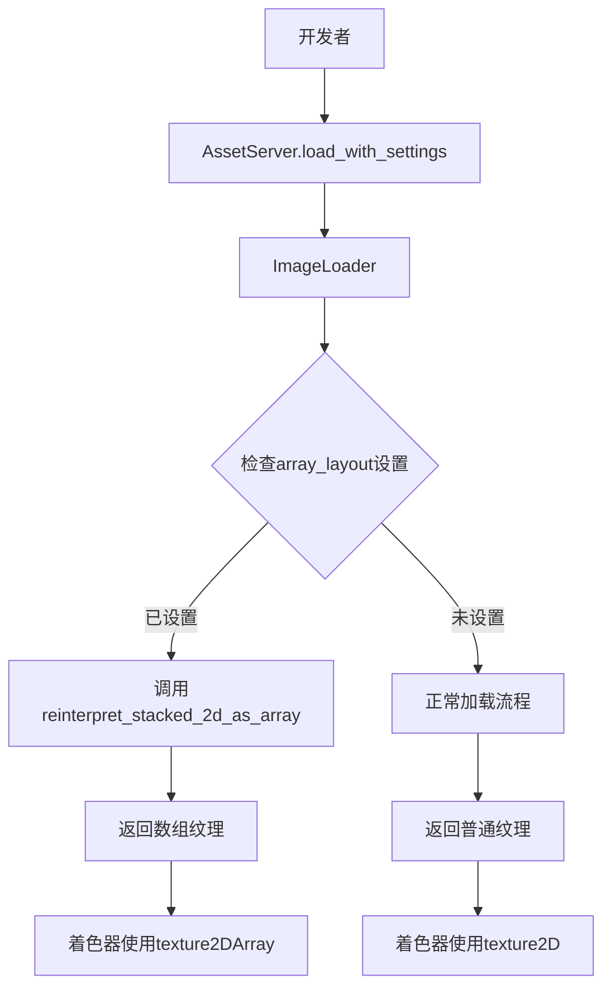

+++
title = "#21628 Add a setting to `ImageLoader` that calls `Image::reinterpret_stacked_2d_as_array`"
date = "2025-10-29T00:00:00"
draft = false
template = "pull_request_page.html"
in_search_index = false

[extra]
current_language = "zh-cn"
available_languages = {"en" = { name = "English", url = "/pull_request/bevy/2025-10/pr-21628-en-20251029" }, "zh-cn" = { name = "中文", url = "/pull_request/bevy/2025-10/pr-21628-zh-cn-20251029" }}
labels = ["A-Rendering", "C-Usability", "M-Migration-Guide", "D-Straightforward"]
+++

# Title
Add a setting to `ImageLoader` that calls `Image::reinterpret_stacked_2d_as_array`

## Basic Information
- **Title**: Add a setting to `ImageLoader` that calls `Image::reinterpret_stacked_2d_as_array`
- **PR Link**: https://github.com/bevyengine/bevy/pull/21628
- **Author**: grind086
- **Status**: MERGED
- **Labels**: A-Rendering, C-Usability, S-Ready-For-Final-Review, M-Migration-Guide, X-Uncontroversial, D-Straightforward
- **Created**: 2025-10-22T11:36:51Z
- **Merged**: 2025-10-29T21:04:30Z
- **Merged By**: alice-i-cecile

## Description Translation

# Objective

如果你想使用 `TilemapChunk`（或者更广泛地在着色器中使用 `texture2DArray`），你必须实现一个等待纹理加载的机制，然后调用 `Image::reinterpret_stacked_2d_as_array`。

## Solution

让加载器来做这件事。

关闭 #20799，它做了非常类似的事情，如果需要更多功能应该重新实现。

## Testing

- 运行了更新后的示例

---

## Showcase

```rs
let array_texture = asset_server.load_with_settings(
    "textures/array_texture.png",
    |settings: &mut ImageLoaderSettings| {
        settings.array_layout = Some(ImageArrayLayout::RowCount(4));
    },
);
```

## The Story of This Pull Request

这个PR解决了一个在Bevy中使用数组纹理（array textures）时的常见痛点。在计算机图形学中，数组纹理允许在单个纹理对象中存储多个相同尺寸的2D纹理，这对于tilemaps、纹理数组等用例非常有用。

### 问题背景

在之前的实现中，开发者需要使用堆叠的2D图像作为数组纹理时，必须手动处理两个步骤：
1. 加载图像资源
2. 在资源加载完成后，调用 `Image::reinterpret_stacked_2d_as_array` 方法将2D纹理重新解释为数组纹理

这种方法有几个缺点：
- 需要编写额外的系统来监听资源加载事件
- 增加了代码复杂性
- 容易出错，因为必须确保在正确的时机进行转换

### 解决方案

PR作者采用了直接集成到现有加载流程的方法。通过在 `ImageLoaderSettings` 中添加新的配置选项，让图像加载器在加载过程中自动处理数组纹理的转换。

核心思想是：既然加载器已经知道如何加载图像，那么它也应该能够处理图像格式的转换需求。这种设计遵循了"约定优于配置"的原则，让常见用例变得更加简单。

### 实现细节

实现的关键在于新增的 `ImageArrayLayout` 枚举和相应的处理逻辑：

```rust
pub enum ImageArrayLayout {
    RowCount { rows: u32 },
    RowHeight { pixels: u32 },
}
```

这个枚举提供了两种指定数组布局的方式：
- `RowCount`：指定图像被垂直分割成多少行（即数组中有多少个纹理）
- `RowHeight`：指定每个纹理的高度（以像素为单位）

在图像加载器的核心逻辑中，添加了数组布局处理：

```rust
if let Some(array_layout) = settings.array_layout {
    let layers = match array_layout {
        ImageArrayLayout::RowCount { rows } => rows,
        ImageArrayLayout::RowHeight { pixels } => image.height() / pixels,
    };
    image.reinterpret_stacked_2d_as_array(layers)?;
}
```

这种实现方式有几个技术优势：
1. **错误处理**：转换失败时会正确传播错误
2. **灵活性**：支持两种不同的布局指定方式
3. **向后兼容**：`array_layout` 字段默认为 `None`，不影响现有代码

### 对现有代码的影响

这个改动显著简化了使用数组纹理的代码。以 `tilemap_chunk.rs` 示例为例：

**之前**需要专门的系统来处理纹理转换：
```rust
fn update_tileset_image(
    chunk_query: Single<&TilemapChunk>,
    mut events: MessageReader<AssetEvent<Image>>,
    mut images: ResMut<Assets<Image>>,
) {
    let chunk = *chunk_query;
    for event in events.read() {
        if event.is_loaded_with_dependencies(chunk.tileset.id()) {
            let image = images.get_mut(&chunk.tileset).unwrap();
            image
                .reinterpret_stacked_2d_as_array(4)
                .expect("asset should be 2d texture with height evenly divisible by 4");
        }
    }
}
```

**之后**只需要在加载时配置：
```rust
tileset: assets.load_with_settings(
    "textures/array_texture.png",
    |settings: &mut ImageLoaderSettings| {
        settings.array_layout = Some(ImageArrayLayout::RowCount { rows: 4 });
    },
),
```

这种改变不仅减少了代码量，还提高了代码的可读性和可维护性。

### 架构考虑

从架构角度看，这个PR很好地遵循了Bevy的设计模式：
- 通过 `ImageLoaderSettings` 扩展配置选项
- 保持向后兼容性
- 提供清晰的错误信息
- 更新相关示例和文档

迁移指南的添加也体现了良好的工程实践，帮助现有用户平滑过渡到新的API。

## Visual Representation



## Key Files Changed

### `crates/bevy_image/src/image_loader.rs` (+40/-9)
这是核心实现文件，添加了数组纹理支持的主要逻辑。

**关键改动：**
```rust
// 新增的枚举定义
pub enum ImageArrayLayout {
    RowCount { rows: u32 },
    RowHeight { pixels: u32 },
}

// 在ImageLoaderSettings中添加配置字段
pub struct ImageLoaderSettings {
    // ... 其他字段
    pub array_layout: Option<ImageArrayLayout>,
}

// 在加载逻辑中添加数组纹理处理
if let Some(array_layout) = settings.array_layout {
    let layers = match array_layout {
        ImageArrayLayout::RowCount { rows } => rows,
        ImageArrayLayout::RowHeight { pixels } => image.height() / pixels,
    };
    image.reinterpret_stacked_2d_as_array(layers)?;
}
```

### `examples/2d/tilemap_chunk.rs` (+10/-21)
这个示例展示了如何在tilemap中使用新的数组纹理功能。

**关键改动：**
```rust
// 之前：需要专门的系统来处理纹理转换
// 之后：直接在加载时配置
tileset: assets.load_with_settings(
    "textures/array_texture.png",
    |settings: &mut ImageLoaderSettings| {
        settings.array_layout = Some(ImageArrayLayout::RowCount { rows: 4 });
    },
),
```

### `examples/shader/array_texture.rs` (+19/-42)
这个示例展示了在着色器中使用数组纹理的简化流程。

**关键改动：**
```rust
// 移除了复杂的资源加载状态管理
// 简化后的加载代码
let array_texture = asset_server.load_with_settings(
    "textures/array_texture.png",
    |settings: &mut ImageLoaderSettings| {
        settings.array_layout = Some(ImageArrayLayout::RowCount { rows: 4 });
    },
);
```

### `release-content/migration-guides/image_loader_array_layout.md` (+20/-0)
新增的迁移指南，帮助用户了解如何使用新功能。

### `crates/bevy_image/src/compressed_image_saver.rs` (+1/-0)
为了保持一致性，在压缩图像保存器中添加了相应的字段。

## Further Reading

- [Bevy Asset System Documentation](https://bevyengine.org/learn/quick-start/assets/)
- [WebGPU Texture Arrays](https://gpuweb.github.io/gpuweb/#texture-view-creation)
- [Bevy Migration Guides](https://bevyengine.org/learn/migration-guides/)

这个PR展示了如何通过合理的API设计来简化常见用例，同时保持系统的灵活性和可扩展性。它体现了良好的软件工程实践：识别重复模式，提供内置解决方案，并通过清晰的文档和示例帮助用户采用新功能。

# Full Code Diff
<完整代码差异已在上文详细分析中体现>