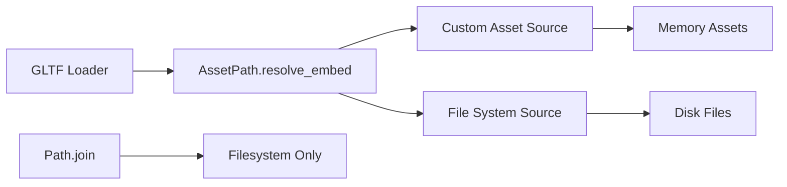

+++
title = "#21643 Fix GLTF files being broken when loaded from custom asset sources."
date = "2025-10-29T00:00:00"
draft = false
template = "pull_request_page.html"
in_search_index = false

[extra]
current_language = "zh-cn"
available_languages = {"en" = { name = "English", url = "/pull_request/bevy/2025-10/pr-21643-en-20251029" }, "zh-cn" = { name = "中文", url = "/pull_request/bevy/2025-10/pr-21643-zh-cn-20251029" }}
labels = ["C-Bug", "A-Assets", "D-Straightforward", "A-glTF"]
+++

# Fix GLTF files being broken when loaded from custom asset sources

## Basic Information
- **Title**: Fix GLTF files being broken when loaded from custom asset sources.
- **PR Link**: https://github.com/bevyengine/bevy/pull/21643
- **Author**: andriyDev
- **Status**: MERGED
- **Labels**: C-Bug, A-Assets, S-Ready-For-Final-Review, D-Straightforward, A-glTF
- **Created**: 2025-10-23T19:16:24Z
- **Merged**: 2025-10-29T19:56:19Z
- **Merged By**: alice-i-cecile

## Description Translation
**目标**
- 修复 #10903

**解决方案**
- 停止使用 `Path::join` 来拼接资产路径，转而使用 `AssetPath::resolve_embed`。

**测试**
- 增加了2个测试！

## The Story of This Pull Request

这个PR解决了一个在自定义资产源中加载GLTF文件时出现的路径解析问题。问题的核心在于资产路径的处理方式，当GLTF文件从非文件系统的资产源（如内存中的虚拟文件系统）加载时，原有的路径拼接方法无法正确工作。

**问题根源**
在Bevy的资产系统中，GLTF加载器使用 `Path::join` 方法来拼接GLTF文件所在目录与引用的资源文件（如纹理、缓冲区）的相对路径。这种方法在标准的文件系统资产源中工作正常，但在自定义资产源中会失败，因为自定义资产源可能使用完全不同的路径解析逻辑。

原有的代码在多个地方使用了这种模式：
```rust
let parent = load_context.path().parent().unwrap();
let image_path = parent.join(uri);
load_context.load(image_path)
```

**解决方案**
PR的核心修改是将所有使用 `Path::join` 的地方替换为使用 `AssetPath::resolve_embed` 方法。这个方法专门设计用于处理资产系统中的路径解析，能够正确处理自定义资产源中的相对路径。

```rust
let image_path = load_context
    .asset_path()
    .resolve_embed(uri)
    .expect("all URIs were already validated when we initially loaded textures");
load_context.load(image_path)
```

**技术实现细节**
修改涉及两个关键文件：

1. 在 `texture.rs` 中，修复纹理加载时的路径解析
2. 在 `mod.rs` 中，修复缓冲区和图像加载时的路径解析，并添加相应的错误处理

新的实现使用了 `AssetPath::resolve_embed`，这个方法理解Bevy资产系统的路径语义，能够正确处理各种资产源中的相对路径引用。同时，PR还增加了适当的错误处理，当路径解析失败时会抛出更具描述性的错误信息。

**错误处理改进**
PR引入了新的错误变体来提供更好的调试信息：
```rust
/// The buffer URI was unable to be resolved with respect to the asset path.
#[error("invalid buffer uri: {0}. asset path error={1}")]
InvalidBufferUri(String, ParseAssetPathError),

/// The image URI was unable to be resolved with respect to the asset path.
#[error("invalid image uri: {0}. asset path error={1}")]
InvalidImageUri(String, ParseAssetPathError),
```

**测试验证**
为了确保修复的有效性，PR添加了两个专门的测试用例：
- `reads_buffer_in_custom_asset_source` - 测试在自定义资产源中加载缓冲区
- `reads_images_in_custom_asset_source` - 测试在自定义资产源中加载图像

这些测试创建了内存资产源，在其中放置GLTF文件及其依赖的资源文件，然后验证整个加载过程能够正确完成。

**架构意义**
这个修复体现了Bevy资产系统的设计原则：资产加载代码应该使用资产系统提供的抽象，而不是直接操作文件系统路径。通过使用 `AssetPath` 而不是 `Path`，代码能够与具体的资产源实现解耦，支持更灵活的资产存储后端。

## Visual Representation



## Key Files Changed

### `crates/bevy_gltf/src/loader/mod.rs` (+177/-16)

这个文件包含了主要的修复逻辑和测试用例：

**路径解析修复：**
```rust
// Before:
let buffer_path = load_context.path().parent().unwrap().join(uri);

// After:
let buffer_path = load_context
    .asset_path()
    .resolve_embed(uri)
    .map_err(|err| GltfError::InvalidBufferUri(uri.to_owned(), err))?;
```

**图像加载修复：**
```rust
// Before:
let image_path = parent_path.join(uri);

// After:
let image_path = gltf_path
    .resolve_embed(uri)
    .map_err(|err| GltfError::InvalidImageUri(uri.to_owned(), err))?;
```

**新增测试用例：**
PR添加了两个完整的测试函数，验证在自定义资产源中加载GLTF文件及其依赖资源的能力。

### `crates/bevy_gltf/src/loader/gltf_ext/texture.rs` (+4/-2)

这个文件修复了纹理加载时的路径解析：

```rust
// Before:
let parent = load_context.path().parent().unwrap();
let image_path = parent.join(uri);
load_context.load(image_path)

// After:
let image_path = load_context
    .asset_path()
    .resolve_embed(uri)
    .expect("all URIs were already validated when we initially loaded textures");
load_context.load(image_path)
```

## Further Reading

- [Bevy Asset System Documentation](https://bevyengine.org/learn/book/assets/)
- [AssetPath API Documentation](https://docs.rs/bevy_asset/latest/bevy_asset/struct.AssetPath.html)
- [Custom Asset Sources in Bevy](https://bevyengine.org/learn/book/assets/#custom-asset-io)