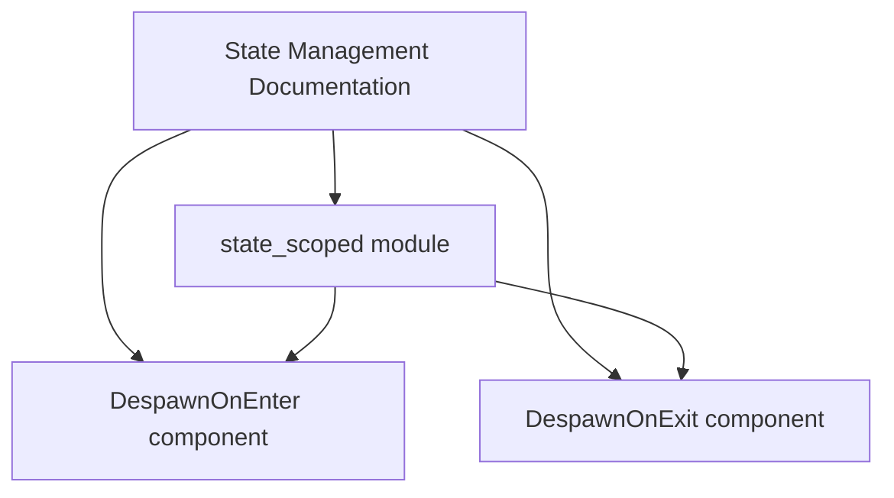

+++
title = "#21650 Doc - Link directly to DespawnOnEnter/Exit"
date = "2025-10-25T00:00:00"
draft = false
template = "pull_request_page.html"
in_search_index = true

[taxonomies]
list_display = ["show"]

[extra]
current_language = "en"
available_languages = {"en" = { name = "English", url = "/pull_request/bevy/2025-10/pr-21650-en-20251025" }, "zh-cn" = { name = "中文", url = "/pull_request/bevy/2025-10/pr-21650-zh-cn-20251025" }}
labels = ["C-Docs", "D-Trivial", "A-States"]
+++

# Title
Doc - Link directly to DespawnOnEnter/Exit

## Basic Information
- **Title**: Doc - Link directly to DespawnOnEnter/Exit
- **PR Link**: https://github.com/bevyengine/bevy/pull/21650
- **Author**: isHavvy
- **Status**: MERGED
- **Labels**: C-Docs, D-Trivial, S-Ready-For-Final-Review, A-States
- **Created**: 2025-10-25T03:03:37Z
- **Merged**: 2025-10-25T07:50:25Z
- **Merged By**: mockersf

## Description Translation

# Objective

* Make DespawnOnExit more discoverable.
* Fix broken link text - the parenthetical before it seems to mess it up.

## Solution

* Link directly to DespawnOnExit from the module documentation instead of just the containing module.

## Testing

None. Somebody should build the docs to make sure the links actually work (I'm 99% sure they do) and that the `\` added actually fixes the link on line 32 (I'm only 80% sure it does)

## Further Questions

I'm wondering if this functionality should be listed in the bulleted list that precedes this paragraph.

## The Story of This Pull Request

This PR addresses a documentation issue in the Bevy game engine's state management system. The problem was straightforward but important for developer experience: the `DespawnOnEnter` and `DespawnOnExit` marker components were not easily discoverable through the documentation.

The original documentation mentioned state-scoped entities functionality but only linked to the containing module (`state_scoped`) rather than directly to the specific components that developers would actually use. This created a discoverability problem where users might not find these useful components without digging deeper into the module structure.

The technical issue was in the Rust documentation syntax. The original line used backticks in the link target which could interfere with proper link rendering:

```rust
//! Bevy also provides ("state-scoped entities") [`state_scoped`](`crate::state_scoped`) functionality...
```

The solution involved two key changes:
1. Removing the problematic backticks from the link syntax
2. Adding direct links to the specific marker components (`DespawnOnEnter` and `DespawnOnExit`) that provide the actual functionality

This change follows good documentation practices by linking directly to the types that implement functionality rather than just pointing to the module that contains them. It makes the documentation more actionable for developers who are looking for specific solutions to common problems like entity lifecycle management during state transitions.

The implementation is minimal but effective - it replaces a single documentation line with two clearer lines that better guide developers to the tools they need. The author correctly identified that while the change seems simple, it required verification that the documentation links would render correctly, which is why they suggested building the docs to test the changes.

## Visual Representation



## Key Files Changed

**File: `crates/bevy_state/src/lib.rs`** (+2/-1)

This file contains the module-level documentation for Bevy's state management system. The changes improve the documentation by making key components more discoverable and fixing link syntax.

**Before:**
```rust
//! Bevy also provides ("state-scoped entities") [`state_scoped`](`crate::state_scoped`) functionality for managing the lifetime of entities in the context of game states.
```

**After:**
```rust
//! Bevy also provides functionality for managing the lifetime of entities in the context of game states, using the [`state_scoped`] module.
//! Specifically, the marker components [`DespawnOnEnter<S>`](crate::state_scoped::DespawnOnEnter) and [`DespawnOnExit<S>`](crate::state_scoped::DespawnOnExit) are provided for despawning entities on state transition.
```

The changes:
1. Remove the problematic backticks from the module link
2. Add direct links to the specific marker components
3. Provide clearer explanation of what these components do

## Further Reading

- [Rust Documentation Comments](https://doc.rust-lang.org/rustdoc/how-to-write-documentation.html)
- [Bevy States Documentation](https://bevyengine.org/learn/quick-start/next-steps/states/)
- [Bevy ECS System Scheduling](https://bevyengine.org/learn/quick-start/next-steps/ec/)