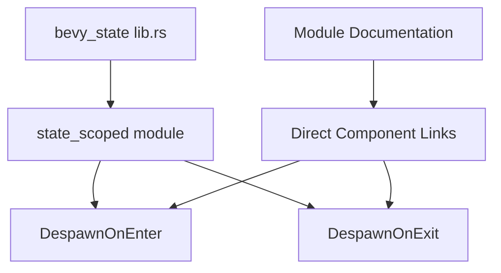

+++
title = "#21650 Doc - Link directly to DespawnOnEnter/Exit"
date = "2025-10-25T00:00:00"
draft = false
template = "pull_request_page.html"
in_search_index = false

[extra]
current_language = "zh-cn"
available_languages = {"en" = { name = "English", url = "/pull_request/bevy/2025-10/pr-21650-en-20251025" }, "zh-cn" = { name = "中文", url = "/pull_request/bevy/2025-10/pr-21650-zh-cn-20251025" }}
labels = ["C-Docs", "D-Trivial", "A-States"]
+++

# Title

## Basic Information
- **Title**: Doc - Link directly to DespawnOnEnter/Exit
- **PR Link**: https://github.com/bevyengine/bevy/pull/21650
- **Author**: isHavvy
- **Status**: MERGED
- **Labels**: C-Docs, D-Trivial, S-Ready-For-Final-Review, A-States
- **Created**: 2025-10-25T03:03:37Z
- **Merged**: 2025-10-25T07:50:25Z
- **Merged By**: mockersf

## Description Translation
# 目标

* 提高 DespawnOnExit 的可发现性。
* 修复损坏的链接文本 - 前面的括号似乎破坏了链接。

## 解决方案

* 从模块文档中直接链接到 DespawnOnExit，而不仅仅是链接到包含它的模块。

## 测试

无。有人应该构建文档以确保链接实际有效（我 99% 确定它们有效），并且添加的 `\` 确实修复了第 32 行的链接（我只有 80% 确定它有效）。

## 进一步的问题

我想知道这个功能是否应该列在之前段落中的项目符号列表中。

## The Story of This Pull Request

这个 PR 解决了一个文档可发现性问题。在 Bevy 游戏引擎中，状态管理是一个核心功能，开发者需要能够轻松找到与状态相关的组件和功能。

问题的核心在于现有的模块文档中，虽然提到了状态作用域实体的功能，但只链接到了 `state_scoped` 模块，而没有直接链接到具体的组件。这导致开发者需要额外的步骤才能找到 `DespawnOnEnter` 和 `DespawnOnExit` 这两个重要的标记组件。

原文档的问题是：
- 只提供了模块级别的链接，没有组件级别的直接链接
- 链接文本格式可能存在问题，导致渲染不正确

开发者 isHavvy 识别到了这个可用性问题，并提出了一个简洁的解决方案：在文档中直接链接到具体的组件，而不是让用户去模块中寻找。这种改进虽然很小，但对于新用户来说意义重大，因为它减少了寻找相关功能所需的时间和精力。

从技术实现角度看，这个修改涉及重写文档注释，使其更加明确和有用。原来的单行注释：

```rust
//! Bevy also provides ("state-scoped entities") [`state_scoped`](`crate::state_scoped`) functionality for managing the lifetime of entities in the context of game states.
```

被扩展为两行更详细的说明：

```rust
//! Bevy also provides functionality for managing the lifetime of entities in the context of game states, using the [`state_scoped`] module.
//! Specifically, the marker components [`DespawnOnEnter<S>`](crate::state_scoped::DespawnOnEnter) and [`DespawnOnExit<S>`](crate::state_scoped::DespawnOnExit) are provided for despawning entities on state transition.
```

这个改进有几个关键好处：
1. **更好的可发现性**：现在开发者可以直接从主模块文档中看到具体的组件名称
2. **直接链接**：点击组件名称可以直接跳转到组件文档，无需手动导航
3. **更清晰的解释**：明确说明了这些组件的用途是在状态转换时销毁实体

从工程角度看，这是一个典型的文档改进案例，展示了如何通过小的修改显著提升开发者体验。虽然代码功能没有改变，但文档的改进使得现有功能更容易被发现和使用。

## Visual Representation



## Key Files Changed

### `crates/bevy_state/src/lib.rs` (+2/-1)

这个文件包含了主要的文档改进。修改前后的关键变化：

**修改前：**
```rust
//! Bevy also provides ("state-scoped entities") [`state_scoped`](`crate::state_scoped`) functionality for managing the lifetime of entities in the context of game states.
```

**修改后：**
```rust
//! Bevy also provides functionality for managing the lifetime of entities in the context of game states, using the [`state_scoped`] module.
//! Specifically, the marker components [`DespawnOnEnter<S>`](crate::state_scoped::DespawnOnEnter) and [`DespawnOnExit<S>`](crate::state_scoped::DespawnOnExit) are provided for despawning entities on state transition.
```

**变化说明：**
1. 从单行注释扩展为两行，提供更详细的信息
2. 移除了可能造成链接格式问题的括号结构
3. 直接链接到具体的组件而不是只链接到模块
4. 明确说明了组件的用途和功能

这个修改直接解决了 PR 中提到的两个目标：提高可发现性和修复潜在的链接格式问题。

## Further Reading

- [Bevy States Documentation](https://docs.rs/bevy_state/latest/bevy_state/) - Bevy 状态系统的完整文档
- [Rust Documentation Comments](https://doc.rust-lang.org/rustdoc/how-to-write-documentation.html) - 如何编写有效的 Rust 文档注释
- [Bevy State Management Guide](https://bevy-cheatbook.github.io/programming/states.html) - Bevy 状态管理的实用指南

# Full Code Diff
diff --git a/crates/bevy_state/src/lib.rs b/crates/bevy_state/src/lib.rs
index 2b2874a2c44fa..a354cf758fe51 100644
--- a/crates/bevy_state/src/lib.rs
+++ b/crates/bevy_state/src/lib.rs
@@ -29,7 +29,8 @@
 //! - The [`in_state<S>`](crate::condition::in_state) and [`state_changed<S>`](crate::condition::state_changed) run conditions - which are used
 //!   to determine whether a system should run based on the current state.
 //!
-//! Bevy also provides ("state-scoped entities") [`state_scoped`](`crate::state_scoped`) functionality for managing the lifetime of entities in the context of game states.
+//! Bevy also provides functionality for managing the lifetime of entities in the context of game states, using the [`state_scoped`] module.
+//! Specifically, the marker components [`DespawnOnEnter<S>`](crate::state_scoped::DespawnOnEnter) and [`DespawnOnExit<S>`](crate::state_scoped::DespawnOnExit) are provided for despawning entities on state transition.
 //! This, especially in combination with system scheduling, enables a flexible and expressive way to manage spawning and despawning entities.
 
 #![cfg_attr(