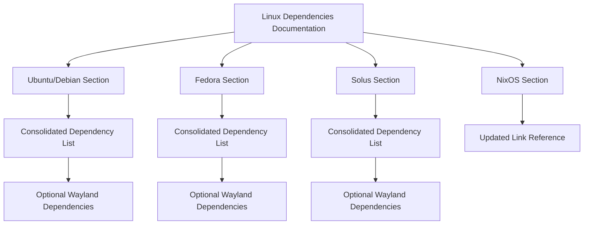

+++
title = "#21651 update linux dependencies"
date = "2025-10-26T00:00:00"
draft = false
template = "pull_request_page.html"
in_search_index = true

[taxonomies]
list_display = ["show"]

[extra]
current_language = "en"
available_languages = {"en" = { name = "English", url = "/pull_request/bevy/2025-10/pr-21651-en-20251026" }, "zh-cn" = { name = "中文", url = "/pull_request/bevy/2025-10/pr-21651-zh-cn-20251026" }}
labels = ["C-Docs", "D-Trivial", "O-Linux"]
+++

# Title
Update Linux Dependencies Documentation

## Basic Information
- **Title**: update linux dependencies
- **PR Link**: https://github.com/bevyengine/bevy/pull/21651
- **Author**: dearfl
- **Status**: MERGED
- **Labels**: C-Docs, D-Trivial, O-Linux, S-Ready-For-Final-Review
- **Created**: 2025-10-25T03:21:13Z
- **Merged**: 2025-10-26T22:10:30Z
- **Merged By**: mockersf

## Description Translation
# Objective

close #21334

## Solution

update linux dependencies in docs

## The Story of This Pull Request

This PR addresses a documentation issue in the Bevy game engine's Linux dependencies guide. The problem was that the documentation presented Wayland dependencies as mandatory requirements when they are actually optional features that only need to be installed if the user plans to use Wayland support.

The core issue stemmed from how the documentation was structured. Previously, for each Linux distribution, there were separate dependency installation sections - one for base dependencies and another specifically for Wayland dependencies. This created the impression that Wayland dependencies were always required, rather than being conditional on feature usage.

The solution approach was straightforward: consolidate the dependency lists and clearly mark Wayland dependencies as optional. The developer restructured the documentation to list all dependencies in a single code block for each distribution, with clear comments indicating which dependencies are only needed when the Wayland feature is enabled.

Looking at the implementation, the changes follow a consistent pattern across multiple distributions. For Ubuntu/Debian, Fedora, and Solus, the separate Wayland dependency sections were removed and integrated into the main dependency lists with appropriate comments. This consolidation reduces visual clutter and makes the documentation more accurate.

One notable technical insight is that this change reflects Bevy's modular architecture, where features like Wayland support are optional and can be disabled at compile time. By making the documentation match this architecture, users can more easily understand which dependencies they actually need based on their specific use case.

The impact of these changes is primarily improved user experience. Developers new to Bevy on Linux will no longer install unnecessary dependencies if they don't need Wayland support. This reduces installation time and potential conflicts, especially in containerized or minimal environments where package bloat is a concern.

Additionally, the PR includes a minor but meaningful improvement to the NixOS documentation - updating a link reference to use more descriptive markdown syntax, making it clearer what the link points to.

## Visual Representation



## Key Files Changed

**File: `docs/linux_dependencies.md`** (+4/-16)

This file contains the main Linux dependencies documentation for Bevy. The changes focus on clarifying that Wayland dependencies are optional and improving the overall structure.

**Key Changes:**

1. **Ubuntu/Debian Section Consolidation:**
```markdown
# Before:
sudo apt-get install g++ pkg-config libx11-dev libasound2-dev libudev-dev libxkbcommon-x11-0

if using Wayland, you will also need to install

sudo apt-get install libwayland-dev libxkbcommon-dev

# After:
sudo apt-get install g++ pkg-config libx11-dev libasound2-dev libudev-dev libxkbcommon-x11-0
# optional if you disabled the wayland feature
sudo apt-get install libwayland-dev libxkbcommon-dev
```

2. **Fedora Section Consolidation:**
```markdown
# Before:
sudo dnf install gcc-c++ libX11-devel alsa-lib-devel systemd-devel

if using Wayland, you will also need to install

sudo dnf install wayland-devel libxkbcommon-devel

# After:
sudo dnf install gcc-c++ libX11-devel alsa-lib-devel systemd-devel
# optional if you disabled the wayland feature
sudo dnf install wayland-devel libxkbcommon-devel
```

3. **NixOS Link Improvement:**
```markdown
# Before:
[Here](https://github.com/NixOS/nixpkgs/blob/master/pkgs/by-name/ju/jumpy/package.nix)

# After:
[nixpkgs#Jumpy](https://github.com/NixOS/nixpkgs/blob/master/pkgs/by-name/ju/jumpy/package.nix)
```

4. **Solus Section Consolidation:**
```markdown
# Before:
sudo eopkg it -c system.devel
sudo eopkg it g++ libx11-devel alsa-lib-devel

If using Wayland, you may also need to install

sudo eopkg it wayland-devel libxkbcommon-devel

# After:
sudo eopkg it -c system.devel
sudo eopkg it g++ libx11-devel alsa-lib-devel
# optional if you disabled the wayland feature
sudo eopkg it wayland-devel libxkbcommon-devel
```

These changes eliminate redundant section headers and clearly mark Wayland dependencies as optional through inline comments, making the documentation more concise and accurate.

## Further Reading

- [Bevy Features Documentation](https://github.com/bevyengine/bevy/blob/main/docs/plugins_guidelines.md#features) - Understanding how optional features work in Bevy
- [Wayland Protocol](https://wayland.freedesktop.org/) - Official Wayland documentation
- [Cargo Features Guide](https://doc.rust-lang.org/cargo/reference/features.html) - How Rust and Cargo handle feature flags
- [Linux Package Management](https://en.wikipedia.org/wiki/Package_manager) - Overview of different Linux package managers