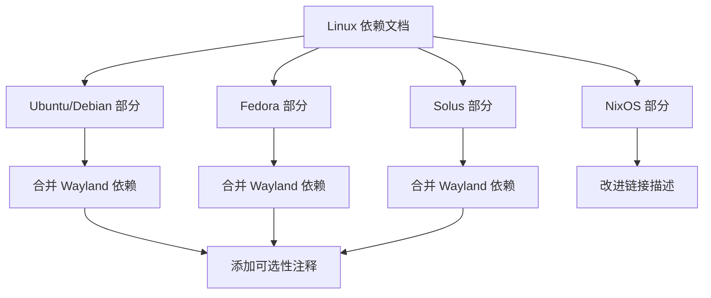

+++
title = "#21651 update linux dependencies"
date = "2025-10-26T00:00:00"
draft = false
template = "pull_request_page.html"
in_search_index = false

[extra]
current_language = "zh-cn"
available_languages = {"en" = { name = "English", url = "/pull_request/bevy/2025-10/pr-21651-en-20251026" }, "zh-cn" = { name = "中文", url = "/pull_request/bevy/2025-10/pr-21651-zh-cn-20251026" }}
labels = ["C-Docs", "D-Trivial", "O-Linux"]
+++

# Title
update linux dependencies

## Basic Information
- **Title**: update linux dependencies
- **PR Link**: https://github.com/bevyengine/bevy/pull/21651
- **Author**: dearfl
- **Status**: MERGED
- **Labels**: C-Docs, D-Trivial, O-Linux, S-Ready-For-Final-Review
- **Created**: 2025-10-25T03:21:13Z
- **Merged**: 2025-10-26T22:10:30Z
- **Merged By**: mockersf

## Description Translation
# Objective

关闭 #21334

## Solution

更新文档中的 Linux 依赖项

## The Story of This Pull Request

这个 PR 解决了一个文档维护问题。开发者发现 Linux 依赖文档中的信息需要更新，特别是关于 Wayland 相关依赖项的说明不够准确。

问题的核心在于文档中对于 Wayland 依赖的描述方式。原来的文档结构将 Wayland 依赖作为独立的部分呈现，这给用户造成了这些依赖是必需安装的误解。但实际上，Wayland 在 Bevy 中是一个可选特性（optional feature），用户可以选择禁用。

开发者采用了直接而有效的解决方案：重构文档结构，将 Wayland 依赖明确标记为可选，并通过代码注释的方式在安装命令中直接说明。这种方法有几个技术优势：

1. **减少用户困惑**：通过在安装命令旁直接添加注释，用户能立即理解这些依赖的可选性质
2. **保持文档简洁**：合并了原先分散的代码块，减少了不必要的重复和空白行
3. **改进链接可读性**：将 NixOS 部分的模糊链接描述改为更具体的引用

从实现角度看，这个 PR 主要涉及文档格式的调整而非技术内容的重大变更。开发者对多个 Linux 发行版的文档部分进行了统一处理：

- Ubuntu/Debian
- Fedora  
- Solus

每个部分都遵循相同的模式：将 Wayland 依赖安装命令合并到主依赖安装块中，并添加注释说明其可选性。

这种一致的处理方式体现了良好的工程实践 - 当发现一个模式的问题时，系统地修复所有相关实例，而不是只处理单个案例。

## Visual Representation



## Key Files Changed

### `docs/linux_dependencies.md` (+4/-16)

这个文件包含了所有 Linux 发行版的依赖安装说明。主要变更包括：

1. **合并代码块**：将 Wayland 依赖安装命令合并到主依赖安装块中
2. **添加可选性注释**：明确标注 Wayland 依赖为可选
3. **改进链接描述**：使 NixOS 示例链接更具描述性

```markdown
# Ubuntu/Debian 部分变更
# Before:
sudo apt-get install g++ pkg-config libx11-dev libasound2-dev libudev-dev libxkbcommon-x11-0

if using Wayland, you will also need to install

sudo apt-get install libwayland-dev libxkbcommon-dev

# After:
sudo apt-get install g++ pkg-config libx11-dev libasound2-dev libudev-dev libxkbcommon-x11-0
# optional if you disabled the wayland feature
sudo apt-get install libwayland-dev libxkbcommon-dev
```

```markdown
# Fedora 部分变更  
# Before:
sudo dnf install gcc-c++ libX11-devel alsa-lib-devel systemd-devel

if using Wayland, you will also need to install

sudo dnf install wayland-devel libxkbcommon-devel

# After:
sudo dnf install gcc-c++ libX11-devel alsa-lib-devel systemd-devel
# optional if you disabled the wayland feature
sudo dnf install wayland-devel libxkbcommon-devel
```

```markdown
# NixOS 链接改进
# Before:
[Here](https://github.com/NixOS/nixpkgs/blob/master/pkgs/by-name/ju/jumpy/package.nix)

# After:
[nixpkgs#Jumpy](https://github.com/NixOS/nixpkgs/blob/master/pkgs/by-name/ju/jumpy/package.nix)
```

这些变更共同改善了文档的准确性和用户体验，确保用户只安装他们实际需要的依赖项。

## Further Reading

- [Bevy 官方文档](https://bevyengine.org/learn/)
- [Wayland 协议说明](https://wayland.freedesktop.org/)
- [NixOS 包管理](https://nixos.org/learn.html)
- [Linux 包管理最佳实践](https://docs.fedoraproject.org/en-US/packaging-guidelines/)

# Full Code Diff
diff --git a/docs/linux_dependencies.md b/docs/linux_dependencies.md
index a5a43c3d5f3be..8ca4177047460 100644
--- a/docs/linux_dependencies.md
+++ b/docs/linux_dependencies.md
@@ -8,11 +8,7 @@ If you don't see your distro present in the list, feel free to add the instructi
 
 ```bash
 sudo apt-get install g++ pkg-config libx11-dev libasound2-dev libudev-dev libxkbcommon-x11-0
-```
-
-if using Wayland, you will also need to install
-
-```bash
+# optional if you disabled the wayland feature
 sudo apt-get install libwayland-dev libxkbcommon-dev
 ```
 
@@ -37,11 +33,7 @@ Following advice from before WSLg's release can lead to additional conflicts.
 
 ```bash
 sudo dnf install gcc-c++ libX11-devel alsa-lib-devel systemd-devel
-```
-
-if using Wayland, you will also need to install
-
-```bash
+# optional if you disabled the wayland feature
 sudo dnf install wayland-devel libxkbcommon-devel
 ```
 
@@ -226,7 +218,7 @@ for more information about `devShells`.
 Note that this template does not add Rust to the environment because there are many ways to do it.
 For example, to use stable Rust from nixpkgs, you can add `cargo` and `rustc` to `nativeBuildInputs`.
 
-[Here](https://github.com/NixOS/nixpkgs/blob/master/pkgs/by-name/ju/jumpy/package.nix)
+[nixpkgs#Jumpy](https://github.com/NixOS/nixpkgs/blob/master/pkgs/by-name/ju/jumpy/package.nix)
 is an example of packaging a Bevy program in nix.
 
 ## [OpenSUSE](https://www.opensuse.org/)
@@ -278,11 +270,7 @@ rustflags = ["-C", "target-feature=-crt-static"]
 ```sh
 sudo eopkg it -c system.devel
 sudo eopkg it g++ libx11-devel alsa-lib-devel
-```
-
-If using Wayland, you may also need to install
-
-```sh
+# optional if you disabled the wayland feature
 sudo eopkg it wayland-devel libxkbcommon-devel
 ```
