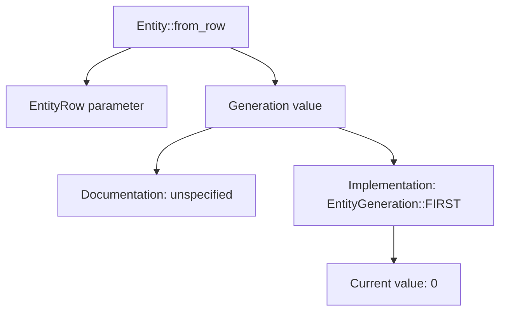

+++
title = "#21652 fix docs for `Entity::from_row`"
date = "2025-10-25T00:00:00"
draft = false
template = "pull_request_page.html"
in_search_index = true

[taxonomies]
list_display = ["show"]

[extra]
current_language = "en"
available_languages = {"en" = { name = "English", url = "/pull_request/bevy/2025-10/pr-21652-en-20251025" }, "zh-cn" = { name = "中文", url = "/pull_request/bevy/2025-10/pr-21652-zh-cn-20251025" }}
labels = ["C-Docs", "A-ECS", "X-Contentious"]
+++

# Title
fix docs for `Entity::from_row`

## Basic Information
- **Title**: fix docs for `Entity::from_row`
- **PR Link**: https://github.com/bevyengine/bevy/pull/21652
- **Author**: zacryol
- **Status**: MERGED
- **Labels**: C-Docs, A-ECS, S-Ready-For-Final-Review, X-Contentious
- **Created**: 2025-10-25T03:38:33Z
- **Merged**: 2025-10-25T20:44:23Z
- **Merged By**: mockersf

## Description Translation
# Objective

The docs state that `Entity::from_row` creates an entity with a generation of `1`, which was the case previously. With `Entity` internals being reworked in `0.17` however, this is no longer the case, as the generation used is now `EntityGeneration::FIRST`, currently equivalent to `0`.

## Solution

This PR changes the docs to state an "unspecified" generation to allow further changes to implementation without needing another rewrite, as the docs rather consistently refer to `Entity`, `EntityRow`, and `EntityGeneration` as being opaque identifiers.

## The Story of This Pull Request

This PR addresses a documentation inconsistency that emerged from changes to Bevy's Entity Component System (ECS) internals. The core issue was straightforward: the documentation for `Entity::from_row` was outdated and no longer reflected the actual implementation behavior.

Before Bevy 0.17, the `Entity::from_row` method consistently created entities with a generation value of 1. However, when the Entity internals were reworked in version 0.17, this implementation detail changed. The method now uses `EntityGeneration::FIRST`, which currently evaluates to 0. This created a mismatch between the documented behavior and the actual implementation.

The developer took a pragmatic approach to solving this problem. Instead of simply updating the documentation to reflect the new generation value (0), they chose to make the documentation more future-proof. By describing the generation as "unspecified," the documentation now aligns with the intended design principle that `Entity`, `EntityRow`, and `EntityGeneration` should be treated as opaque identifiers.

This approach has several technical benefits. First, it prevents the documentation from becoming outdated again if the implementation changes in the future. Second, it reinforces the abstraction boundary by not exposing internal implementation details. Third, it maintains consistency with other parts of the ECS documentation that treat these types as opaque.

The change is minimal but significant because documentation accuracy is crucial for developers relying on these APIs. When documentation specifies concrete implementation details that later change, it can lead to subtle bugs or confusion. By making the documentation more abstract, this PR helps maintain the stability of the public API contract.

The implementation itself is a single-line change to the documentation comment, but it reflects important engineering principles about API design and documentation practices. It demonstrates how small documentation fixes can have meaningful impact on code maintainability and developer experience.

## Visual Representation



## Key Files Changed

**File:** `crates/bevy_ecs/src/entity/mod.rs`

This file contains the core Entity implementation for Bevy's ECS system. The change modifies the documentation for the `from_row` method to be more abstract and future-proof.

**Code Change:**
```rust
// Before:
/// Creates a new entity ID with the specified `row` and a generation of 1.

// After:  
/// Creates a new entity ID with the specified `row` and an unspecified generation.
```

The change replaces the specific generation value (1) with the more abstract description "unspecified generation." This aligns with the broader documentation strategy of treating Entity components as opaque identifiers.

## Further Reading

- [Bevy ECS Documentation](https://docs.rs/bevy_ecs/latest/bevy_ecs/) - Official Bevy ECS documentation
- [Entity Component System Pattern](https://en.wikipedia.org/wiki/Entity_component_system) - Overview of ECS architecture
- [API Design Principles](https://rust-lang.github.io/api-guidelines/) - Rust API guidelines relevant to documentation practices
- [Bevy 0.17 Release Notes](https://bevyengine.org/news/bevy-0-17/) - Context for the Entity internals rework mentioned in the PR

# Full Code Diff
diff --git a/crates/bevy_ecs/src/entity/mod.rs b/crates/bevy_ecs/src/entity/mod.rs
index dd1b1b24f7c78..c7f94bd4d3252 100644
--- a/crates/bevy_ecs/src/entity/mod.rs
+++ b/crates/bevy_ecs/src/entity/mod.rs
@@ -496,7 +496,7 @@ impl Entity {
     /// ```
     pub const PLACEHOLDER: Self = Self::from_row(EntityRow::PLACEHOLDER);
 
-    /// Creates a new entity ID with the specified `row` and a generation of 1.
+    /// Creates a new entity ID with the specified `row` and an unspecified generation.
     ///
     /// # Note
     ///