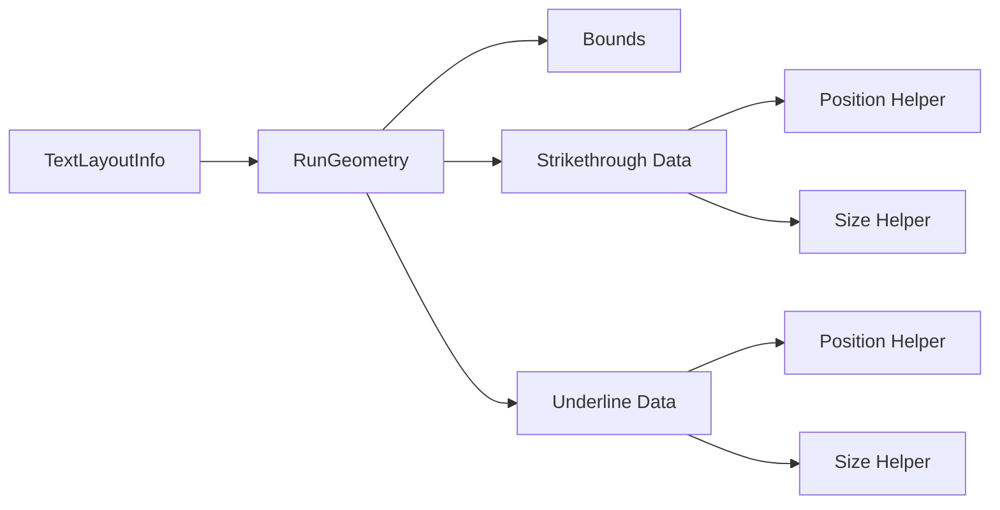

+++
title = "#21656 `RunGeometry`"
date = "2025-10-29T00:00:00"
draft = false
template = "pull_request_page.html"
in_search_index = true

[taxonomies]
list_display = ["show"]

[extra]
current_language = "en"
available_languages = {"en" = { name = "English", url = "/pull_request/bevy/2025-10/pr-21656-en-20251029" }, "zh-cn" = { name = "中文", url = "/pull_request/bevy/2025-10/pr-21656-zh-cn-20251029" }}
labels = ["C-Code-Quality", "A-Text", "D-Straightforward"]
+++

# Title
`RunGeometry`

## Basic Information
- **Title**: `RunGeometry`
- **PR Link**: https://github.com/bevyengine/bevy/pull/21656
- **Author**: ickshonpe
- **Status**: MERGED
- **Labels**: C-Code-Quality, S-Ready-For-Final-Review, A-Text, D-Straightforward
- **Created**: 2025-10-25T12:28:55Z
- **Merged**: 2025-10-29T21:58:24Z
- **Merged By**: alice-i-cecile

## Description Translation

# Objective

Follow up to the underline and strikethrough PRs:
* Replace the quintuples stored in `TextLayoutInfo::section_geometry` with a struct with named fields.
* Rename  `TextLayoutInfo::section_geometry` because "section" in our terminology implies a one-to-one correspondence with text entities.
* Add some basic helpers to construct the underline and strikethrough lines.
* Seperate the thickness values for underline and strikethrough. This is needed for an API that allows users to set custom thicknesses.

## Solution

* New struct `RunGeometry`. `RunGeometry` holds the bounds and decoration geometry for each text run (a contiguous sequence of glyphs on a line that share text attributes). It has helper methods for placing underline and strikethrough.
* Rename the `section_geometry` field to `run_geometry` and make it a `Vec<RunGeometry>`
* `RunGeometry` has seperate `underline_thickness` and `strikethrough_thickness` values.

## The Story of This Pull Request

This PR addresses several technical debt issues in Bevy's text rendering system that became apparent after implementing underline and strikethrough features. The core problem was that text layout information was stored in unstructured tuples, making the code difficult to understand and maintain.

The previous implementation used a `Vec<(usize, Rect, f32, f32, f32)>` to store text geometry data, where each tuple represented a text section's layout information. This approach had several problems:

1. **Poor code readability**: The tuple elements were anonymous, requiring developers to remember what each position represented
2. **Inconsistent terminology**: The field name "section_geometry" was misleading because in Bevy's terminology, a "section" corresponds to a text entity, but the data actually represented "runs" - contiguous glyph sequences on a line with shared attributes
3. **Limited extensibility**: The tuple structure made it difficult to add new properties or modify existing ones
4. **Code duplication**: Multiple places in the codebase were manually calculating underline and strikethrough positions

The solution introduced a new `RunGeometry` struct that provides named fields and helper methods:

```rust
#[derive(Default, Debug, Clone, Reflect)]
pub struct RunGeometry {
    pub span_index: usize,
    pub bounds: Rect,
    pub strikethrough_y: f32,
    pub strikethrough_thickness: f32,
    pub underline_y: f32,
    pub underline_thickness: f32,
}
```

This struct includes helper methods like `strikethrough_position()`, `strikethrough_size()`, `underline_position()`, and `underline_size()` that encapsulate the calculations previously scattered throughout the codebase.

The implementation required changes across multiple rendering systems. In the text pipeline, the code that previously pushed tuples was updated to create `RunGeometry` instances:

```rust
// Before:
layout_info.section_geometry.push((
    section,
    Rect::new(start, run.line_top, end, run.line_top + run.line_height),
    (run.line_y - self.glyph_info[section].3).round(),
    self.glyph_info[section].4,
    (run.line_y - self.glyph_info[section].5).round(),
));

// After:
layout_info.run_geometry.push(RunGeometry {
    span_index: section,
    bounds: Rect::new(start, run.line_top, end, run.line_top + run.line_height),
    strikethrough_y: (run.line_y - self.glyph_info[section].3).round(),
    strikethrough_thickness: self.glyph_info[section].4,
    underline_y: (run.line_y - self.glyph_info[section].5).round(),
    underline_thickness: self.glyph_info[section].4,
});
```

One significant technical improvement was the separation of underline and strikethrough thickness values. While they currently use the same value (`self.glyph_info[section].4`), the struct now provides separate fields, enabling future customization of these values independently.

The consumption sites in sprite rendering and UI rendering were updated to use the new helper methods:

```rust
// Before:
let offset = Vec2::new(rect.center().x, -strikethrough_y - 0.5 * stroke);
let custom_size = Some(Vec2::new(rect.size().x, stroke));

// After:
let offset = run.strikethrough_position() * Vec2::new(1., -1.);
let custom_size = Some(run.strikethrough_size());
```

This change significantly improves code clarity by replacing manual calculations with descriptive method calls. The helper methods handle the coordinate system transformations and positioning logic consistently across the codebase.

The PR also includes a migration guide that explains the conceptual shift from "sections" to "runs" and provides guidance for developers who need to update their code. This is particularly important because the new `RunGeometry` struct doesn't include entity IDs directly - developers must use the `span_index` to look up entities in the `ComputedTextBlock`.

## Visual Representation



## Key Files Changed

### `crates/bevy_text/src/pipeline.rs` (+71/-18)
This file contains the core text layout pipeline where the `RunGeometry` struct was introduced and the text layout algorithm was updated to use it.

**Key changes:**
- Introduced the `RunGeometry` struct with named fields and helper methods
- Updated the text layout algorithm to create `RunGeometry` instances instead of tuples
- Renamed `section_geometry` field to `run_geometry`

```rust
// New struct definition
#[derive(Default, Debug, Clone, Reflect)]
pub struct RunGeometry {
    pub span_index: usize,
    pub bounds: Rect,
    pub strikethrough_y: f32,
    pub strikethrough_thickness: f32,
    pub underline_y: f32,
    pub underline_thickness: f32,
}

// Helper methods implementation
impl RunGeometry {
    pub fn strikethrough_position(&self) -> Vec2 {
        Vec2::new(
            self.bounds.center().x,
            self.strikethrough_y + 0.5 * self.strikethrough_thickness,
        )
    }
    
    pub fn strikethrough_size(&self) -> Vec2 {
        Vec2::new(self.bounds.size().x, self.strikethrough_thickness)
    }
}
```

### `crates/bevy_ui_render/src/lib.rs` (+14/-33)
This file handles UI text rendering and was updated to use the new `RunGeometry` helper methods.

**Key changes:**
- Replaced manual calculations with `RunGeometry` helper methods
- Simplified offset and size calculations for text decorations

```rust
// Before:
transform: node_transform * Affine2::from_translation(Vec2::new(
    rect.center().x,
    strikethrough_y + 0.5 * stroke,
)),

// After:
transform: node_transform * Affine2::from_translation(run.strikethrough_position()),
```

### `crates/bevy_sprite_render/src/text2d/mod.rs` (+16/-20)
This file handles 2D sprite text rendering and was similarly updated to use the new helper methods.

**Key changes:**
- Updated background color extraction to use `run.bounds` instead of tuple elements
- Simplified strikethrough and underline rendering using helper methods

```rust
// Before:
for &(section_index, rect, strikethrough_y, stroke, underline_y) in text_layout_info.section_geometry.iter()

// After:
for run in text_layout_info.run_geometry.iter()
```

### `release-content/migration-guides/text_layout_info_section_rects_is_replaced_by_run_geometry.md` (+9/-0)
This new file provides migration guidance for developers.

**Key content:**
- Explains the conceptual shift from sections to runs
- Documents how to access entity information using `span_index`
- Describes the coordinate system used in the new structure

## Further Reading

- [Bevy Text Rendering Documentation](https://docs.rs/bevy_text/latest/bevy_text/)
- [Text Layout and Rendering in Game Engines](https://faultlore.com/blah/text-hates-you/)
- [Rust Struct Best Practices](https://doc.rust-lang.org/book/ch05-01-defining-structs.html)