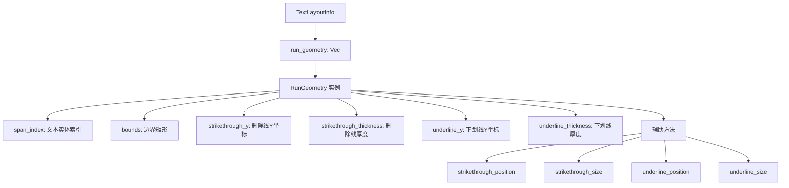

+++
title = "#21656 RunGeometry"
date = "2025-10-29T00:00:00"
draft = false
template = "pull_request_page.html"
in_search_index = false

[extra]
current_language = "zh-cn"
available_languages = {"en" = { name = "English", url = "/pull_request/bevy/2025-10/pr-21656-en-20251029" }, "zh-cn" = { name = "中文", url = "/pull_request/bevy/2025-10/pr-21656-zh-cn-20251029" }}
+++

# RunGeometry

## 基本情报
- **标题**: `RunGeometry`
- **PR链接**: https://github.com/bevyengine/bevy/pull/21656
- **作者**: ickshonpe
- **状态**: 已合并
- **标签**: C-Code-Quality, S-Ready-For-Final-Review, A-Text, D-Straightforward
- **创建时间**: 2025-10-25T12:28:55Z
- **合并时间**: 2025-10-29T21:58:24Z
- **合并者**: alice-i-cecile

## 描述翻译

### 目标
- 跟进下划线和删除线相关的PR：
  * 将`TextLayoutInfo::section_geometry`中存储的五元组替换为具有命名字段的结构体。
  * 重命名`TextLayoutInfo::section_geometry`，因为在我们的术语中，"section"暗示与文本实体的一一对应关系。
  * 添加一些基本的辅助方法来构建下划线和删除线。
  * 分离下划线和删除线的厚度值。这是为了允许用户设置自定义厚度的API。

### 解决方案
- 新的结构体`RunGeometry`。`RunGeometry`保存每个文本运行（一行中具有相同文本属性的连续字形序列）的边界和装饰几何信息。它提供了放置下划线和删除线的辅助方法。
- 将`section_geometry`字段重命名为`run_geometry`并使其成为`Vec<RunGeometry>`
- `RunGeometry`具有独立的`underline_thickness`和`strikethrough_thickness`值。

## 这个PR的故事

这个PR主要解决文本渲染系统中几何信息表示的问题。在之前的实现中，文本布局信息使用了五元组来存储几何数据，这种表示方式存在几个明显的问题。

首先，五元组的可读性很差。当开发者看到`(section_index, rect, strikethrough_y, stroke, underline_y)`这样的代码时，很难直观理解每个字段的含义，特别是`stroke`字段同时用于下划线和删除线的厚度，这限制了未来API的扩展性。

其次，术语使用不准确。在Bevy的文本系统中，"section"指的是文本实体，但一个文本实体可能跨越多个行，从而产生多个"run"（运行）。原来的字段名`section_geometry`容易引起混淆。

解决方案是引入`RunGeometry`结构体来替代五元组。这个结构体通过命名字段提高了代码的可读性：

```rust
pub struct RunGeometry {
    pub span_index: usize,
    pub bounds: Rect,
    pub strikethrough_y: f32,
    pub strikethrough_thickness: f32,
    pub underline_y: f32,
    pub underline_thickness: f32,
}
```

更重要的是，这个重构分离了下划线和删除线的厚度值，为将来支持用户自定义装饰线厚度提供了基础。之前两个装饰线共享同一个`stroke`值，现在可以独立控制。

在实现过程中，作者还添加了辅助方法来简化下划线和删除线的定位计算：

```rust
impl RunGeometry {
    pub fn strikethrough_position(&self) -> Vec2 {
        Vec2::new(
            self.bounds.center().x,
            self.strikethrough_y + 0.5 * self.strikethrough_thickness,
        )
    }
    
    pub fn strikethrough_size(&self) -> Vec2 {
        Vec2::new(self.bounds.size().x, self.strikethrough_thickness)
    }
}
```

这些方法封装了之前散布在多个渲染模块中的重复计算逻辑，提高了代码的复用性和可维护性。

在文本布局管道的核心逻辑中，创建几何信息的代码从使用元组：

```rust
layout_info.section_geometry.push((
    section,
    Rect::new(start, run.line_top, end, run.line_top + run.line_height),
    (run.line_y - self.glyph_info[section].3).round(),
    self.glyph_info[section].4,
    (run.line_y - self.glyph_info[section].5).round(),
));
```

改为使用结构体：

```rust
layout_info.run_geometry.push(RunGeometry {
    span_index: section,
    bounds: Rect::new(start, run.line_top, end, run.line_top + run.line_height),
    strikethrough_y: (run.line_y - self.glyph_info[section].3).round(),
    strikethrough_thickness: self.glyph_info[section].4,
    underline_y: (run.line_y - self.glyph_info[section].5).round(),
    underline_thickness: self.glyph_info[section].4,
});
```

这种改变使得代码更加自文档化，也更容易在未来进行扩展。

在渲染端，多个模块（UI渲染、2D精灵渲染）都需要更新来使用新的API。这些更新主要涉及：

1. 将循环从遍历元组改为遍历`RunGeometry`结构体
2. 使用新的辅助方法替代手动的几何计算
3. 更新字段访问方式

例如，在文本背景渲染中：

```rust
// 之前：
let offset = Vec2::new(rect.center().x, -rect.center().y);
let custom_size = Some(rect.size());

// 之后：
let offset = Vec2::new(run.bounds.center().x, -run.bounds.center().y);
let custom_size = Some(run.bounds.size());
```

这种重构虽然涉及多个文件，但每个文件的修改都是系统性的，遵循相同的模式，降低了引入错误的风险。

## 视觉表示



## 关键文件更改

### `crates/bevy_text/src/pipeline.rs` (+71/-18)

这是核心的文本布局管道，定义了新的`RunGeometry`结构体和相关的辅助方法。

**主要更改：**

```rust
// 新的RunGeometry结构体定义
#[derive(Default, Debug, Clone, Reflect)]
pub struct RunGeometry {
    pub span_index: usize,
    pub bounds: Rect,
    pub strikethrough_y: f32,
    pub strikethrough_thickness: f32,
    pub underline_y: f32,
    pub underline_thickness: f32,
}

// 辅助方法实现
impl RunGeometry {
    pub fn strikethrough_position(&self) -> Vec2 {
        Vec2::new(
            self.bounds.center().x,
            self.strikethrough_y + 0.5 * self.strikethrough_thickness,
        )
    }
    
    pub fn strikethrough_size(&self) -> Vec2 {
        Vec2::new(self.bounds.size().x, self.strikethrough_thickness)
    }
    
    // 类似的underline方法...
}
```

### `crates/bevy_ui_render/src/lib.rs` (+14/-33)

UI渲染模块更新以使用新的`RunGeometry`API。

**主要更改：**

```rust
// 之前：
for &(section_index, rect, strikethrough_y, stroke, underline_y) in 
    text_layout_info.section_geometry.iter() 

// 之后：
for run in text_layout_info.run_geometry.iter()

// 使用辅助方法替代手动计算：
transform: node_transform * Affine2::from_translation(run.strikethrough_position()),
max: run.strikethrough_size(),
```

### `crates/bevy_sprite_render/src/text2d/mod.rs` (+16/-20)

2D精灵渲染模块的类似更新。

**主要更改：**

```rust
// 使用新的辅助方法：
let offset = run.strikethrough_position() * Vec2::new(1., -1.);
let custom_size = Some(run.strikethrough_size());
```

### `release-content/migration-guides/text_layout_info_section_rects_is_replaced_by_run_geometry.md` (+9/-0)

新增的迁移指南，帮助开发者从旧的API迁移到新的API。

## 进一步阅读

- [Bevy文本渲染文档](https://docs.rs/bevy_text/latest/bevy_text/)
- [Rust结构体最佳实践](https://doc.rust-lang.org/book/ch05-01-defining-structs.html)
- [代码重构模式](https://refactoring.com/catalog/)