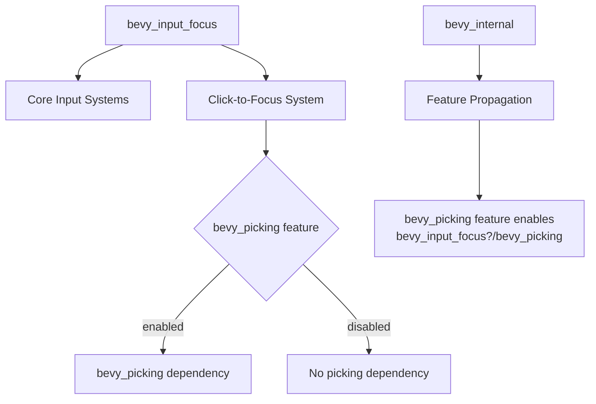

+++
title = "#21659 make bevy_input_focus dep on bevy_picking optional"
date = "2025-10-26T00:00:00"
draft = false
template = "pull_request_page.html"
in_search_index = true

[taxonomies]
list_display = ["show"]

[extra]
current_language = "en"
available_languages = {"en" = { name = "English", url = "/pull_request/bevy/2025-10/pr-21659-en-20251026" }, "zh-cn" = { name = "中文", url = "/pull_request/bevy/2025-10/pr-21659-zh-cn-20251026" }}
labels = ["A-Windowing", "A-UI", "C-Code-Quality"]
+++

# Title
make bevy_input_focus dep on bevy_picking optional

## Basic Information
- **Title**: make bevy_input_focus dep on bevy_picking optional
- **PR Link**: https://github.com/bevyengine/bevy/pull/21659
- **Author**: atlv24
- **Status**: MERGED
- **Labels**: A-Windowing, A-UI, C-Code-Quality, S-Ready-For-Final-Review
- **Created**: 2025-10-26T15:21:09Z
- **Merged**: 2025-10-26T19:37:27Z
- **Merged By**: alice-i-cecile

## Description Translation
# Objective

- Fixes #21413

## Solution

- make bevy_input_focus dep on bevy_picking optional

## Testing

- ci

## The Story of This Pull Request

This PR addresses a dependency management issue in the Bevy engine's input focus system. The core problem was that `bevy_input_focus` had a hard dependency on `bevy_picking`, which created unnecessary coupling and forced users to include picking functionality even when they didn't need it.

The solution follows a straightforward conditional compilation approach. The key insight was that only one specific feature - click-to-focus functionality - actually required the picking system. By making the dependency optional and using Rust's feature flags, we can maintain the existing functionality for users who need picking while allowing others to exclude it.

The implementation involved three coordinated changes across the codebase. First, in `Cargo.toml`, the dependency declaration was modified to mark `bevy_picking` as optional. This tells Cargo that the dependency doesn't always need to be present:

```toml
# Before:
bevy_picking = { path = "../bevy_picking", version = "0.18.0-dev", default-features = false }

# After:
bevy_picking = { path = "../bevy_picking", version = "0.18.0-dev", default-features = false, optional = true }
```

Next, in the tab navigation implementation, the code was restructured to conditionally include picking-related functionality. The `click_to_focus` system, which handles mouse click interactions to change focus, was wrapped in a `#[cfg(feature = "bevy_picking")]` attribute. This ensures the system only compiles when the picking feature is enabled. The function signature was also updated to use fully qualified paths for the picking types, avoiding the need for the `use` statement that was removed:

```rust
// Before:
use bevy_picking::events::{Pointer, Press};
// ... later in the code without conditionals
app.add_observer(click_to_focus);

// After:
#[cfg(feature = "bevy_picking")]
fn click_to_focus(
    press: On<bevy_picking::events::Pointer<bevy_picking::events::Press>>,
    // ... parameters
)
```

Finally, the internal Cargo.toml was updated to properly propagate the feature flag, ensuring that when users enable the `bevy_picking` feature at the top level, it automatically enables the corresponding feature in `bevy_input_focus`.

This approach demonstrates a common pattern in Rust ecosystem development: using optional dependencies and feature flags to make functionality modular. The change reduces binary size and compile times for users who don't need picking functionality, while maintaining full backward compatibility for those who do.

## Visual Representation



## Key Files Changed

### `crates/bevy_input_focus/Cargo.toml`
**Changes**: Made `bevy_picking` dependency optional by adding `optional = true`
```toml
# Before:
bevy_picking = { path = "../bevy_picking", version = "0.18.0-dev", default-features = false }

# After:  
bevy_picking = { path = "../bevy_picking", version = "0.18.0-dev", default-features = false, optional = true }
```

### `crates/bevy_input_focus/src/tab_navigation.rs`
**Changes**: Conditionally compiled picking-related code and removed direct imports
```rust
// Before:
use bevy_picking::events::{Pointer, Press};
// ... in Plugin implementation
app.add_observer(click_to_focus);

// After:
// use statement removed
// ... in Plugin implementation  
app.add_observer(acquire_focus);
#[cfg(feature = "bevy_picking")]
app.add_observer(click_to_focus);

// Function made conditional:
#[cfg(feature = "bevy_picking")]
fn click_to_focus(
    press: On<bevy_picking::events::Pointer<bevy_picking::events::Press>>,
    // ... rest of function
)
```

### `crates/bevy_internal/Cargo.toml`
**Changes**: Updated feature propagation to handle the optional dependency
```toml
# Before:
bevy_picking = ["dep:bevy_picking"]

# After:
bevy_picking = ["dep:bevy_picking", "bevy_input_focus?/bevy_picking"]
```

## Further Reading

- [Rust Book: Features](https://doc.rust-lang.org/cargo/reference/features.html) - Official documentation on Cargo features and optional dependencies
- [Bevy Engine Documentation](https://bevyengine.org/learn/) - General Bevy engine concepts and architecture
- [Conditional Compilation in Rust](https://doc.rust-lang.org/reference/conditional-compilation.html) - Rust reference on `#[cfg]` attributes and feature-based compilation

# Full Code Diff
```
diff --git a/crates/bevy_input_focus/Cargo.toml b/crates/bevy_input_focus/Cargo.toml
index 1766ee2243b31..45d6acb60539c 100644
--- a/crates/bevy_input_focus/Cargo.toml
+++ b/crates/bevy_input_focus/Cargo.toml
@@ -64,7 +64,7 @@ bevy_app = { path = "../bevy_app", version = "0.18.0-dev", default-features = fa
 bevy_ecs = { path = "../bevy_ecs", version = "0.18.0-dev", default-features = false }
 bevy_input = { path = "../bevy_input", version = "0.18.0-dev", default-features = false }
 bevy_math = { path = "../bevy_math", version = "0.18.0-dev", default-features = false }
-bevy_picking = { path = "../bevy_picking", version = "0.18.0-dev", default-features = false }
+bevy_picking = { path = "../bevy_picking", version = "0.18.0-dev", default-features = false, optional = true }
 bevy_window = { path = "../bevy_window", version = "0.18.0-dev", default-features = false }
 bevy_reflect = { path = "../bevy_reflect", version = "0.18.0-dev", features = [
   "glam",
diff --git a/crates/bevy_input_focus/src/tab_navigation.rs b/crates/bevy_input_focus/src/tab_navigation.rs
index a490d00dda10e..b8ce6a8d95375 100644
--- a/crates/bevy_input_focus/src/tab_navigation.rs
+++ b/crates/bevy_input_focus/src/tab_navigation.rs
@@ -38,7 +38,6 @@ use bevy_input::{
     keyboard::{KeyCode, KeyboardInput},
     ButtonInput, ButtonState,
 };
-use bevy_picking::events::{Pointer, Press};
 use bevy_window::{PrimaryWindow, Window};
 use log::warn;
 use thiserror::Error;
@@ -346,6 +345,7 @@ impl Plugin for TabNavigationPlugin {
     fn build(&self, app: &mut App) {
         app.add_systems(Startup, setup_tab_navigation);
         app.add_observer(acquire_focus);
+        #[cfg(feature = "bevy_picking")]
         app.add_observer(click_to_focus);
     }
 }
@@ -356,8 +356,9 @@ fn setup_tab_navigation(mut commands: Commands, window: Query<Entity, With<Prima
     }
 }
 
+#[cfg(feature = "bevy_picking")]
 fn click_to_focus(
-    press: On<Pointer<Press>>,
+    press: On<bevy_picking::events::Pointer<bevy_picking::events::Press>>,
     mut focus_visible: ResMut<InputFocusVisible>,
     windows: Query<Entity, With<PrimaryWindow>>,
     mut commands: Commands,
diff --git a/crates/bevy_internal/Cargo.toml b/crates/bevy_internal/Cargo.toml
index 32784290611be..f6872757b04a7 100644
--- a/crates/bevy_internal/Cargo.toml
+++ b/crates/bevy_internal/Cargo.toml
@@ -316,7 +316,7 @@ pan_camera = ["bevy_camera_controller/pan_camera"]
 bevy_remote = ["dep:bevy_remote", "serialize"]
 
 # Provides picking functionality
-bevy_picking = ["dep:bevy_picking"]
+bevy_picking = ["dep:bevy_picking", "bevy_input_focus?/bevy_picking"]
 
 # Provides a mesh picking backend
 mesh_picking = ["bevy_picking", "bevy_picking/mesh_picking"]
```