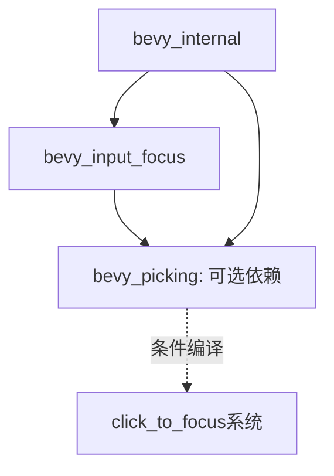

+++
title = "#21659 make bevy_input_focus dep on bevy_picking optional"
date = "2025-10-26T00:00:00"
draft = false
template = "pull_request_page.html"
in_search_index = false

[extra]
current_language = "zh-cn"
available_languages = {"en" = { name = "English", url = "/pull_request/bevy/2025-10/pr-21659-en-20251026" }, "zh-cn" = { name = "中文", url = "/pull_request/bevy/2025-10/pr-21659-zh-cn-20251026" }}
+++

# 标题

## 基本信息
- **标题**: make bevy_input_focus dep on bevy_picking optional
- **PR链接**: https://github.com/bevyengine/bevy/pull/21659
- **作者**: atlv24
- **状态**: 已合并
- **标签**: A-Windowing, A-UI, C-Code-Quality, S-Ready-For-Final-Review
- **创建时间**: 2025-10-26T15:21:09Z
- **合并时间**: 2025-10-26T19:37:27Z
- **合并者**: alice-i-cecile

## 描述翻译

### 目标
- 修复 #21413

### 解决方案
- 使 bevy_input_focus 对 bevy_picking 的依赖变为可选

### 测试
- CI

## 这个PR的故事

这个PR解决了一个依赖管理问题。在Bevy游戏引擎中，`bevy_input_focus`模块负责处理输入焦点管理，但之前强制依赖于`bevy_picking`模块，即使某些项目可能不需要点选功能。

问题的核心在于依赖的强制性。当开发者想要使用`bevy_input_focus`的功能但不需要点选系统时，仍然被迫引入`bevy_picking`的所有依赖和编译开销。这在构建轻量级应用或针对特定平台的构建时尤其成问题。

解决方案采用了Rust生态系统中的常见模式：条件编译。开发者通过将`bevy_picking`依赖标记为可选，并在使用该依赖的代码周围添加条件编译指令来实现解耦。

具体实现分为三个部分：

首先，在`crates/bevy_input_focus/Cargo.toml`中，将`bevy_picking`依赖添加了`optional = true`标志。这使得该依赖变为可选，只有在明确启用相应特性时才会被包含。

```toml
# 修改前：
bevy_picking = { path = "../bevy_picking", version = "0.18.0-dev", default-features = false }

# 修改后：
bevy_picking = { path = "../bevy_picking", version = "0.18.0-dev", default-features = false, optional = true }
```

其次，在`crates/bevy_input_focus/src/tab_navigation.rs`中，将与点选相关的功能包装在条件编译块中。关键的`click_to_focus`函数现在只在启用`bevy_picking`特性时才会被编译和注册：

```rust
// 修改前：
use bevy_picking::events::{Pointer, Press};

// 修改后：
// 移除了顶层的use语句，改为在函数内使用完整路径

// 在Plugin实现中：
#[cfg(feature = "bevy_picking")]
app.add_observer(click_to_focus);

// click_to_focus函数现在被条件编译保护：
#[cfg(feature = "bevy_picking")]
fn click_to_focus(
    press: On<bevy_picking::events::Pointer<bevy_picking::events::Press>>,
    // ... 其他参数
) {
    // 函数实现
}
```

最后，在`crates/bevy_internal/Cargo.toml`中更新了特性传播，确保当启用`bevy_picking`特性时，`bevy_input_focus`也会启用相应的可选特性：

```toml
# 修改前：
bevy_picking = ["dep:bevy_picking"]

# 修改后：
bevy_picking = ["dep:bevy_picking", "bevy_input_focus?/bevy_picking"]
```

这种实现方式展示了Rust条件编译和特性系统的有效使用。通过将可选依赖隔离在特性门控后面，项目现在可以：

1. 减少不必要的依赖，降低编译时间和二进制大小
2. 保持向后兼容性 - 现有代码无需修改
3. 提供更好的模块化，允许开发者只包含他们需要的功能

从工程角度来看，这是一个典型的依赖解耦模式。通过将强依赖转换为可选依赖，提高了代码的灵活性和可重用性，同时保持了现有的功能完整性。

## 视觉表示



## 关键文件更改

### `crates/bevy_input_focus/Cargo.toml`
**更改描述**: 将bevy_picking依赖标记为可选
```toml
# 修改前:
bevy_picking = { path = "../bevy_picking", version = "0.18.0-dev", default-features = false }

# 修改后:
bevy_picking = { path = "../bevy_picking", version = "0.18.0-dev", default-features = false, optional = true }
```

### `crates/bevy_input_focus/src/tab_navigation.rs`
**更改描述**: 添加条件编译保护点选相关功能
```rust
// 修改前:
use bevy_picking::events::{Pointer, Press};

// 在Plugin构建中:
app.add_observer(click_to_focus);

// 修改后:
// 移除了use语句

// 在Plugin构建中:
#[cfg(feature = "bevy_picking")]
app.add_observer(click_to_focus);

// 添加了条件编译属性:
#[cfg(feature = "bevy_picking")]
fn click_to_focus(
    press: On<bevy_picking::events::Pointer<bevy_picking::events::Press>>,
    // ... 参数
) {
    // 函数体保持不变
}
```

### `crates/bevy_internal/Cargo.toml`
**更改描述**: 更新特性传播以包含可选依赖
```toml
# 修改前:
bevy_picking = ["dep:bevy_picking"]

# 修改后:
bevy_picking = ["dep:bevy_picking", "bevy_input_focus?/bevy_picking"]
```

## 进一步阅读

- [Rust Cargo特性指南](https://doc.rust-lang.org/cargo/reference/features.html)
- [Bevy引擎架构文档](https://bevyengine.org/learn/book/introduction/)
- [条件编译在Rust中的使用](https://doc.rust-lang.org/reference/attributes.html#conditional-compilation)