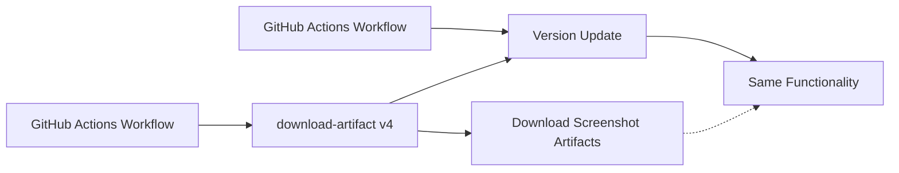

+++
title = "#21664 Bump actions/download-artifact from 4 to 6"
date = "2025-10-27T00:00:00"
draft = false
template = "pull_request_page.html"
in_search_index = true

[taxonomies]
list_display = ["show"]

[extra]
current_language = "en"
available_languages = {"en" = { name = "English", url = "/pull_request/bevy/2025-10/pr-21664-en-20251027" }, "zh-cn" = { name = "中文", url = "/pull_request/bevy/2025-10/pr-21664-zh-cn-20251027" }}
labels = ["D-Trivial", "C-Dependencies"]
+++

# Title
Bump actions/download-artifact from 4 to 6

## Basic Information
- **Title**: Bump actions/download-artifact from 4 to 6
- **PR Link**: https://github.com/bevyengine/bevy/pull/21664
- **Author**: app/dependabot
- **Status**: MERGED
- **Labels**: D-Trivial, C-Dependencies, S-Ready-For-Final-Review
- **Created**: 2025-10-27T06:18:16Z
- **Merged**: 2025-10-27T22:11:32Z
- **Merged By**: mockersf

## Description Translation
Bumps [actions/download-artifact](https://github.com/actions/download-artifact) from 4 to 6.
<details>
<summary>Release notes</summary>
<p><em>Sourced from <a href="https://github.com/actions/download-artifact/releases">actions/download-artifact's releases</a>.</em></p>
<blockquote>
<h2>v6.0.0</h2>
<h2>What's Changed</h2>
<p><strong>BREAKING CHANGE:</strong> this update supports Node <code>v24.x</code>. This is not a breaking change per-se but we're treating it as such.</p>
<ul>
<li>Update README for download-artifact v5 changes by <a href="https://github.com/yacaovsnc"><code>@​yacaovsnc</code></a> in <a href="https://redirect.github.com/actions/download-artifact/pull/417">actions/download-artifact#417</a></li>
<li>Update README with artifact extraction details by <a href="https://github.com/yacaovsnc"><code>@​yacaovsnc</code></a> in <a href="https://redirect.github.com/actions/download-artifact/pull/424">actions/download-artifact#424</a></li>
<li>Readme: spell out the first use of GHES by <a href="https://github.com/danwkennedy"><code>@​danwkennedy</code></a> in <a href="https://redirect.github.com/actions/download-artifact/pull/431">actions/download-artifact#431</a></li>
<li>Bump <code>@actions/artifact</code> to <code>v4.0.0</code></li>
<li>Prepare <code>v6.0.0</code> by <a href="https://github.com/danwkennedy"><code>@​danwkennedy</code></a> in <a href="https://redirect.github.com/actions/download-artifact/pull/438">actions/download-artifact#438</a></li>
</ul>
<h2>New Contributors</h2>
<ul>
<li><a href="https://github.com/danwkennedy"><code>@​danwkennedy</code></a> made their first contribution in <a href="https://redirect.github.com/actions/download-artifact/pull/431">actions/download-artifact#431</a></li>
</ul>
<p><strong>Full Changelog</strong>: <a href="https://github.com/actions/download-artifact/compare/v5...v6.0.0">https://github.com/actions/download-artifact/compare/v5...v6.0.0</a></p>
<h2>v5.0.0</h2>
<h2>What's Changed</h2>
<ul>
<li>Update README.md by <a href="https://github.com/nebuk89"><code>@​nebuk89</code></a> in <a href="https://redirect.github.com/actions/download-artifact/pull/407">actions/download-artifact#407</a></li>
<li>BREAKING fix: inconsistent path behavior for single artifact downloads by ID by <a href="https://github.com/GrantBirki"><code>@​GrantBirki</code></a> in <a href="https://redirect.github.com/actions/download-artifact/pull/416">actions/download-artifact#416</a></li>
</ul>
<h2>v5.0.0</h2>
<h3>🚨 Breaking Change</h3>
<p>This release fixes an inconsistency in path behavior for single artifact downloads by ID. <strong>If you're downloading single artifacts by ID, the output path may change.</strong></p>
<h4>What Changed</h4>
<p>Previously, <strong>single artifact downloads</strong> behaved differently depending on how you specified the artifact:</p>
<ul>
<li><strong>By name</strong>: <code>name: my-artifact</code> → extracted to <code>path/</code> (direct)</li>
<li><strong>By ID</strong>: <code>artifact-ids: 12345</code> → extracted to <code>path/my-artifact/</code> (nested)</li>
</ul>
<p>Now both methods are consistent:</p>
<ul>
<li><strong>By name</strong>: <code>name: my-artifact</code> → extracted to <code>path/</code> (unchanged)</li>
<li><strong>By ID</strong>: <code>artifact-ids: 12345</code> → extracted to <code>path/</code> (fixed - now direct)</li>
</ul>
<h4>Migration Guide</h4>
<h5>✅ No Action Needed If:</h5>
<ul>
<li>You download artifacts by <strong>name</strong></li>
<li>You download <strong>multiple</strong> artifacts by ID</li>
<li>You already use <code>merge-multiple: true</code> as a workaround</li>
</ul>
<h5>⚠️ Action Required If:</h5>
<p>You download <strong>single artifacts by ID</strong> and your workflows expect the nested directory structure.</p>
<!-- raw HTML omitted -->
</blockquote>
<p>... (truncated)</p>
</details>
<details>
<summary>Commits</summary>
<ul>
<li><a href="https://github.com/actions/download-artifact/commit/018cc2cf5baa6db3ef3c5f8a56943fffe632ef53"><code>018cc2c</code></a> Merge pull request <a href="https://redirect.github.com/actions/download-artifact/issues/438">#438</a> from actions/danwkennedy/prepare-6.0.0</li>
<li><a href="https://github.com/actions/download-artifact/commit/815651c680ffe1c95719d0ed08aba1a2f9d5c177"><code>815651c</code></a> Revert &quot;Remove <code>github.dep.yml</code>&quot;</li>
<li><a href="https://github.com/actions/download-artifact/commit/bb3a066a8babc8ed7b3e4218896c548fe34e7115"><code>bb3a066</code></a> Remove <code>github.dep.yml</code></li>
<li><a href="https://github.com/actions/download-artifact/commit/fa1ce46bbd11b8387539af12741055a76dfdf804"><code>fa1ce46</code></a> Prepare <code>v6.0.0</code></li>
<li><a href="https://github.com/actions/download-artifact/commit/4a24838f3d5601fd639834081e118c2995d51e1c"><code>4a24838</code></a> Merge pull request <a href="https://redirect.github.com/actions/download-artifact/issues/431">#431</a> from danwkennedy/patch-1</li>
<li><a href="https://github.com/actions/download-artifact/commit/5e3251c4ff5a32e4cf8dd4adaee0e692365237ae"><code>5e3251c</code></a> Readme: spell out the first use of GHES</li>
<li><a href="https://github.com/actions/download-artifact/commit/abefc31eafcfbdf6c5336127c1346fdae79ff41c"><code>abefc31</code></a> Merge pull request <a href="https://redirect.github.com/actions/download-artifact/issues/424">#424</a> from actions/yacaovsnc/update_readme</li>
<li><a href="https://github.com/actions/download-artifact/commit/ac43a6070aa7db8a41e756e7a2846221edca7027"><code>ac43a60</code></a> Update README with artifact extraction details</li>
<li><a href="https://github.com/actions/download-artifact/commit/de96f4613b77ec03b5cf633e7c350c32bd3c5660"><code>de96f46</code></a> Merge pull request <a href="https://redirect.github.com/actions/download-artifact/issues/417">#417</a> from actions/yacaovsnc/update_readme</li>
<li><a href="https://github.com/actions/download-artifact/commit/7993cb44e9052f2f08f9b828ae5ef3ecca7d2ac7"><code>7993cb4</code></a> Remove migration guide for artifact download changes</li>
<li>Additional commits viewable in <a href="https://github.com/actions/download-artifact/compare/v4...v6">compare view</a></li>
</ul>
</details>
<br />


[](https://docs.github.com/en/github/managing-security-vulnerabilities/about-dependabot-security-updates#about-compatibility-scores)

Dependabot will resolve any conflicts with this PR as long as you don't alter it yourself. You can also trigger a rebase manually by commenting `@dependabot rebase`.

[//]: # (dependabot-automerge-start)
[//]: # (dependabot-automerge-end)

---

<details>
<summary>Dependabot commands and options</summary>
<br />

You can trigger Dependabot actions by commenting on this PR:
- `@dependabot rebase` will rebase this PR
- `@dependabot recreate` will recreate this PR, overwriting any edits that have been made to it
- `@dependabot merge` will merge this PR after your CI passes on it
- `@dependabot squash and merge` will squash and merge this PR after your CI passes on it
- `@dependabot cancel merge` will cancel a previously requested merge and block automerging
- `@dependabot reopen` will reopen this PR if it is closed
- `@dependabot close` will close this PR and stop Dependabot recreating it. You can achieve the same result by closing it manually
- `@dependabot show <dependency name> ignore conditions` will show all of the ignore conditions of the specified dependency
- `@dependabot ignore this major version` will close this PR and stop Dependabot creating any more for this major version (unless you reopen the PR or upgrade to it yourself)
- `@dependabot ignore this minor version` will close this PR and stop Dependabot creating any more for this minor version (unless you reopen the PR or upgrade to it yourself)
- `@dependabot ignore this dependency` will close this PR and stop Dependabot creating any more for this dependency (unless you reopen the PR or upgrade to it yourself)


</details>

## The Story of This Pull Request

This PR represents a routine but important dependency maintenance task in the Bevy project's GitHub Actions workflow infrastructure. The change was automatically generated by Dependabot, GitHub's automated dependency management service, which monitors project dependencies for available updates.

The core issue addressed here is keeping GitHub Actions workflows current with the latest versions of third-party actions. The `actions/download-artifact` action is used in Bevy's CI/CD pipeline to download build artifacts during the screenshot processing workflow. This particular workflow handles the automated capture and distribution of screenshots from Bevy examples.

The update from version 4 to version 6 of `actions/download-artifact` represents a two-major-version jump, which typically warrants careful review due to potential breaking changes. However, the Dependabot compatibility score indicated high compatibility, suggesting minimal risk for this specific usage.

Looking at the release notes for the major versions skipped (v5 and v6), we can identify the key changes:

- **v5.0.0**: Fixed inconsistent path behavior for single artifact downloads by ID. Previously, downloading by ID created a nested directory structure (`path/artifact-name/`) while downloading by name extracted directly to the specified path (`path/`). This version standardized both methods to extract directly to the specified path.

- **v6.0.0**: Updated to support Node.js v24.x runtime and bumped the underlying `@actions/artifact` dependency to v4.0.0.

For Bevy's specific use case, the breaking change in v5.0.0 was not relevant because the workflow downloads artifacts by name using the `pattern` parameter rather than by artifact ID. The workflow code shows:

```yaml
- name: Download artifact
  if: ${{ fromJSON(env.PIXELEAGLE_TOKEN_EXISTS) }}
  uses: actions/download-artifact@v6
  with:
    pattern: ${{ inputs.artifact }}
```

This pattern-based usage was unaffected by the path behavior changes in v5.0.0, making the upgrade safe.

The engineering decision to proceed with this update follows standard dependency management practices: staying current with dependencies to benefit from security patches, bug fixes, and performance improvements while carefully evaluating breaking changes against actual usage patterns.

The implementation itself is minimal - a single line change in one workflow file. This simplicity reflects the well-designed nature of GitHub Actions, where dependency updates often require only version number changes without code modifications.

The impact of this change is primarily maintenance-oriented: it ensures the project benefits from the latest improvements in the download-artifact action, including potential performance enhancements and security updates. It also maintains compatibility with GitHub's evolving infrastructure, particularly the Node.js runtime environment used by GitHub Actions.

## Visual Representation



## Key Files Changed

### `.github/workflows/send-screenshots-to-pixeleagle.yml` (+1/-1)

This file contains the GitHub Actions workflow responsible for sending screenshots to PixelEagle, a service for visual testing and comparison. The workflow captures screenshots from Bevy examples and processes them for analysis.

**Key Modification:**
```yaml
# Before:
uses: actions/download-artifact@v4

# After:  
uses: actions/download-artifact@v6
```

This change updates the download-artifact action from version 4 to version 6. The workflow uses this action to download screenshot artifacts that were previously uploaded during the build process. The artifact download occurs conditionally based on the presence of a PixelEagle token, ensuring the step only runs when proper authentication is available.

The update maintains the same functionality while benefiting from the improvements in the newer version, including better performance, security updates, and compatibility with GitHub's current infrastructure.

## Further Reading

- [GitHub Actions: Download Artifact](https://github.com/actions/download-artifact)
- [GitHub Docs: About Dependabot version updates](https://docs.github.com/en/code-security/dependabot/dependabot-version-updates/about-dependabot-version-updates)
- [GitHub Actions Workflow Syntax](https://docs.github.com/en/actions/using-workflows/workflow-syntax-for-github-actions)
- [Semantic Versioning](https://semver.org/) - Understanding major version changes and breaking changes

# Full Code Diff
```diff
diff --git a/.github/workflows/send-screenshots-to-pixeleagle.yml b/.github/workflows/send-screenshots-to-pixeleagle.yml
index bff3505237472..3fdaf08b47947 100644
--- a/.github/workflows/send-screenshots-to-pixeleagle.yml
+++ b/.github/workflows/send-screenshots-to-pixeleagle.yml
@@ -40,7 +40,7 @@ jobs:
 
       - name: Download artifact
         if: ${{ fromJSON(env.PIXELEAGLE_TOKEN_EXISTS) }}
-        uses: actions/download-artifact@v4
+        uses: actions/download-artifact@v6
         with:
           pattern: ${{ inputs.artifact }}
 
```