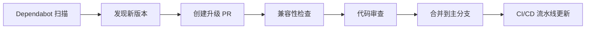

+++
title = "#21664 Bump actions/download-artifact from 4 to 6"
date = "2025-10-27T00:00:00"
draft = false
template = "pull_request_page.html"
in_search_index = false

[extra]
current_language = "zh-cn"
available_languages = {"en" = { name = "English", url = "/pull_request/bevy/2025-10/pr-21664-en-20251027" }, "zh-cn" = { name = "中文", url = "/pull_request/bevy/2025-10/pr-21664-zh-cn-20251027" }}
labels = ["D-Trivial", "C-Dependencies"]
+++

# Bump actions/download-artifact from 4 to 6

## Basic Information
- **Title**: Bump actions/download-artifact from 4 to 6
- **PR Link**: https://github.com/bevyengine/bevy/pull/21664
- **Author**: app/dependabot
- **Status**: MERGED
- **Labels**: D-Trivial, C-Dependencies, S-Ready-For-Final-Review
- **Created**: 2025-10-27T06:18:16Z
- **Merged**: 2025-10-27T22:11:32Z
- **Merged By**: mockersf

## Description Translation
将 [actions/download-artifact](https://github.com/actions/download-artifact) 从版本 4 升级到 6。

<details>
<summary>发布说明</summary>
<p><em>来源自 <a href="https://github.com/actions/download-artifact/releases">actions/download-artifact 的发布</a>。</em></p>
<blockquote>
<h2>v6.0.0</h2>
<h2>变更内容</h2>
<p><strong>破坏性变更：</strong> 此更新支持 Node <code>v24.x</code>。这本身不是破坏性变更，但我们将其视为破坏性变更。</p>
<ul>
<li>更新 download-artifact v5 变更的 README by <a href="https://github.com/yacaovsnc"><code>@​yacaovsnc</code></a> in <a href="https://redirect.github.com/actions/download-artifact/pull/417">actions/download-artifact#417</a></li>
<li>使用构件提取详情更新 README by <a href="https://github.com/yacaovsnc"><code>@​yacaovsnc</code></a> in <a href="https://redirect.github.com/actions/download-artifact/pull/424">actions/download-artifact#424</a></li>
<li>Readme: 首次使用 GHES 时完整拼写 by <a href="https://github.com/danwkennedy"><code>@​danwkennedy</code></a> in <a href="https://redirect.github.com/actions/download-artifact/pull/431">actions/download-artifact#431</a></li>
<li>将 <code>@actions/artifact</code> 升级到 <code>v4.0.0</code></li>
<li>准备 <code>v6.0.0</code> by <a href="https://github.com/danwkennedy"><code>@​danwkennedy</code></a> in <a href="https://redirect.github.com/actions/download-artifact/pull/438">actions/download-artifact#438</a></li>
</ul>
<h2>新贡献者</h2>
<ul>
<li><a href="https://github.com/danwkennedy"><code>@​danwkennedy</code></a> 在 <a href="https://redirect.github.com/actions/download-artifact/pull/431">actions/download-artifact#431</a> 中做出了首次贡献</li>
</ul>
<p><strong>完整变更日志</strong>: <a href="https://github.com/actions/download-artifact/compare/v5...v6.0.0">https://github.com/actions/download-artifact/compare/v5...v6.0.0</a></p>
<h2>v5.0.0</h2>
<h2>变更内容</h2>
<ul>
<li>更新 README.md by <a href="https://github.com/nebuk89"><code>@​nebuk89</code></a> in <a href="https://redirect.github.com/actions/download-artifact/pull/407">actions/download-artifact#407</a></li>
<li>破坏性修复：按 ID 下载单个构件时的路径行为不一致 by <a href="https://github.com/GrantBirki"><code>@​GrantBirki</code></a> in <a href="https://redirect.github.com/actions/download-artifact/pull/416">actions/download-artifact#416</a></li>
</ul>
<h2>v5.0.0</h2>
<h3>🚨 破坏性变更</h3>
<p>此版本修复了按 ID 下载单个构件时的路径行为不一致问题。<strong>如果你按 ID 下载单个构件，输出路径可能会改变。</strong></p>
<h4>变更内容</h4>
<p>之前，<strong>单个构件下载</strong>的行为取决于你如何指定构件：</p>
<ul>
<li><strong>按名称</strong>: <code>name: my-artifact</code> → 提取到 <code>path/</code> (直接)</li>
<li><strong>按 ID</strong>: <code>artifact-ids: 12345</code> → 提取到 <code>path/my-artifact/</code> (嵌套)</li>
</ul>
<p>现在两种方法保持一致：</p>
<ul>
<li><strong>按名称</strong>: <code>name: my-artifact</code> → 提取到 <code>path/</code> (未变)</li>
<li><strong>按 ID</strong>: <code>artifact-ids: 12345</code> → 提取到 <code>path/</code> (已修复 - 现在直接)</li>
</ul>
<h4>迁移指南</h4>
<h5>✅ 无需操作如果：</h5>
<ul>
<li>你按<strong>名称</strong>下载构件</li>
<li>你按 ID 下载<strong>多个</strong>构件</li>
<li>你已经使用 <code>merge-multiple: true</code> 作为变通方法</li>
</ul>
<h5>⚠️ 需要操作如果：</h5>
<p>你按 ID 下载<strong>单个构件</strong>，并且你的工作流期望嵌套目录结构。</p>
<!-- raw HTML omitted -->
</blockquote>
<p>... (截断)</p>
</details>
<details>
<summary>提交</summary>
<ul>
<li><a href="https://github.com/actions/download-artifact/commit/018cc2cf5baa6db3ef3c5f8a56943fffe632ef53"><code>018cc2c</code></a> Merge pull request <a href="https://redirect.github.com/actions/download-artifact/issues/438">#438</a> from actions/danwkennedy/prepare-6.0.0</li>
<li><a href="https://github.com/actions/download-artifact/commit/815651c680ffe1c95719d0ed08aba1a2f9d5c177"><code>815651c</code></a> Revert "Remove <code>github.dep.yml</code>"</li>
<li><a href="https://github.com/actions/download-artifact/commit/bb3a066a8babc8ed7b3e4218896c548fe34e7115"><code>bb3a066</code></a> Remove <code>github.dep.yml</code></li>
<li><a href="https://github.com/actions/download-artifact/commit/fa1ce46bbd11b8387539af12741055a76dfdf804"><code>fa1ce46</code></a> Prepare <code>v6.0.0</code></li>
<li><a href="https://github.com/actions/download-artifact/commit/4a24838f3d5601fd639834081e118c2995d51e1c"><code>4a24838</code></a> Merge pull request <a href="https://redirect.github.com/actions/download-artifact/issues/431">#431</a> from danwkennedy/patch-1</li>
<li><a href="https://github.com/actions/download-artifact/commit/5e3251c4ff5a32e4cf8dd4adaee0e692365237ae"><code>5e3251c</code></a> Readme: spell out the first use of GHES</li>
<li><a href="https://github.com/actions/download-artifact/commit/abefc31eafcfbdf6c5336127c1346fdae79ff41c"><code>abefc31</code></a> Merge pull request <a href="https://redirect.github.com/actions/download-artifact/issues/424">#424</a> from actions/yacaovsnc/update_readme</li>
<li><a href="https://github.com/actions/download-artifact/commit/ac43a6070aa7db8a41e756e7a2846221edca7027"><code>ac43a60</code></a> Update README with artifact extraction details</li>
<li><a href="https://github.com/actions/download-artifact/commit/de96f4613b77ec03b5cf633e7c350c32bd3c5660"><code>de96f46</code></a> Merge pull request <a href="https://redirect.github.com/actions/download-artifact/issues/417">#417</a> from actions/yacaovsnc/update_readme</li>
<li><a href="https://github.com/actions/download-artifact/commit/7993cb44e9052f2f08f9b828ae5ef3ecca7d2ac7"><code>7993cb4</code></a> Remove migration guide for artifact download changes</li>
<li>其他提交可在 <a href="https://github.com/actions/download-artifact/compare/v4...v6">比较视图</a> 中查看</li>
</ul>
</details>
<br />


[](https://docs.github.com/en/github/managing-security-vulnerabilities/about-dependabot-security-updates#about-compatibility-scores)

只要你没有手动修改此 PR，Dependabot 将解决任何冲突。你也可以通过评论 `@dependabot rebase` 手动触发 rebase。

[//]: # (dependabot-automerge-start)
[//]: # (dependabot-automerge-end)

---

<details>
<summary>Dependabot 命令和选项</summary>
<br />

你可以通过评论此 PR 来触发 Dependabot 操作：
- `@dependabot rebase` 将 rebase 此 PR
- `@dependabot recreate` 将重新创建此 PR，覆盖对其进行的任何编辑
- `@dependabot merge` 将在 CI 通过后合并此 PR
- `@dependabot squash and merge` 将在 CI 通过后 squash 并合并此 PR
- `@dependabot cancel merge` 将取消之前请求的合并并阻止自动合并
- `@dependabot reopen` 将重新打开此 PR（如果已关闭）
- `@dependabot close` 将关闭此 PR 并阻止 Dependabot 重新创建它。你可以通过手动关闭它来达到相同的结果
- `@dependabot show <dependency name> ignore conditions` 将显示指定依赖项的所有忽略条件
- `@dependabot ignore this major version` 将关闭此 PR 并阻止 Dependabot 为此主要版本创建更多 PR（除非你重新打开 PR 或自行升级）
- `@dependabot ignore this minor version` 将关闭此 PR 并阻止 Dependabot 为此次要版本创建更多 PR（除非你重新打开 PR 或自行升级）
- `@dependabot ignore this dependency` 将关闭此 PR 并阻止 Dependabot 为此依赖项创建更多 PR（除非你重新打开 PR 或自行升级）


</details>

## 这个 Pull Request 的故事

这是一个由 Dependabot 自动生成的依赖升级 PR，展示了现代软件开发中依赖管理的重要性。虽然变更本身很简单，但它反映了维护项目依赖健康的关键实践。

这个 PR 的核心是将 GitHub Actions 工作流中使用的 `actions/download-artifact` 从 v4 升级到 v6。这个升级跨越了两个主要版本，包含了重要的功能改进和破坏性变更。

在 v5 版本中，最重要的变更是修复了按 ID 下载单个构件时的路径行为不一致问题。之前的版本中，按名称下载构件会直接提取到指定路径，而按 ID 下载会在路径下创建一个以构件名命名的子目录。v5 版本统一了这种行为，使两种下载方式都直接提取到指定路径。对于 Bevy 项目来说，这个破坏性变更影响有限，因为项目中的工作流主要使用按名称下载构件的方式。

v6 版本主要提供了对 Node.js v24 的支持，这对于长期维护来说很重要。随着 GitHub Actions 运行环境的更新，确保所有依赖的 action 都与最新的 Node.js 版本兼容是必要的。

这个升级是由 Dependabot 自动发起的，Dependabot 会定期扫描项目的依赖关系，并在发现新版本时自动创建升级 PR。这种自动化流程大大减轻了维护者的负担，确保项目能够及时获得安全更新和功能改进。

在代码层面，这个变更只涉及一个文件的一行修改：

```yaml
# 之前：
uses: actions/download-artifact@v4

# 之后：
uses: actions/download-artifact@v6
```

尽管这个修改很小，但它体现了软件工程中的一个重要原则：保持依赖的更新。过时的依赖可能包含已知的安全漏洞、性能问题或与新版工具的兼容性问题。

Dependabot 的兼容性评分系统显示这次升级是兼容的，这给了维护者信心来合并这个变更。兼容性评分基于其他项目的升级经验，为维护者提供了有价值的决策参考。

从工程实践的角度看，这种依赖升级应该作为常规维护的一部分。及时升级依赖不仅可以获得新功能和性能改进，还可以减少未来需要进行大规模升级时的风险。每次小的、增量的升级都比一次性跨越多个主要版本要容易管理和测试。

## 视觉表示



## 关键文件变更

**文件**: `.github/workflows/send-screenshots-to-pixeleagle.yml`

**变更描述**: 将 `actions/download-artifact` 从 v4 升级到 v6

**代码变更**:
```yaml
# 变更前:
-        uses: actions/download-artifact@v4

# 变更后:
+        uses: actions/download-artifact@v6
```

**影响分析**: 
- 这个工作流负责将截图发送到 PixelEagle 服务
- 升级确保了构件下载功能的长期兼容性和性能
- 由于工作流使用按名称下载构件的方式，不受 v5 破坏性变更的影响

## 进一步阅读

- [GitHub Actions 官方文档](https://docs.github.com/en/actions)
- [actions/download-artifact 仓库](https://github.com/actions/download-artifact)
- [Dependabot 文档](https://docs.github.com/en/code-security/dependabot)
- [语义化版本控制](https://semver.org/lang/zh-CN/)