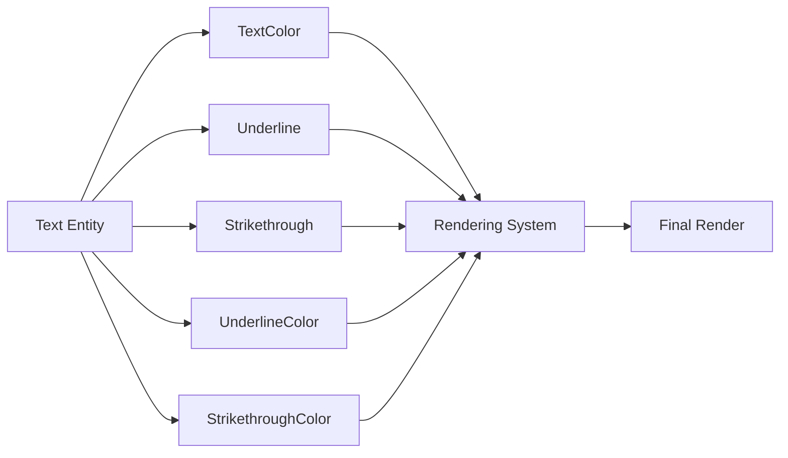

+++
title = "#21667 Text strikethrough and underline colors"
date = "2025-10-29T00:00:00"
draft = false
template = "pull_request_page.html"
in_search_index = true

[taxonomies]
list_display = ["show"]

[extra]
current_language = "en"
available_languages = {"en" = { name = "English", url = "/pull_request/bevy/2025-10/pr-21667-en-20251029" }, "zh-cn" = { name = "中文", url = "/pull_request/bevy/2025-10/pr-21667-zh-cn-20251029" }}
labels = ["C-Feature", "A-UI", "M-Release-Note", "D-Straightforward"]
+++

# Text strikethrough and underline colors

## Basic Information
- **Title**: Text strikethrough and underline colors
- **PR Link**: https://github.com/bevyengine/bevy/pull/21667
- **Author**: ickshonpe
- **Status**: MERGED
- **Labels**: C-Feature, A-UI, S-Ready-For-Final-Review, M-Release-Note, X-Uncontroversial, D-Straightforward
- **Created**: 2025-10-27T12:13:24Z
- **Merged**: 2025-10-29T19:56:19Z
- **Merged By**: alice-i-cecile

## Description Translation

# Objective

Allows users to override `TextColor` and use a custom color for underline and strikethrough text decorations.

## Solution

New components `UnderlineColor` and `StrikethroughColor`. Add them to a text entity with `Underline` or `Strikethrough`, respectively, to use a custom color for the lines.

#

This could just be an optional color field on `Underline` or `Strikethrough`, that would be fine. I spent a while going back and fourth about it. The main reasons why I went with a separate component:

* The same color is almost always used for both text and its decorations. Overriding `TextColor` is going to be rare.
* Once we have some sort of global or propagated text style support, underline and strikethrough colors probably won't be set per entity.

The single component approach has some advantages too. Discoverability, obviously. Also compare:
```rust
(
    Text::new("Hello"),
    Underline,
    UnderlineColor(RED.into())
)
```
with 
```rust
(
    Text::new("Hello"),
    Underline::color(RED),
)
```
which seems clearly nicer. If it weren't for the planned non-entity-local text styling support, I'd lean more towards the single component approach.

## Testing

Added a few color overrides to this example:
```
cargo run --example strikethrough
```

## Showcase


## The Story of This Pull Request

This PR addresses a straightforward but important gap in Bevy's text rendering system: the inability to customize colors for text decorations like underline and strikethrough independently from the main text color. Prior to this change, these decorations always inherited the `TextColor` of the parent text entity, which limited design flexibility for UI elements requiring distinct decorative styling.

The implementation follows Bevy's established component-based architecture pattern. Rather than modifying the existing `Underline` and `Strikethrough` components, the developer chose to introduce two new dedicated color components: `UnderlineColor` and `StrikethroughColor`. This design decision reflects careful consideration of both current needs and future architectural plans.

The core technical challenge was modifying the text extraction systems to query for these optional color components and use them when available. The solution maintains backward compatibility - if no custom decoration color is specified, the system falls back to using the existing `TextColor`, ensuring existing code continues to work unchanged.

The implementation required coordinated changes across both 2D sprite text rendering and UI text rendering systems. In both cases, the extraction queries were extended to include optional references to the new color components, and the rendering logic was updated to prefer these custom colors when present.

The developer explicitly considered an alternative approach: adding optional color fields directly to the `Underline` and `Strikethrough` components. While this would have provided a cleaner API with methods like `Underline::color(RED)`, the separate component approach was chosen for two key reasons. First, it aligns with the observation that most use cases don't require different colors for text and decorations. Second, it anticipates future text styling systems where decoration colors might be set globally rather than per-entity.

The changes are implemented consistently across the codebase. Both new components follow the same pattern as existing color components like `TextColor`, implementing `Deref`, `DerefMut`, `Reflect`, and supporting conversion from any type that implements `Into<Color>`. This consistency makes the API intuitive for developers already familiar with Bevy's text system.

Testing was straightforward - the existing strikethrough example was extended to demonstrate the new functionality with various color combinations, providing both visual verification and documentation for users.

## Visual Representation



## Key Files Changed

### `crates/bevy_text/src/text.rs` (+34/-0)
This file defines the new color components for text decorations.

```rust
// New component definition
/// Color for the text's strikethrough. If this component is not present, its `TextColor` will be used.
#[derive(Component, Copy, Clone, Debug, Deref, DerefMut, Reflect, PartialEq)]
#[reflect(Component, Default, Debug, PartialEq, Clone)]
pub struct StrikethroughColor(pub Color);

// New component definition  
/// Color for the text's underline. If this component is not present, its `TextColor` will be used.
#[derive(Component, Copy, Clone, Debug, Deref, DerefMut, Reflect, PartialEq)]
#[reflect(Component, Default, Debug, PartialEq, Clone)]
pub struct UnderlineColor(pub Color);
```

### `crates/bevy_sprite_render/src/text2d/mod.rs` (+29/-8)
Updated the 2D text extraction system to support custom decoration colors.

```rust
// Updated query to include optional color components
decoration_query: Extract<
    Query<(
        &TextColor,
        Has<Strikethrough>,
        Has<Underline>,
        Option<&StrikethroughColor>,
        Option<&UnderlineColor>,
    )>,
>

// Color selection logic for strikethrough
if has_strike_through {
    let color = maybe_strikethrough_color
        .map(|c| c.0)
        .unwrap_or(text_color.0)
        .to_linear();
    // ... use custom color
}
```

### `crates/bevy_ui_render/src/lib.rs` (+22/-6)
Updated the UI text rendering system with similar changes.

```rust
// Updated UI text decoration query
let Ok((
    (text_background_color, maybe_strikethrough, maybe_underline),
    text_color,
    maybe_strikethrough_color,
    maybe_underline_color,
)) = text_background_colors_query.get(section_entity)
```

### `examples/ui/strikethrough.rs` (+6/-2)
Enhanced the example to demonstrate the new functionality.

```rust
// Example usage with custom colors
(
    Text::new("struck\nstruckstruck\nstruckstuckstruck"),
    Strikethrough,
    StrikethroughColor(RED.into()),
    TextBackgroundColor(GREEN.into()),
),
```

### `crates/bevy_text/src/lib.rs` (+2/-2)
Added the new components to the prelude for easy access.

## Further Reading

- [Bevy Text Component Documentation](https://docs.rs/bevy_text/latest/bevy_text/)
- [Bevy UI System Overview](https://bevyengine.org/learn/quick-start/ui/)
- [Component-Based Architecture Patterns in Bevy](https://bevyengine.org/learn/book/features/ecs/)