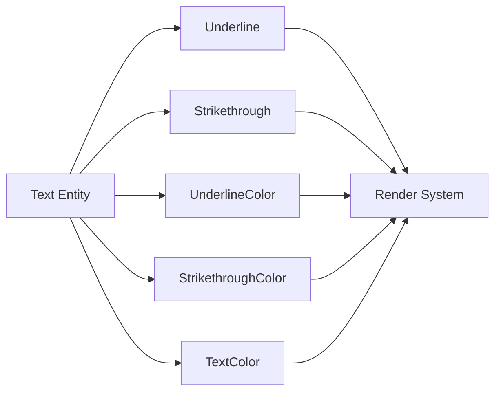

+++
title = "#21667 Text strikethrough and underline colors"
date = "2025-10-29T00:00:00"
draft = false
template = "pull_request_page.html"
in_search_index = false

[extra]
current_language = "zh-cn"
available_languages = {"en" = { name = "English", url = "/pull_request/bevy/2025-10/pr-21667-en-20251029" }, "zh-cn" = { name = "中文", url = "/pull_request/bevy/2025-10/pr-21667-zh-cn-20251029" }}
labels = ["C-Feature", "A-UI", "M-Release-Note", "D-Straightforward"]
+++

# Text strikethrough and underline colors

## Basic Information
- **Title**: Text strikethrough and underline colors
- **PR Link**: https://github.com/bevyengine/bevy/pull/21667
- **Author**: ickshonpe
- **Status**: MERGED
- **Labels**: C-Feature, A-UI, S-Ready-For-Final-Review, M-Release-Note, X-Uncontroversial, D-Straightforward
- **Created**: 2025-10-27T12:13:24Z
- **Merged**: 2025-10-29T19:56:19Z
- **Merged By**: alice-i-cecile

## Description Translation
目标

允许用户覆盖 `TextColor` 并为下划线和删除线文本装饰使用自定义颜色。

解决方案

新增组件 `UnderlineColor` 和 `StrikethroughColor`。将它们分别与 `Underline` 或 `Strikethrough` 一起添加到文本实体上，以使用自定义颜色绘制线条。

#

这可以只是 `Underline` 或 `Strikethrough` 上的可选颜色字段，这样也可以。我花了一段时间来回考虑这个问题。选择使用单独组件的主要原因是：

* 相同的颜色几乎总是用于文本及其装饰。覆盖 `TextColor` 的情况会很罕见。
* 一旦我们有了某种全局或传播的文本样式支持，下划线和删除线颜色可能不会按实体设置。

单一组件方法也有一些优点。显然，可发现性更好。另外比较：
```rust
(
    Text::new("Hello"),
    Underline,
    UnderlineColor(RED.into())
)
```
与
```rust
(
    Text::new("Hello"),
    Underline::color(RED),
)
```
后者显然更简洁。如果不是因为计划中的非实体本地文本样式支持，我会更倾向于单一组件方法。

测试

在这个示例中添加了一些颜色覆盖：
```
cargo run --example strikethrough
```

展示


## The Story of This Pull Request

这个PR解决了一个直接的UI定制需求：为文本装饰（下划线和删除线）提供独立的颜色控制。在现有的Bevy文本系统中，下划线和删除线只能使用与文本相同的颜色，这限制了设计灵活性。

开发者面临的核心问题是设计决策：是扩展现有的`Underline`和`Strikethrough`组件来包含颜色字段，还是创建独立的新组件。经过权衡，选择了独立组件的方案，主要基于两个考虑：

1. 大多数情况下文本和装饰使用相同颜色，单独设置装饰颜色的需求相对较少
2. 为未来的全局文本样式系统做准备，装饰颜色可能不会在实体级别设置

实现上，这个PR采用了典型的ECS模式扩展。在渲染管线的两个主要分支（2D精灵渲染和UI渲染）中，修改了装饰线的颜色提取逻辑：

```rust
// 在提取装饰线时检查是否有自定义颜色
let color = maybe_strikethrough_color
    .map(|c| c.0)
    .unwrap_or(text_color.0)
    .to_linear();
```

这种实现保持了向后兼容性 - 如果没有自定义颜色组件，系统会回退到使用文本颜色。代码修改集中在渲染系统的查询和颜色计算部分，没有改变核心的文本布局或渲染算法。

从技术角度看，这个PR展示了Bevy中组件组合的典型模式。通过添加可选的颜色组件，系统可以在不破坏现有API的情况下扩展功能。颜色转换使用了`to_linear()`方法，这是Bevy渲染管线的标准做法，确保颜色值在正确的色彩空间中处理。

这个实现的工程权衡很明显：独立组件提供了更好的架构清晰度和未来兼容性，但牺牲了API的简洁性。正如作者在PR描述中提到的，`Underline::color(RED)`的API确实更优雅，但考虑到长期的架构演进，分离的组件是更合理的选择。

## Visual Representation



## Key Files Changed

### `crates/bevy_text/src/text.rs` (+34/-0)
新增了两个颜色组件定义：

```rust
/// Color for the text's strikethrough. If this component is not present, its `TextColor` will be used.
#[derive(Component, Copy, Clone, Debug, Deref, DerefMut, Reflect, PartialEq)]
#[reflect(Component, Default, Debug, PartialEq, Clone)]
pub struct StrikethroughColor(pub Color);

/// Color for the text's underline. If this component is not present, its `TextColor` will be used.
#[derive(Component, Copy, Clone, Debug, Deref, DerefMut, Reflect, PartialEq)]
#[reflect(Component, Default, Debug, PartialEq, Clone)]
pub struct UnderlineColor(pub Color);
```

这两个组件都实现了从任意可转换为Color类型的转换trait，提供了灵活的颜色设置方式。

### `crates/bevy_sprite_render/src/text2d/mod.rs` (+29/-8)
修改了2D文本的装饰渲染系统，扩展查询以包含新的颜色组件：

```rust
// 扩展查询包含可选的颜色组件
decoration_query: Extract<
    Query<(
        &TextColor,
        Has<Strikethrough>,
        Has<Underline>,
        Option<&StrikethroughColor>,
        Option<&UnderlineColor>,
    )>,
>

// 在渲染时使用自定义颜色或回退到文本颜色
let color = maybe_strikethrough_color
    .map(|c| c.0)
    .unwrap_or(text_color.0)
    .to_linear();
```

### `crates/bevy_ui_render/src/lib.rs` (+22/-6)
类似的修改应用于UI文本渲染系统：

```rust
// 扩展UI装饰查询
let Ok((
    (text_background_color, maybe_strikethrough, maybe_underline),
    text_color,
    maybe_strikethrough_color,
    maybe_underline_color,
)) = text_background_colors_query.get(section_entity)

// 应用自定义颜色
let color = maybe_strikethrough_color
    .map(|sc| sc.0)
    .unwrap_or(text_color.0)
    .to_linear();
```

### `examples/ui/strikethrough.rs` (+6/-2)
更新示例展示新功能：

```rust
// 添加自定义颜色的删除线
(
    Text::new("struck\nstruckstruck\nstruckstuckstruck"),
    Strikethrough,
    StrikethroughColor(RED.into()),  // 红色删除线
    TextBackgroundColor(GREEN.into()),
),

// 添加自定义颜色的下划线
TextSpan::new("\nunderline"),
Underline,
UnderlineColor(YELLOW.into()),  // 黄色下划线
```

### `crates/bevy_text/src/lib.rs` (+2/-2)
更新prelude模块导出新的组件。

## Further Reading

- [Bevy ECS 组件文档](https://docs.rs/bevy_ecs/latest/bevy_ecs/component/trait.Component.html)
- [Bevy 文本系统架构](https://github.com/bevyengine/bevy/tree/main/crates/bevy_text)
- [ECS 查询模式最佳实践](https://bevy-cheatbook.github.io/programming/queries.html)