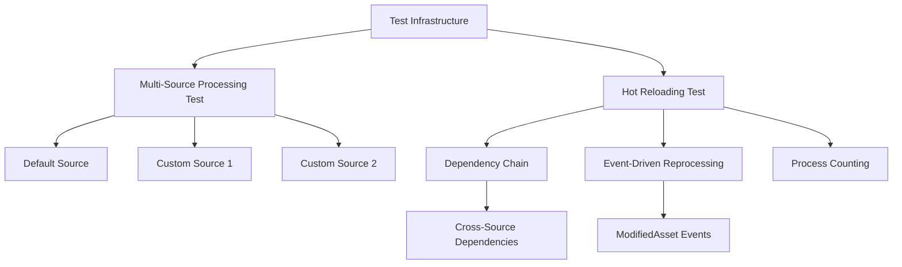

+++
title = "#21673 Add tests for asset processing under hot reloading and across asset sources."
date = "2025-10-30T00:00:00"
draft = false
template = "pull_request_page.html"
in_search_index = true

[taxonomies]
list_display = ["show"]

[extra]
current_language = "en"
available_languages = {"en" = { name = "English", url = "/pull_request/bevy/2025-10/pr-21673-en-20251030" }, "zh-cn" = { name = "中文", url = "/pull_request/bevy/2025-10/pr-21673-zh-cn-20251030" }}
labels = ["A-Assets", "C-Testing", "D-Straightforward"]
+++

# Title

## Basic Information
- **Title**: Add tests for asset processing under hot reloading and across asset sources.
- **PR Link**: https://github.com/bevyengine/bevy/pull/21673
- **Author**: andriyDev
- **Status**: MERGED
- **Labels**: A-Assets, S-Ready-For-Final-Review, C-Testing, D-Straightforward
- **Created**: 2025-10-28T07:20:10Z
- **Merged**: 2025-10-30T16:20:13Z
- **Merged By**: alice-i-cecile

## Description Translation

# Objective

- Trying to rewrite asset processing to be dynamic is hard, especially since we don't have tests verifying all the situations asset processing is supposed to be able to handle!

## Solution

- Add a couple more tests! One to check that processing multiple sources works, and another to check that sending asset events triggers processing (including processing of dependent processing).

## Testing

- ;)

## The Story of This Pull Request

This PR addresses a critical gap in Bevy's asset processing system testing infrastructure. The core problem was straightforward: when working on dynamic asset processing improvements, developers lacked comprehensive tests that could validate the system's behavior across different scenarios, particularly involving multiple asset sources and hot reloading.

The solution approach focused on building robust test coverage that simulates real-world asset processing scenarios. The developer recognized that asset processing needs to handle complex dependency chains and cross-source asset references reliably. Rather than making functional changes to the asset processing logic itself, this PR strengthens the test suite to ensure future changes don't break existing functionality.

The implementation centers around two key test scenarios. First, the test infrastructure was refactored to support multiple asset sources simultaneously. The `create_app_with_asset_processor` function was enhanced to accept a list of extra source names and return structured `ProcessingDirs` for each source, complete with event channels for simulating file system changes. This setup allows tests to verify that assets from different sources are processed independently and correctly.

Second, the tests validate that asset processing properly handles hot reloading scenarios. The `run_app_until_finished_processing` function was updated with a fixed iteration count to handle race conditions in multithreaded environments where asset events might compete with processor state transitions.

The technical insights from this implementation reveal several important patterns. The test infrastructure now properly simulates asset watchers through `FakeWatcher` and event channels, allowing tests to trigger reprocessing by sending `AssetSourceEvent::ModifiedAsset` events. The use of `Arc<Mutex<u32>>` counters in the nested asset test provides a reliable way to track how many times processing occurs, which is crucial for validating that dependencies are reprocessed correctly.

The impact of these tests is significant for the Bevy asset system's reliability. They provide concrete validation that:
- Assets from multiple sources are processed independently
- Hot reloading triggers reprocessing of modified assets
- Dependency chains across different asset sources work correctly
- Unchanged assets aren't unnecessarily reprocessed

These tests will serve as critical guardrails during future refactoring of the asset processing system, particularly the planned dynamic asset processing improvements mentioned in the PR description.

## Visual Representation



## Key Files Changed

### `crates/bevy_asset/src/processor/tests.rs` (+501/-64)

This file received substantial additions to support comprehensive testing of asset processing across multiple sources and under hot reloading conditions.

**Key Changes:**

1. **Enhanced Test Infrastructure**: The `create_app_with_asset_processor` function was completely refactored to support multiple asset sources:

```rust
// Before: Single source setup
fn create_app_with_asset_processor() -> AppWithProcessor

// After: Multi-source setup  
fn create_app_with_asset_processor(extra_sources: &[String]) -> AppWithProcessor
```

The new implementation uses a builder pattern with `UnfinishedProcessingDirs` to properly handle the asynchronous nature of asset watcher setup.

2. **New Test: Multi-Source Processing**: Added `asset_processor_processes_all_sources` test that validates processing across default and custom sources:

```rust
#[test]
fn asset_processor_processes_all_sources() {
    let AppWithProcessor {
        mut app,
        default_source_dirs: ProcessingDirs { source: default_source_dir, processed: default_processed_dir, source_event_sender: default_source_events },
        extra_sources_dirs,
    } = create_app_with_asset_processor(&["custom_1".into(), "custom_2".into()]);
    
    // Test setup and assertions for multiple sources
}
```

3. **New Test: Hot Reloading with Dependencies**: Added `nested_loads_of_processed_asset_reprocesses_on_reload` test that validates dependency chain reprocessing:

```rust
#[test]
fn nested_loads_of_processed_asset_reprocesses_on_reload() {
    // Complex test setup with cross-source dependencies and process counting
    let process_counter = Arc::new(Mutex::new(0));
    
    // Test validates that modifying a leaf asset reprocesses all dependent assets
}
```

4. **Test Infrastructure Improvements**: Added helper structures and functions:

```rust
#[derive(Clone)]
struct ProcessingDirs {
    source: Dir,
    processed: Dir,
    source_event_sender: async_channel::Sender<AssetSourceEvent>,
}

fn read_asset_as_string(dir: &Dir, path: &Path) -> String {
    let bytes = dir.get_asset(path).unwrap();
    str::from_utf8(bytes.value()).unwrap().to_string()
}
```

These changes provide the foundation for testing complex asset processing scenarios that mirror real-world use cases.

## Further Reading

- [Bevy Asset System Documentation](https://bevyengine.org/learn/quick-start/assets/)
- [Asset Processing in Bevy](https://bevyengine.org/learn/quick-start/assets/processing/)
- [Async Programming in Rust](https://rust-lang.github.io/async-book/)
- [Test-Driven Development Principles](https://en.wikipedia.org/wiki/Test-driven_development)

# Full Code Diff
```diff
diff --git a/crates/bevy_asset/src/processor/tests.rs b/crates/bevy_asset/src/processor/tests.rs
index 3cf62817a2159..133fde43ee3fd 100644
--- a/crates/bevy_asset/src/processor/tests.rs
+++ b/crates/bevy_asset/src/processor/tests.rs
@@ -2,12 +2,18 @@ use alloc::{
     boxed::Box,
     collections::BTreeMap,
     string::{String, ToString},
+    sync::Arc,
     vec,
     vec::Vec,
 };
+use bevy_platform::{
+    collections::HashMap,
+    sync::{Mutex, PoisonError},
+};
 use bevy_reflect::TypePath;
 use core::marker::PhantomData;
 use futures_lite::AsyncWriteExt;
+use ron::ser::PrettyConfig;
 use serde::{Deserialize, Serialize};
 use std::path::Path;
 
@@ -18,7 +24,7 @@ use bevy_tasks::BoxedFuture;
 use crate::{
     io::{
         memory::{Dir, MemoryAssetReader, MemoryAssetWriter},
-        AssetSource, AssetSourceId, Reader,
+        AssetSource, AssetSourceEvent, AssetSourceId, AssetWatcher, Reader,
     },
     processor::{
         AssetProcessor, LoadTransformAndSave, LogEntry, ProcessorState, ProcessorTransactionLog,
@@ -30,39 +36,99 @@ use crate::{
     Asset, AssetApp, AssetLoader, AssetMode, AssetPath, AssetPlugin, LoadContext,
 };
 
+#[derive(Clone)]
+struct ProcessingDirs {
+    source: Dir,
+    processed: Dir,
+    source_event_sender: async_channel::Sender<AssetSourceEvent>,
+}
+
 struct AppWithProcessor {
     app: App,
-    source_dir: Dir,
-    processed_dir: Dir,
+    default_source_dirs: ProcessingDirs,
+    extra_sources_dirs: HashMap<String, ProcessingDirs>,
 }
 
-fn create_app_with_asset_processor() -> AppWithProcessor {
+fn create_app_with_asset_processor(extra_sources: &[String]) -> AppWithProcessor {
     let mut app = App::new();
-    let source_dir = Dir::default();
-    let processed_dir = Dir::default();
 
-    let source_memory_reader = MemoryAssetReader {
-        root: source_dir.clone(),
-    };
-    let processed_memory_reader = MemoryAssetReader {
-        root: processed_dir.clone(),
-    };
-    let processed_memory_writer = MemoryAssetWriter {
-        root: processed_dir.clone(),
-    };
+    struct UnfinishedProcessingDirs {
+        source: Dir,
+        processed: Dir,
+        // The receiver channel for the source event sender for the unprocessed source.
+        source_event_sender_receiver:
+            async_channel::Receiver<async_channel::Sender<AssetSourceEvent>>,
+    }
+
+    impl UnfinishedProcessingDirs {
+        fn finish(self) -> ProcessingDirs {
+            ProcessingDirs {
+                source: self.source,
+                processed: self.processed,
+                // The processor listens for events on the source unconditionally, and we enable
+                // watching for the processed source, so both of these channels will be filled.
+                source_event_sender: self.source_event_sender_receiver.recv_blocking().unwrap(),
+            }
+        }
+    }
+
+    fn create_source(app: &mut App, source_id: AssetSourceId<'static>) -> UnfinishedProcessingDirs {
+        let source_dir = Dir::default();
+        let processed_dir = Dir::default();
+
+        let source_memory_reader = MemoryAssetReader {
+            root: source_dir.clone(),
+        };
+        let processed_memory_reader = MemoryAssetReader {
+            root: processed_dir.clone(),
+        };
+        let processed_memory_writer = MemoryAssetWriter {
+            root: processed_dir.clone(),
+        };
+
+        let (source_event_sender_sender, source_event_sender_receiver) = async_channel::bounded(1);
+
+        struct FakeWatcher;
+
+        impl AssetWatcher for FakeWatcher {}
+
+        app.register_asset_source(
+            source_id,
+            AssetSource::build()
+                .with_reader(move || Box::new(source_memory_reader.clone()))
+                .with_watcher(move |sender: async_channel::Sender<AssetSourceEvent>| {
+                    source_event_sender_sender.send_blocking(sender).unwrap();
+                    Some(Box::new(FakeWatcher))
+                })
+                .with_processed_reader(move || Box::new(processed_memory_reader.clone()))
+                .with_processed_writer(move |_| Some(Box::new(processed_memory_writer.clone()))),
+        );
+
+        UnfinishedProcessingDirs {
+            source: source_dir,
+            processed: processed_dir,
+            source_event_sender_receiver,
+        }
+    }
+
+    let default_source_dirs = create_source(&mut app, AssetSourceId::Default);
 
-    app.register_asset_source(
-        AssetSourceId::Default,
-        AssetSource::build()
-            .with_reader(move || Box::new(source_memory_reader.clone()))
-            .with_processed_reader(move || Box::new(processed_memory_reader.clone()))
-            .with_processed_writer(move |_| Some(Box::new(processed_memory_writer.clone()))),
-    )
-    .add_plugins((
+    let extra_sources_dirs = extra_sources
+        .iter()
+        .map(|source_name| {
+            (
+                source_name.clone(),
+                create_source(&mut app, AssetSourceId::Name(source_name.clone().into())),
+            )
+        })
+        .collect::<Vec<_>>();
+
+    app.add_plugins((
         TaskPoolPlugin::default(),
         AssetPlugin {
             mode: AssetMode::Processed,
             use_asset_processor_override: Some(true),
+            watch_for_changes_override: Some(true),
             ..Default::default()
         },
     ));
@@ -113,14 +179,25 @@ fn create_app_with_asset_processor() -> AppWithProcessor {
         .set_log_factory(Box::new(FakeTransactionLogFactory))
         .unwrap();
 
+    // Now that we've built the app, finish all the processing dirs.
+
     AppWithProcessor {
         app,
-        source_dir,
-        processed_dir,
+        default_source_dirs: default_source_dirs.finish(),
+        extra_sources_dirs: extra_sources_dirs
+            .into_iter()
+            .map(|(name, dirs)| (name, dirs.finish()))
+            .collect(),
     }
 }
 
 fn run_app_until_finished_processing(app: &mut App) {
+    // If the original source changes through an AssetSourceEvent, we'll be racing (on
+    // multithreaded) between this and processor thread switching the state to `Processing`. So do a
+    // fixed number of iterations so the processor thread is likely to win.
+    for _ in 0..5 {
+        app.update();
+    }
     run_app_until(app, |world| {
         if bevy_tasks::block_on(world.resource::<AssetProcessor>().get_state())
             == ProcessorState::Finished
@@ -162,7 +239,7 @@ impl AssetSaver for CoolTextSaver {
             // another file to do so.
             embedded_dependencies: vec![],
         };
-        let ron = ron::ser::to_string(&ron).unwrap();
+        let ron = ron::ser::to_string_pretty(&ron, PrettyConfig::new().new_line("\n")).unwrap();
         writer.write_all(ron.as_bytes()).await?;
         Ok(())
     }
@@ -199,6 +276,19 @@ impl<M: MutateAsset<A>, A: Asset> AssetTransformer for RootAssetTransformer<M, A
     }
 }
 
+struct AddText(String);
+
+impl MutateAsset<CoolText> for AddText {
+    fn mutate(&self, text: &mut CoolText) {
+        text.text.push_str(&self.0);
+    }
+}
+
+fn read_asset_as_string(dir: &Dir, path: &Path) -> String {
+    let bytes = dir.get_asset(path).unwrap();
+    str::from_utf8(bytes.value()).unwrap().to_string()
+}
+
 #[test]
 fn no_meta_or_default_processor_copies_asset() {
     // Assets without a meta file or a default processor should still be accessible in the
@@ -209,9 +299,14 @@ fn no_meta_or_default_processor_copies_asset() {
 
     let AppWithProcessor {
         mut app,
-        source_dir,
-        processed_dir,
-    } = create_app_with_asset_processor();
+        default_source_dirs:
+            ProcessingDirs {
+                source: source_dir,
+                processed: processed_dir,
+                ..
+            },
+        ..
+    } = create_app_with_asset_processor(&[]);
 
     let path = Path::new("abc.cool.ron");
     let source_asset = r#"(
@@ -234,17 +329,14 @@ fn no_meta_or_default_processor_copies_asset() {
 fn asset_processor_transforms_asset_default_processor() {
     let AppWithProcessor {
         mut app,
-        source_dir,
-        processed_dir,
-    } = create_app_with_asset_processor();
-
-    struct AddText;
-
-    impl MutateAsset<CoolText> for AddText {
-        fn mutate(&self, text: &mut CoolText) {
-            text.text.push_str("_def");
-        }
-    }
+        default_source_dirs:
+            ProcessingDirs {
+                source: source_dir,
+                processed: processed_dir,
+                ..
+            },
+        ..
+    } = create_app_with_asset_processor(&[]);
 
     type CoolTextProcessor = LoadTransformAndSave<
         CoolTextLoader,
@@ -253,7 +345,7 @@ fn asset_processor_transforms_asset_default_processor() {
     >;
     app.register_asset_loader(CoolTextLoader)
         .register_asset_processor(CoolTextProcessor::new(
-            RootAssetTransformer::new(AddText),
+            RootAssetTransformer::new(AddText("_def".into())),
             CoolTextSaver,
         ))
         .set_default_asset_processor::<CoolTextProcessor>("cool.ron");
@@ -275,7 +367,12 @@ fn asset_processor_transforms_asset_default_processor() {
     let processed_asset = str::from_utf8(processed_asset.value()).unwrap();
     assert_eq!(
         processed_asset,
-        r#"(text:"abc_def",dependencies:[],embedded_dependencies:[],sub_texts:[])"#
+        r#"(
+    text: "abc_def",
+    dependencies: [],
+    embedded_dependencies: [],
+    sub_texts: [],
+)"#
     );
 }
 
@@ -283,17 +380,14 @@ fn asset_processor_transforms_asset_default_processor() {
 fn asset_processor_transforms_asset_with_meta() {
     let AppWithProcessor {
         mut app,
-        source_dir,
-        processed_dir,
-    } = create_app_with_asset_processor();
-
-    struct AddText;
-
-    impl MutateAsset<CoolText> for AddText {
-        fn mutate(&self, text: &mut CoolText) {
-            text.text.push_str("_def");
-        }
-    }
+        default_source_dirs:
+            ProcessingDirs {
+                source: source_dir,
+                processed: processed_dir,
+                ..
+            },
+        ..
+    } = create_app_with_asset_processor(&[]);
 
     type CoolTextProcessor = LoadTransformAndSave<
         CoolTextLoader,
@@ -302,7 +396,7 @@ fn asset_processor_transforms_asset_with_meta() {
     >;
     app.register_asset_loader(CoolTextLoader)
         .register_asset_processor(CoolTextProcessor::new(
-            RootAssetTransformer::new(AddText),
+            RootAssetTransformer::new(AddText("_def".into())),
             CoolTextSaver,
         ));
 
@@ -319,7 +413,7 @@ fn asset_processor_transforms_asset_with_meta() {
     source_dir.insert_meta_text(path, r#"(
     meta_format_version: "1.0",
     asset: Process(
-        processor: "bevy_asset::processor::process::LoadTransformAndSave<bevy_asset::tests::CoolTextLoader, bevy_asset::processor::tests::RootAssetTransformer<bevy_asset::processor::tests::asset_processor_transforms_asset_with_meta::AddText, bevy_asset::tests::CoolText>, bevy_asset::processor::tests::CoolTextSaver>",
+        processor: "bevy_asset::processor::process::LoadTransformAndSave<bevy_asset::tests::CoolTextLoader, bevy_asset::processor::tests::RootAssetTransformer<bevy_asset::processor::tests::AddText, bevy_asset::tests::CoolText>, bevy_asset::processor::tests::CoolTextSaver>",
         settings: (
             loader_settings: (),
             transformer_settings: (),
@@ -334,7 +428,12 @@ fn asset_processor_transforms_asset_with_meta() {
     let processed_asset = str::from_utf8(processed_asset.value()).unwrap();
     assert_eq!(
         processed_asset,
-        r#"(text:"abc_def",dependencies:[],embedded_dependencies:[],sub_texts:[])"#
+        r#"(
+    text: "abc_def",
+    dependencies: [],
+    embedded_dependencies: [],
+    sub_texts: [],
+)"#
     );
 }
 
@@ -462,8 +561,6 @@ impl AssetSaver for FakeBsnSaver {
     ) -> Result<(), Self::Error> {
         use std::io::{Error, ErrorKind};
 
-        use ron::ser::PrettyConfig;
-
         let ron_string =
             ron::ser::to_string_pretty(asset.get(), PrettyConfig::new().new_line("\n"))
                 .map_err(|err| Error::new(ErrorKind::InvalidData, err))?;
@@ -477,9 +574,14 @@ fn asset_processor_loading_can_read_processed_assets() {
 
     let AppWithProcessor {
         mut app,
-        source_dir,
-        processed_dir,
-    } = create_app_with_asset_processor();
+        default_source_dirs:
+            ProcessingDirs {
+                source: source_dir,
+                processed: processed_dir,
+                ..
+            },
+        ..
+    } = create_app_with_asset_processor(&[]);
 
     // This processor loads a gltf file, converts it to BSN and then saves out the BSN.
     type GltfProcessor = LoadTransformAndSave<FakeGltfLoader, GltfToBsn, FakeBsnSaver>;
@@ -543,9 +645,14 @@ fn asset_processor_loading_can_read_processed_assets() {
 fn asset_processor_loading_can_read_source_assets() {
     let AppWithProcessor {
         mut app,
-        source_dir,
-        processed_dir,
-    } = create_app_with_asset_processor();
+        default_source_dirs:
+            ProcessingDirs {
+                source: source_dir,
+                processed: processed_dir,
+                ..
+            },
+        ..
+    } = create_app_with_asset_processor(&[]);
 
     #[derive(Serialize, Deserialize)]
     struct FakeGltfxData {
@@ -726,3 +833,333 @@ fn asset_processor_loading_can_read_source_assets() {
     // This assertion exists to "prove" that this problem exists.
     assert!(processed_dir.get_asset(gltfx_path).is_none());
 }
+
+#[test]
+fn asset_processor_processes_all_sources() {
+    let AppWithProcessor {
+        mut app,
+        default_source_dirs:
+            ProcessingDirs {
+                source: default_source_dir,
+                processed: default_processed_dir,
+                source_event_sender: default_source_events,
+            },
+        extra_sources_dirs,
+    } = create_app_with_asset_processor(&["custom_1".into(), "custom_2".into()]);
+    let ProcessingDirs {
+        source: custom_1_source_dir,
+        processed: custom_1_processed_dir,
+        source_event_sender: custom_1_source_events,
+    } = extra_sources_dirs["custom_1"].clone();
+    let ProcessingDirs {
+        source: custom_2_source_dir,
+        processed: custom_2_processed_dir,
+        source_event_sender: custom_2_source_events,
+    } = extra_sources_dirs["custom_2"].clone();
+
+    type AddTextProcessor = LoadTransformAndSave<
+        CoolTextLoader,
+        RootAssetTransformer<AddText, CoolText>,
+        CoolTextSaver,
+    >;
+    app.init_asset::<CoolText>()
+        .init_asset::<SubText>()
+        .register_asset_loader(CoolTextLoader)
+        .register_asset_processor(AddTextProcessor::new(
+            RootAssetTransformer::new(AddText(" processed".into())),
+            CoolTextSaver,
+        ))
+        .set_default_asset_processor::<AddTextProcessor>("cool.ron");
+
+    // All the assets will have the same path, but they will still be separately processed since
+    // they are in different sources.
+    let path = Path::new("asset.cool.ron");
+    let serialize_as_cool_text = |text: &str| {
+        let cool_text_ron = CoolTextRon {
+            text: text.into(),
+            dependencies: vec![],
+            embedded_dependencies: vec![],
+            sub_texts: vec![],
+        };
+        ron::ser::to_string_pretty(&cool_text_ron, PrettyConfig::new().new_line("\n")).unwrap()
+    };
+    default_source_dir.insert_asset_text(path, &serialize_as_cool_text("default asset"));
+    custom_1_source_dir.insert_asset_text(path, &serialize_as_cool_text("custom 1 asset"));
+    custom_2_source_dir.insert_asset_text(path, &serialize_as_cool_text("custom 2 asset"));
+
+    run_app_until_finished_processing(&mut app);
+
+    // Check that all the assets are processed.
+    assert_eq!(
+        read_asset_as_string(&default_processed_dir, path),
+        serialize_as_cool_text("default asset processed")
+    );
+    assert_eq!(
+        read_asset_as_string(&custom_1_processed_dir, path),
+        serialize_as_cool_text("custom 1 asset processed")
+    );
+    assert_eq!(
+        read_asset_as_string(&custom_2_processed_dir, path),
+        serialize_as_cool_text("custom 2 asset processed")
+    );
+
+    // Update the default source asset and notify the watcher.
+    default_source_dir.insert_asset_text(path, &serialize_as_cool_text("default asset changed"));
+    default_source_events
+        .send_blocking(AssetSourceEvent::ModifiedAsset(path.to_path_buf()))
+        .unwrap();
+
+    run_app_until_finished_processing(&mut app);
+
+    // Check that all the assets are processed again.
+    assert_eq!(
+        read_asset_as_string(&default_processed_dir, path),
+        serialize_as_cool_text("default asset changed processed")
+    );
+    assert_eq!(
+        read_asset_as_string(&custom_1_processed_dir, path),
+        serialize_as_cool_text("custom 1 asset processed")
+    );
+    assert_eq!(
+        read_asset_as_string(&custom_2_processed_dir, path),
+        serialize_as_cool_text("custom 2 asset processed")
+    );
+
+    // Update the custom source assets and notify the watchers.
+    custom_1_source_dir.insert_asset_text(path, &serialize_as_cool_text("custom 1 asset changed"));
+    custom_2_source_dir.insert_asset_text(path, &serialize_as_cool_text("custom 2 asset changed"));
+    custom_1_source_events
+        .send_blocking(AssetSourceEvent::ModifiedAsset(path.to_path_buf()))
+        .unwrap();
+    custom_2_source_events
+        .send_blocking(AssetSourceEvent::ModifiedAsset(path.to_path_buf()))
+        .unwrap();
+
+    run_app_until_finished_processing(&mut app);
+
+    // Check that all the assets are processed again.
+    assert_eq!(
+        read_asset_as_string(&default_processed_dir, path),
+        serialize_as_cool_text("default asset changed processed")
+    );
+    assert_eq!(
+        read_asset_as_string(&custom_1_processed_dir, path),
+        serialize_as_cool_text("custom 1 asset changed processed")
+    );
+    assert_eq!(
+        read_asset_as_string(&custom_2_processed_dir, path),
+        serialize_as_cool_text("custom 2 asset changed processed")
+    );
+}
+
+#[test]
+fn nested_loads_of_processed_asset_reprocesses_on_reload() {
+    let AppWithProcessor {
+        mut app,
+        default_source_dirs:
+            ProcessingDirs {
+                source: default_source_dir,
+                processed: default_processed_dir,
+                source_event_sender: default_source_events,
+            },
+        extra_sources_dirs,
+    } = create_app_with_asset_processor(&["custom".into()]);
+    let ProcessingDirs {
+        source: custom_source_dir,
+        processed: custom_processed_dir,
+        source_event_sender: custom_source_events,
+    } = extra_sources_dirs["custom"].clone();
+
+    #[derive(Serialize, Deserialize)]
+    enum NesterSerialized {
+        Leaf(String),
+        Path(String),
+    }
+
+    #[derive(Asset, TypePath)]
+    struct Nester {
+        value: String,
+    }
+
+    struct NesterLoader;
+
+    impl AssetLoader for NesterLoader {
+        type Asset = Nester;
+        type Settings = ();
+        type Error = std::io::Error;
+
+        async fn load(
+            &self,
+            reader: &mut dyn Reader,
+            _settings: &Self::Settings,
+            load_context: &mut LoadContext<'_>,
+        ) -> Result<Self::Asset, Self::Error> {
+            let mut bytes = vec![];
+            reader.read_to_end(&mut bytes).await?;
+
+            let serialized: NesterSerialized = ron::de::from_bytes(&bytes).unwrap();
+            Ok(match serialized {
+                NesterSerialized::Leaf(value) => Nester { value },
+                NesterSerialized::Path(path) => {
+                    let loaded_asset = load_context.loader().immediate().load(path).await.unwrap();
+                    loaded_asset.take()
+                }
+            })
+        }
+
+        fn extensions(&self) -> &[&str] {
+            &["nest"]
+        }
+    }
+
+    struct AddTextToNested(String, Arc<Mutex<u32>>);
+
+    impl MutateAsset<Nester> for AddTextToNested {
+        fn mutate(&self, asset: &mut Nester) {
+            asset.value.push_str(&self.0);
+
+            *self.1.lock().unwrap_or_else(PoisonError::into_inner) += 1;
+        }
+    }
+
+    fn serialize_as_leaf(value: String) -> String {
+        let serialized = NesterSerialized::Leaf(value);
+        ron::ser::to_string(&serialized).unwrap()
+    }
+
+    struct NesterSaver;
+
+    impl AssetSaver for NesterSaver {
+        type Asset = Nester;
+        type Error = std::io::Error;
+        type Settings = ();
+        type OutputLoader = NesterLoader;
+
+        async fn save(
+            &self,
+            writer: &mut crate::io::Writer,
+            asset: crate::saver::SavedAsset<'_, Self::Asset>,
+            _settings: &Self::Settings,
+        ) -> Result<<Self::OutputLoader as AssetLoader>::Settings, Self::Error> {
+            let serialized = serialize_as_leaf(asset.get().value.clone());
+            writer.write_all(serialized.as_bytes()).await
+        }
+    }
+
+    let process_counter = Arc::new(Mutex::new(0));
+
+    type NesterProcessor = LoadTransformAndSave<
+        NesterLoader,
+        RootAssetTransformer<AddTextToNested, Nester>,
+        NesterSaver,
+    >;
+    app.init_asset::<Nester>()
+        .register_asset_loader(NesterLoader)
+        .register_asset_processor(NesterProcessor::new(
+            RootAssetTransformer::new(AddTextToNested("-ref".into(), process_counter.clone())),
+            NesterSaver,
+        ))
+        .set_default_asset_processor::<NesterProcessor>("nest");
+
+    // This test also checks that processing of nested assets can occur across asset sources.
+    custom_source_dir.insert_asset_text(
+        Path::new("top.nest"),
+        &ron::ser::to_string(&NesterSerialized::Path("middle.nest".into())).unwrap(),
+    );
+    default_source_dir.insert_asset_text(
+        Path::new("middle.nest"),
+        &ron::ser::to_string(&NesterSerialized::Path("custom://bottom.nest".into())).unwrap(),
+    );
+    custom_source_dir
+        .insert_asset_text(Path::new("bottom.nest"), &serialize_as_leaf("leaf".into()));
+    default_source_dir.insert_asset_text(
+        Path::new("unrelated.nest"),
+        &serialize_as_leaf("unrelated".into()),
+    );
+
+    run_app_until_finished_processing(&mut app);
+
+    // The initial processing step should have processed all assets.
+    assert_eq!(
+        read_asset_as_string(&custom_processed_dir, Path::new("bottom.nest")),
+        serialize_as_leaf("leaf-ref".into())
+    );
+    assert_eq!(
+        read_asset_as_string(&default_processed_dir, Path::new("middle.nest")),
+        serialize_as_leaf("leaf-ref-ref".into())
+    );
+    assert_eq!(
+        read_asset_as_string(&custom_processed_dir, Path::new("top.nest")),
+        serialize_as_leaf("leaf-ref-ref-ref".into())
+    );
+    assert_eq!(
+        read_asset_as_string(&default_processed_dir, Path::new("unrelated.nest")),
+        serialize_as_leaf("unrelated-ref".into())
+    );
+
+    let get_process_count = || {
+        *process_counter
+            .lock()
+            .unwrap_or_else(PoisonError::into_inner)
+    };
+   