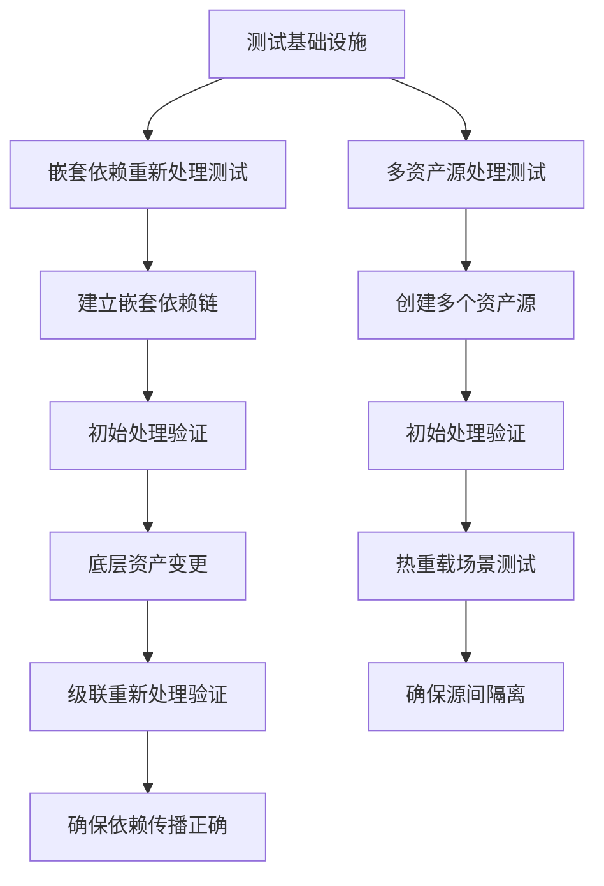

+++
title = "#21673 Add tests for asset processing under hot reloading and across asset sources."
date = "2025-10-30T00:00:00"
draft = false
template = "pull_request_page.html"
in_search_index = false

[extra]
current_language = "zh-cn"
available_languages = {"en" = { name = "English", url = "/pull_request/bevy/2025-10/pr-21673-en-20251030" }, "zh-cn" = { name = "中文", url = "/pull_request/bevy/2025-10/pr-21673-zh-cn-20251030" }}
+++

# Add tests for asset processing under hot reloading and across asset sources.

## 基本信息
- **标题**: Add tests for asset processing under hot reloading and across asset sources.
- **PR链接**: https://github.com/bevyengine/bevy/pull/21673
- **作者**: andriyDev
- **状态**: 已合并
- **标签**: A-Assets, S-Ready-For-Final-Review, C-Testing, D-StraightForward
- **创建时间**: 2025-10-28T07:20:10Z
- **合并时间**: 2025-10-30T16:20:13Z
- **合并者**: alice-i-cecile

## 描述翻译
### 目标
- 尝试重写资产处理以使其动态化是很困难的，特别是因为我们没有测试来验证资产处理应该能够处理的所有情况！

### 解决方案
- 增加一些测试！一个测试用于检查处理多个源是否有效，另一个测试用于检查发送资产事件是否会触发处理（包括依赖处理）。

### 测试
- ;)

## 这个PR的故事

### 问题和背景
在开发Bevy的资产处理系统时，团队面临一个关键挑战：重写资产处理逻辑以支持动态处理非常困难，因为缺乏全面的测试来验证系统在各种边界条件下的行为。具体来说，系统需要能够处理：

1. 跨多个资产源的处理
2. 热重载场景下的资产事件处理
3. 依赖资产的级联重新处理

没有这些测试，任何对资产处理系统的重构都可能引入难以发现的回归问题。这个PR的目标就是填补这些测试空白，为未来的重构工作提供安全保障。

### 解决方案方法
开发者采取了直接而实用的方法：编写两个新的集成测试来覆盖之前未经测试的关键场景。这些测试模拟了真实的使用情况，并验证了资产处理系统在复杂条件下的正确行为。

为了支持这些测试，首先重构了测试基础设施，使其能够：
- 支持多个资产源的配置
- 模拟资产文件变更事件
- 跟踪处理过程中的状态变化

### 实现细节
#### 测试基础设施重构
核心的改进是引入了`ProcessingDirs`结构体来封装每个资产源的目录和事件通道：

```rust
#[derive(Clone)]
struct ProcessingDirs {
    source: Dir,
    processed: Dir,
    source_event_sender: async_channel::Sender<AssetSourceEvent>,
}
```

这个结构体替代了之前测试中使用的简单目录对，增加了事件发送能力来模拟文件系统监视器。

`create_app_with_asset_processor`函数被重构为支持多个资产源：

```rust
fn create_app_with_asset_processor(extra_sources: &[String]) -> AppWithProcessor {
    // 创建默认源
    let default_source_dirs = create_source(&mut app, AssetSourceId::Default);
    
    // 创建额外源
    let extra_sources_dirs = extra_sources
        .iter()
        .map(|source_name| {
            (
                source_name.clone(),
                create_source(&mut app, AssetSourceId::Name(source_name.clone().into())),
            )
        })
        .collect::<Vec<_>>();
}
```

每个资产源现在都配置了模拟的监视器，通过`FakeWatcher`来捕获和处理资产事件：

```rust
struct FakeWatcher;
impl AssetWatcher for FakeWatcher {}

app.register_asset_source(
    source_id,
    AssetSource::build()
        .with_reader(move || Box::new(source_memory_reader.clone()))
        .with_watcher(move |sender: async_channel::Sender<AssetSourceEvent>| {
            source_event_sender_sender.send_blocking(sender).unwrap();
            Some(Box::new(FakeWatcher))
        })
        // ... 其他配置
);
```

#### 多资产源处理测试
第一个新测试`asset_processor_processes_all_sources`验证了系统能够正确处理来自不同资产源的资产：

```rust
#[test]
fn asset_processor_processes_all_sources() {
    let AppWithProcessor {
        mut app,
        default_source_dirs: ProcessingDirs { source: default_source_dir, processed: default_processed_dir, source_event_sender: default_source_events },
        extra_sources_dirs,
    } = create_app_with_asset_processor(&["custom_1".into(), "custom_2".into()]);
    
    // 配置处理器
    type AddTextProcessor = LoadTransformAndSave</* ... */>;
    app.register_asset_processor(AddTextProcessor::new(
        RootAssetTransformer::new(AddText(" processed".into())),
        CoolTextSaver,
    ));
    
    // 在多个源中创建相同路径的资产
    let path = Path::new("asset.cool.ron");
    default_source_dir.insert_asset_text(path, &serialize_as_cool_text("default asset"));
    custom_1_source_dir.insert_asset_text(path, &serialize_as_cool_text("custom 1 asset"));
    custom_2_source_dir.insert_asset_text(path, &serialize_as_cool_text("custom 2 asset"));
    
    run_app_until_finished_processing(&mut app);
    
    // 验证每个源中的资产都被独立处理
    assert_eq!(
        read_asset_as_string(&default_processed_dir, path),
        serialize_as_cool_text("default asset processed")
    );
    // ... 验证其他源
}
```

测试还验证了热重载场景 - 当某个源中的资产被修改时，只有该源的资产会被重新处理，其他源保持不变。

#### 嵌套资产依赖测试
第二个测试`nested_loads_of_processed_asset_reprocesses_on_reload`验证了依赖资产的级联重新处理：

```rust
#[test]
fn nested_loads_of_processed_asset_reprocesses_on_reload() {
    // 设置嵌套依赖：top.nest -> middle.nest -> bottom.nest
    custom_source_dir.insert_asset_text(
        Path::new("top.nest"),
        &ron::ser::to_string(&NesterSerialized::Path("middle.nest".into())).unwrap(),
    );
    default_source_dir.insert_asset_text(
        Path::new("middle.nest"),
        &ron::ser::to_string(&NesterSerialized::Path("custom://bottom.nest".into())).unwrap(),
    );
    custom_source_dir.insert_asset_text(Path::new("bottom.nest"), &serialize_as_leaf("leaf".into()));
    
    // 初始处理
    run_app_until_finished_processing(&mut app);
    
    // 修改底层资产并发送事件
    custom_source_dir.insert_asset_text(
        Path::new("bottom.nest"),
        &serialize_as_leaf("leaf changed".into()),
    );
    custom_source_events
        .send_blocking(AssetSourceEvent::ModifiedAsset("bottom.nest".into()))
        .unwrap();
    
    run_app_until_finished_processing(&mut app);
    
    // 验证所有依赖资产都被重新处理
    assert_eq!(
        read_asset_as_string(&custom_processed_dir, Path::new("bottom.nest")),
        serialize_as_leaf("leaf changed-ref".into())
    );
    assert_eq!(
        read_asset_as_string(&default_processed_dir, Path::new("middle.nest")),
        serialize_as_leaf("leaf changed-ref-ref".into())
    );
    // ... 验证顶层资产
}
```

这个测试使用了处理计数器来精确跟踪每个资产被处理的次数，确保只有受影响的资产被重新处理。

### 技术洞察
这个PR展示了几个重要的软件工程实践：

1. **测试驱动的基础设施改进**：为了编写有效的测试，首先需要改进测试基础设施。这导致了更健壮和可重用的测试工具。

2. **事件驱动的测试验证**：通过模拟`AssetSourceEvent`，测试能够验证系统在真实热重载场景下的行为。

3. **跨源依赖处理**：测试验证了资产处理系统能够正确处理跨不同资产源的依赖关系，这是一个复杂的边界情况。

4. **处理状态管理**：改进的`run_app_until_finished_processing`函数现在包含重试逻辑来处理多线程环境下的竞态条件。

### 影响
这些测试为资产处理系统的未来重构提供了关键的安全网。它们覆盖了：
- 多源隔离：确保不同源的资产处理互不干扰
- 事件驱动处理：验证热重载机制的正确性  
- 依赖传播：确保资产依赖变更的正确级联处理

通过提供这些测试，开发者现在可以更有信心地对资产处理系统进行改进和优化，知道这些关键场景都得到了验证。

## 可视化表示



## 关键文件更改

- `crates/bevy_asset/src/processor/tests.rs` (+501/-64)

这个文件包含了所有的测试改进：

1. **测试基础设施重构**：
```rust
// 新增结构体
#[derive(Clone)]
struct ProcessingDirs {
    source: Dir,
    processed: Dir,
    source_event_sender: async_channel::Sender<AssetSourceEvent>,
}

struct AppWithProcessor {
    app: App,
    default_source_dirs: ProcessingDirs,
    extra_sources_dirs: HashMap<String, ProcessingDirs>,
}

// 重构的创建函数
fn create_app_with_asset_processor(extra_sources: &[String]) -> AppWithProcessor {
    // 支持创建多个资产源
}
```

2. **新的测试工具函数**：
```rust
fn read_asset_as_string(dir: &Dir, path: &Path) -> String {
    let bytes = dir.get_asset(path).unwrap();
    str::from_utf8(bytes.value()).unwrap().to_string()
}
```

3. **两个主要的新测试**：
```rust
#[test]
fn asset_processor_processes_all_sources() {
    // 测试多资产源处理
}

#[test] 
fn nested_loads_of_processed_asset_reprocesses_on_reload() {
    // 测试嵌套依赖重新处理
}
```

4. **现有测试的改进**：
- 更新现有测试以使用新的测试基础设施
- 改进RON序列化输出格式以提高可读性
- 增强处理状态管理以处理多线程竞态条件

## 进一步阅读

- [Bevy资产系统文档](https://bevyengine.org/learn/quick-start/assets/)
- [资产处理指南](https://bevyengine.org/learn/quick-start/assets/processing/)
- [异步通道文档](https://docs.rs/async-channel/latest/async_channel/)
- [RON序列化格式](https://github.com/ron-rs/ron)