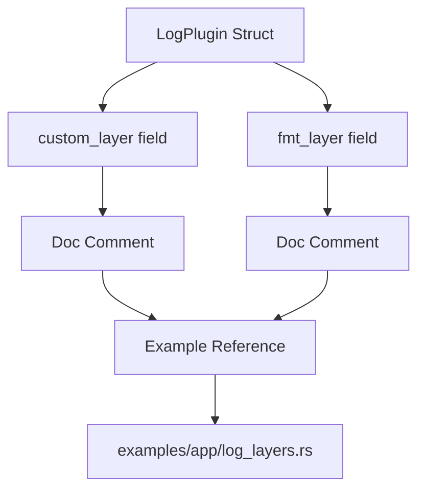

+++
title = "#21674 Fix example file paths in doc comments"
date = "2025-10-29T00:00:00"
draft = false
template = "pull_request_page.html"
in_search_index = true

[taxonomies]
list_display = ["show"]

[extra]
current_language = "en"
available_languages = {"en" = { name = "English", url = "/pull_request/bevy/2025-10/pr-21674-en-20251029" }, "zh-cn" = { name = "中文", url = "/pull_request/bevy/2025-10/pr-21674-zh-cn-20251029" }}
labels = ["C-Docs", "D-Trivial", "C-Examples", "A-Diagnostics"]
+++

# Title
Fix example file paths in doc comments

## Basic Information
- **Title**: Fix example file paths in doc comments
- **PR Link**: https://github.com/bevyengine/bevy/pull/21674
- **Author**: chocolacula
- **Status**: MERGED
- **Labels**: C-Docs, D-Trivial, C-Examples, S-Ready-For-Final-Review, A-Diagnostics
- **Created**: 2025-10-28T08:00:00Z
- **Merged**: 2025-10-29T19:56:19Z
- **Merged By**: alice-i-cecile

## Description Translation
# Objective

Just a tiny fix of `log_layers` example path in documentation comments.

## Solution

The comments are corrected.

## Testing

No needed

## The Story of This Pull Request

This pull request addresses a straightforward but important documentation issue in the Bevy game engine's logging system. The problem was simple: documentation comments in the `LogPlugin` struct were referencing incorrect file paths to example code.

In the Bevy codebase, examples are organized in a directory structure that separates different types of examples. The `log_layers.rs` example file is located in the `examples/app/` subdirectory, but the documentation was pointing to it as if it were in the root examples directory. This discrepancy could cause confusion for developers trying to locate and study the referenced examples.

The author identified two fields in the `LogPlugin` struct where this path issue occurred:
- The `custom_layer` field documentation
- The `fmt_layer` field documentation

Both fields were pointing developers to `examples/log_layers.rs` when the correct path was `examples/app/log_layers.rs`. This kind of documentation error, while minor, can create friction for developers exploring the codebase and trying to understand how to implement custom logging layers.

The solution was direct and minimal - simply updating the string literals in the doc comments to reflect the correct file paths. This change required no modifications to actual code logic, no testing, and no architectural considerations. It's a pure documentation fix that improves the developer experience by ensuring accurate references to example code.

From an engineering perspective, this fix demonstrates the importance of maintaining accurate documentation, even for seemingly small details. Incorrect file paths in documentation can waste developer time and create unnecessary confusion, especially for newcomers to the codebase. The change was reviewed and merged quickly, indicating that it was clearly correct and uncontroversial.

## Visual Representation



## Key Files Changed

**File**: `crates/bevy_log/src/lib.rs` (+2/-2)

This file contains the core logging functionality for Bevy. The changes were limited to documentation comments for two fields in the `LogPlugin` struct.

**Changes**:
```rust
// Before:
/// Please see the `examples/log_layers.rs` for a complete example.

// After:  
/// Please see the `examples/app/log_layers.rs` for a complete example.
```

The same change was applied to both the `custom_layer` and `fmt_layer` field documentation. These fields allow developers to customize the logging behavior in Bevy applications by providing custom tracing layers, and the corrected documentation now accurately points to the example that demonstrates their usage.

## Further Reading

- [Bevy Examples Directory Structure](https://github.com/bevyengine/bevy/tree/main/examples)
- [Rust Documentation Comments](https://doc.rust-lang.org/rustdoc/how-to-write-documentation.html)
- [tracing_subscriber crate documentation](https://docs.rs/tracing-subscriber/latest/tracing_subscriber/)

# Full Code Diff
```diff
diff --git a/crates/bevy_log/src/lib.rs b/crates/bevy_log/src/lib.rs
index 6a75a179516c9..988fa8e23ad71 100644
--- a/crates/bevy_log/src/lib.rs
+++ b/crates/bevy_log/src/lib.rs
@@ -240,7 +240,7 @@ pub struct LogPlugin {
     /// Access to [`App`] is also provided to allow for communication between the
     /// [`Subscriber`](tracing::Subscriber) and the [`App`].
     ///
-    /// Please see the `examples/log_layers.rs` for a complete example.
+    /// Please see the `examples/app/log_layers.rs` for a complete example.
     pub custom_layer: fn(app: &mut App) -> Option<BoxedLayer>,
 
     /// Override the default [`tracing_subscriber::fmt::Layer`] with a custom one.
@@ -253,7 +253,7 @@ pub struct LogPlugin {
     /// For example, you can use [`tracing_subscriber::fmt::Layer::without_time`] to remove the
     /// timestamp from the log output.
     ///
-    /// Please see the `examples/log_layers.rs` for a complete example.
+    /// Please see the `examples/app/log_layers.rs` for a complete example.
     pub fmt_layer: fn(app: &mut App) -> Option<BoxedFmtLayer>,
 }
```