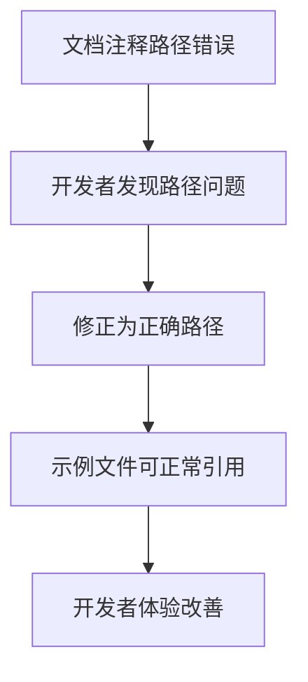

+++
title = "#21674 Fix example file paths in doc comments"
date = "2025-10-29T00:00:00"
draft = false
template = "pull_request_page.html"
in_search_index = false

[extra]
current_language = "zh-cn"
available_languages = {"en" = { name = "English", url = "/pull_request/bevy/2025-10/pr-21674-en-20251029" }, "zh-cn" = { name = "中文", url = "/pull_request/bevy/2025-10/pr-21674-zh-cn-20251029" }}
+++

# Fix example file paths in doc comments

## 基本信息
- **标题**: Fix example file paths in doc comments
- **PR链接**: https://github.com/bevyengine/bevy/pull/21674
- **作者**: chocolacula
- **状态**: 已合并
- **标签**: C-Docs, D-Trivial, C-Examples, S-Ready-For-Final-Review, A-Diagnostics
- **创建时间**: 2025-10-28T08:00:00Z
- **合并时间**: 2025-10-29T19:56:19Z
- **合并者**: alice-i-cecile

## 描述翻译

**目标**

只是对文档注释中的 `log_layers` 示例路径进行微小修正。

**解决方案**

注释已被修正。

**测试**

不需要。

## 这个Pull Request的故事

这个PR解决了一个看似简单但实际重要的文档问题。在Bevy引擎的日志系统中，`LogPlugin`结构体的文档注释引用了示例文件路径，但这些路径指向了错误的位置。

问题出现在`crates/bevy_log/src/lib.rs`文件中，其中有两个文档注释指向了不存在的示例文件路径`examples/log_layers.rs`。实际上，该示例文件位于`examples/app/log_layers.rs`目录下。这种路径错误虽然不会影响代码编译或运行，但对于开发者查阅文档和使用示例代码会造成困扰。

当开发者按照文档中的路径去寻找示例时，会发现文件不存在，这会导致不必要的困惑和时间浪费。特别是在学习Bevy日志系统的高级功能时，正确的示例引用至关重要。

开发者chocolacula发现了这个问题并提出了简单的修复方案：将两处错误的文档注释路径从`examples/log_layers.rs`修正为`examples/app/log_layers.rs`。

这个修改虽然微小，但体现了对文档质量的重视。在开源项目中，准确的文档对于新开发者的入门体验和现有开发者的工作效率都至关重要。错误的文档引用虽然不会导致运行时错误，但会降低项目的专业性和可用性。

从技术角度看，这个修改涉及的是Rust的文档注释（doc comments），这些注释会被rustdoc工具处理并生成项目的API文档。准确的示例路径引用使得开发者能够快速找到相关的示例代码，理解如何使用`LogPlugin`的自定义日志层功能。

## 视觉表示



## 关键文件更改

- `crates/bevy_log/src/lib.rs` (+2/-2)

这个文件包含了Bevy日志系统的核心实现，主要修改了两个文档注释中的示例文件路径：

```rust
// 文件: crates/bevy_log/src/lib.rs
// 修改前:
/// Please see the `examples/log_layers.rs` for a complete example.
pub custom_layer: fn(app: &mut App) -> Option<BoxedLayer>,

/// Please see the `examples/log_layers.rs` for a complete example.
pub fmt_layer: fn(app: &mut App) -> Option<BoxedFmtLayer>,

// 修改后:
/// Please see the `examples/app/log_layers.rs` for a complete example.
pub custom_layer: fn(app: &mut App) -> Option<BoxedLayer>,

/// Please see the `examples/app/log_layers.rs` for a complete example.
pub fmt_layer: fn(app: &mut App) -> Option<BoxedFmtLayer>,
```

这些修改确保了文档注释中引用的示例文件路径与实际文件位置一致，使开发者能够准确找到相关的示例代码。

## 进一步阅读

- [Rust文档注释指南](https://doc.rust-lang.org/rustdoc/how-to-write-documentation.html)
- [Bevy示例目录结构](https://github.com/bevyengine/bevy/tree/main/examples)
- [tracing库文档](https://docs.rs/tracing) - Bevy日志系统基于的底层库