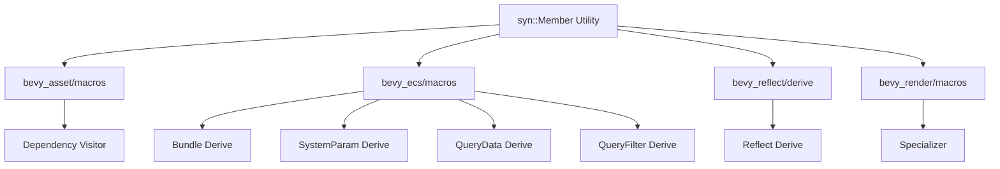

+++
title = "#21678 Cleaner macros utilizing syn::Member v2"
date = "2025-10-30T00:00:00"
draft = false
template = "pull_request_page.html"
in_search_index = true

[taxonomies]
list_display = ["show"]

[extra]
current_language = "en"
available_languages = {"en" = { name = "English", url = "/pull_request/bevy/2025-10/pr-21678-en-20251030" }, "zh-cn" = { name = "中文", url = "/pull_request/bevy/2025-10/pr-21678-zh-cn-20251030" }}
labels = ["C-Code-Quality", "A-Cross-Crossing", "D-Macros"]
+++

# Title

## Basic Information
- **Title**: Cleaner macros utilizing syn::Member v2
- **PR Link**: https://github.com/bevyengine/bevy/pull/21678
- **Author**: Bleachfuel
- **Status**: MERGED
- **Labels**: C-Code-Quality, S-Ready-For-Final-Review, A-Cross-Crossing, D-Macros
- **Created**: 2025-10-28T13:26:14Z
- **Merged**: 2025-10-30T03:16:36Z
- **Merged By**: alice-i-cecile

## Description Translation
# Objective

Some macros were handling Idents and indexes as seperate things, we can use syn::Member to make this more readable and nicer.

revive of #18199

## The Story of This Pull Request

This PR addresses a common pattern in Bevy's macro codebase where field access needed to handle both named fields (using identifiers) and tuple fields (using indices) separately. The core issue was that different syntax was required for accessing `self.field` versus `self.0`, leading to duplicated code and complex conditional logic throughout the derive macros.

The solution centers around using `syn::Member`, a type from the syn crate that can represent both named and indexed field access in a unified way. This abstraction allows macros to handle both field types with the same code path, significantly simplifying the implementation.

The implementation started by adding a new utility function `as_member` in the `bevy_macro_utils` crate:

```rust
pub fn as_member(ident: Option<&Ident>, index: usize) -> Member {
    ident.map_or_else(|| Member::from(index), |ident| Member::Named(ident.clone()))
}
```

This function takes an optional identifier and an index, returning the appropriate `syn::Member` variant. When an identifier is present, it creates a `Member::Named`, otherwise it creates a `Member::Unnamed` using the index.

The changes then propagate through multiple derive macros that handle struct fields:

- **Asset dependency visitor**: Simplified field iteration and access patterns
- **ECS Bundle derive**: Unified field handling for component extraction
- **SystemParam derive**: Cleaned up field validation and state management  
- **QueryData derive**: Streamlined field processing for world queries
- **QueryFilter derive**: Consolidated field access for filter types
- **Reflect derive**: Updated field member generation

A key technical insight is how this change affects code generation. Previously, macros needed to generate different access patterns:

```rust
// Before: Separate handling for named vs tuple fields
match &field.ident {
    Some(ident) => quote!(&self.#ident),
    None => {
        let index = syn::Index::from(i);
        quote!(&self.#index)
    }
}
```

After the changes, the code becomes much cleaner:

```rust
// After: Unified handling with syn::Member
let member = as_member(field.ident.as_ref(), i);
quote!(&self.#member)
```

The PR also includes updates to the `get_struct_fields` utility function to return the full `Fields` type instead of just the punctuated field list, providing better context for field processing.

One notable improvement is in the `derive_system_param` implementation, where field validation and state management were significantly simplified by using member-based access patterns. The code now handles both named and tuple structs with the same logic path, reducing complexity and potential error points.

The impact of these changes is substantial code simplification across multiple critical Bevy macros. By eliminating the duplicated field access logic, the codebase becomes more maintainable and less prone to bugs. The changes also make the macros more robust when handling different struct field patterns.

## Visual Representation



## Key Files Changed

### `crates/bevy_macro_utils/src/member.rs` (+46/-0)
Added a new utility module for handling field members.

**Key addition:**
```rust
pub fn as_member(ident: Option<&Ident>, index: usize) -> Member {
    ident.map_or_else(|| Member::from(index), |ident| Member::Named(ident.clone()))
}
```

### `crates/bevy_ecs/macros/src/lib.rs` (+69/-104)
Simplified field handling in bundle and system param derives.

**Before:**
```rust
let field = named_fields.iter().map(|field| field.ident.as_ref()).collect::<Vec<_>>();
let field_type = named_fields.iter().map(|field| &field.ty).collect::<Vec<_>>();

let mut active_field_tokens = Vec::new();
for (((i, field_type), field_kind), field) in field_type.iter().enumerate().zip(field_kind.iter()).zip(field.iter()) {
    let field_alias = format_ident!("field_{}", i).to_token_stream();
    let field_tokens = match field {
        Some(field) => field.to_token_stream(),
        None => Index::from(i).to_token_stream(),
    };
    // ... complex field handling
}
```

**After:**
```rust
let field_types = fields.iter().map(|field| &field.ty).collect::<Vec<_>>();
let field_members = fields.members().collect::<Vec<_>>();

for ((field_member, field_type), field_kind) in fields.members().zip(field_types).zip(field_kinds) {
    let field_local = format_ident!("field_{}", field_member);
    // ... simplified field handling
}
```

### `crates/bevy_ecs/macros/src/query_data.rs` (+35/-92)
Streamlined query data field processing.

**Key change:**
```rust
// Before: Manual field ident/index handling
let field_ident = field.ident.as_ref().map_or(quote! { #i }, |i| quote! { #i });

// After: Unified member handling  
let field_members = fields.members().collect();
```

### `crates/bevy_asset/macros/src/lib.rs` (+19/-36)
Simplified dependency visitor field iteration.

**Before:**
```rust
let field_visitors = fields.enumerate().filter(|(_, f)| field_has_dep(f));
let field_visitors = field_visitors.map(|(i, field)| match &field.ident {
    Some(ident) => visit_dep(quote!(&self.#ident)),
    None => {
        let index = syn::Index::from(i);
        visit_dep(quote!(&self.#index))
    }
});
```

**After:**
```rust
let field_visitors = fields.iter().enumerate()
    .filter(|(_, f)| field_has_dep(f))
    .map(|(i, field)| as_member(field.ident.as_ref(), i))
    .map(|member| visit_dep(quote!(&self.#member)));
```

### `crates/bevy_ecs/macros/src/query_filter.rs` (+16/-39)
Applied the same pattern to query filter derivation.

## Further Reading

- [syn::Member documentation](https://docs.rs/syn/latest/syn/enum.Member.html)
- [Rust Procedural Macros Guide](https://doc.rust-lang.org/reference/procedural-macros.html)
- [Bevy ECS Derive Macros](https://bevyengine.org/learn/quick-start/ecs/#derive-macros)