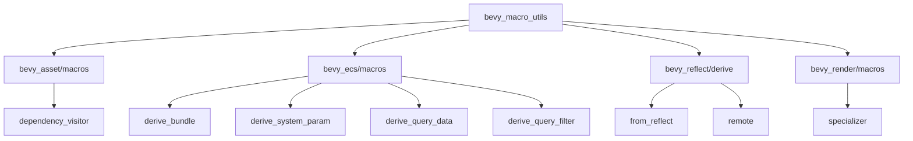

+++
title = "#21678 Cleaner macros utilizing syn::Member v2"
date = "2025-10-30T00:00:00"
draft = false
template = "pull_request_page.html"
in_search_index = false

[extra]
current_language = "zh-cn"
available_languages = {"en" = { name = "English", url = "/pull_request/bevy/2025-10/pr-21678-en-20251030" }, "zh-cn" = { name = "中文", url = "/pull_request/bevy/2025-10/pr-21678-zh-cn-20251030" }}
+++

# Cleaner macros utilizing syn::Member v2

## 基本信息
- **标题**: Cleaner macros utilizing syn::Member v2
- **PR链接**: https://github.com/bevyengine/bevy/pull/21678
- **作者**: Bleachfuel
- **状态**: 已合并
- **标签**: C-Code-Quality, S-Ready-For-Final-Review, A-Cross-Cutting, D-Macros
- **创建时间**: 2025-10-28T13:26:14Z
- **合并时间**: 2025-10-30T03:16:36Z
- **合并者**: alice-i-cecile

## 描述翻译
**目标**

一些宏将标识符（Idents）和索引（indexes）作为单独的东西处理，我们可以使用 syn::Member 来使代码更易读和更简洁。

这是 #18199 的复兴。

## 这个PR的故事

这个PR的核心目标是简化Bevy引擎中多个派生宏的字段处理逻辑。在之前的实现中，宏代码需要分别处理具名字段（named fields）和元组字段（tuple fields），这导致代码重复且难以维护。

### 问题和背景

在Rust的派生宏开发中，处理结构体字段时经常面临一个基本问题：具名字段通过标识符访问（如`self.field`），而元组字段通过索引访问（如`self.0`）。在Bevy的多个宏实现中，这种差异导致了大量重复的匹配逻辑：

```rust
// 修改前的典型代码模式
match &field.ident {
    Some(ident) => quote!(&self.#ident),
    None => {
        let index = syn::Index::from(i);
        quote!(&self.#index)
    }
}
```

这种模式在代码库中重复出现，不仅增加了代码量，也降低了可维护性。每次处理字段时都需要重复这个逻辑，而且容易出错。

### 解决方案

PR引入了`syn::Member`类型来统一处理这两种字段访问方式。`syn::Member`是一个枚举，可以表示具名字段（`Member::Named`）或元组字段索引（`Member::Unnamed`）。通过创建一个工具函数`as_member`，将字段标识符和索引统一转换为`Member`类型：

```rust
// 新增的辅助函数
pub fn as_member(ident: Option<&Ident>, index: usize) -> Member {
    ident.map_or_else(|| Member::from(index), |ident| Member::Named(ident.clone()))
}
```

这个函数在`bevy_macro_utils` crate中定义，可以被所有需要处理字段的宏共享使用。

### 实现细节

实现过程涉及多个crate的修改，主要集中在字段处理逻辑的重构：

1. **在`bevy_asset/macros`中**，重构了依赖访问者（dependency visitor）的生成逻辑，使用`as_member`统一处理结构体和枚举的字段访问。

2. **在`bevy_ecs/macros`中**，这是改动最大的部分：
   - `derive_bundle`：使用新的字段成员系统替换了原有的字段处理逻辑
   - `derive_system_param`：重构了系统参数的状态管理
   - `derive_query_data`和`derive_query_filter`：统一了查询系统的字段访问

3. **在`bevy_reflect/derive`中**，移除了原有的`ident_or_index`函数，改用`as_member`

关键的技术改进包括：

- 使用`Fields::members()`方法获取所有字段的成员信息
- 创建字段成员的本地别名（如`field_0`, `field_1`）用于代码生成
- 统一使用`#field_member`语法在quote宏中访问字段

### 技术洞察

这个重构展示了几个重要的宏编程模式：

1. **抽象层的重要性**：通过创建一个通用的`as_member`函数，将字段处理的复杂性封装在一个地方，简化了调用方的代码。

2. **类型系统的力量**：`syn::Member`类型提供了类型安全的字段表示，避免了手动处理索引和标识符的复杂性。

3. **一致性改进**：修改后的代码在处理具名字段和元组字段时行为完全一致，减少了潜在的错误。

4. **依赖管理**：PR还更新了`syn`依赖到2.0.108版本，确保了对新功能的支持。

### 影响

这个重构带来了显著的代码质量改进：

- **代码行数减少**：净减少了约100行代码
- **可维护性提升**：消除了重复的字段处理逻辑
- **一致性增强**：所有宏现在使用相同的字段处理模式
- **错误减少**：通过统一的API降低了出错概率

修改是向后兼容的，不影响现有的派生宏使用方式，只是内部实现的优化。

## 视觉表示



## 关键文件更改

### `crates/bevy_macro_utils/src/member.rs` (+46/-0)
新增了`as_member`函数，这是整个重构的核心工具函数。

```rust
pub fn as_member(ident: Option<&Ident>, index: usize) -> Member {
    ident.map_or_else(|| Member::from(index), |ident| Member::Named(ident.clone()))
}
```

### `crates/bevy_ecs/macros/src/lib.rs` (+69/-104)
重构了bundle和system param的派生宏，使用新的字段成员系统。

```rust
// 修改前：
let field = named_fields.iter().map(|field| field.ident.as_ref()).collect::<Vec<_>>();
let field_type = named_fields.iter().map(|field| &field.ty).collect::<Vec<_>>();

// 修改后：
let field_members = fields.members().collect::<Vec<_>>();
let field_types = fields.iter().map(|f| &f.ty).collect::<Vec<_>>();
```

### `crates/bevy_ecs/macros/src/query_data.rs` (+35/-92)
简化了query data派生宏的字段处理逻辑。

```rust
// 修改前：
let mut field_idents = Vec::new();
for (i, field) in fields.iter().enumerate() {
    let i = Index::from(i);
    let field_ident = field.ident.as_ref().map_or(quote! { #i }, |i| quote! { #i });
    field_idents.push(field_ident);
}

// 修改后：
let field_members = fields.members().collect();
```

### `crates/bevy_asset/macros/src/lib.rs` (+19/-36)
重构了asset依赖访问者的生成逻辑。

```rust
// 修改前：
let field_visitors = fields.enumerate().filter(|(_, f)| field_has_dep(f));
let field_visitors = field_visitors.map(|(i, field)| match &field.ident {
    Some(ident) => visit_dep(quote!(&self.#ident)),
    None => {
        let index = syn::Index::from(i);
        visit_dep(quote!(&self.#index))
    }
});

// 修改后：
let field_visitors = fields
    .iter()
    .enumerate()
    .filter(|(_, f)| field_has_dep(f))
    .map(|(i, field)| as_member(field.ident.as_ref(), i))
    .map(|member| visit_dep(quote!(&self.#member)));
```

### `crates/bevy_ecs/macros/src/query_filter.rs` (+16/-39)
简化了query filter派生宏的实现。

## 进一步阅读

- [syn::Member文档](https://docs.rs/syn/2.0.108/syn/enum.Member.html) - 了解Member类型的详细信息
- [Rust过程宏指南](https://doc.rust-lang.org/reference/procedural-macros.html) - 学习过程宏的基础知识
- [Bevy ECS文档](https://bevyengine.org/learn/book/ecs/) - 了解Bevy的实体组件系统
- [PR #18199](https://github.com/bevyengine/bevy/pull/18199) - 原始的实现尝试