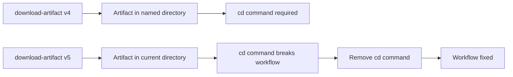

+++
title = "#21683 fix path when sending screenshots to pixeleagle"
date = "2025-10-28T00:00:00"
draft = false
template = "pull_request_page.html"
in_search_index = true

[taxonomies]
list_display = ["show"]

[extra]
current_language = "en"
available_languages = {"en" = { name = "English", url = "/pull_request/bevy/2025-10/pr-21683-en-20251028" }, "zh-cn" = { name = "中文", url = "/pull_request/bevy/2025-10/pr-21683-zh-cn-20251028" }}
labels = ["C-Bug", "A-Build-System"]
+++

# Title

## Basic Information
- **Title**: fix path when sending screenshots to pixeleagle
- **PR Link**: https://github.com/bevyengine/bevy/pull/21683
- **Author**: mockersf
- **Status**: MERGED
- **Labels**: C-Bug, A-Build-System, S-Ready-For-Final-Review
- **Created**: 2025-10-28T20:18:26Z
- **Merged**: 2025-10-28T21:20:55Z
- **Merged By**: cart

## Description Translation
# Objective

- #21664 broke CI. Failures wasn't triggered by this PR as it's the CI that runs from the main branch

## Solution

- download-artifact v5 changed how artefacts are handled. we met a case not documented in their breaking change

## The Story of This Pull Request

This PR addresses a CI pipeline failure that occurred after the upgrade to download-artifact v5 in PR #21664. The issue manifested as a path resolution problem in the screenshot processing workflow, where the CI job that sends screenshots to pixeleagle was failing due to incorrect directory navigation.

The core problem stemmed from a breaking change in download-artifact v5 that altered how artifacts are structured when downloaded. Previously, artifacts were downloaded into a directory named after the artifact itself, but in v5, the behavior changed in a way that wasn't fully documented in the breaking change notes. This caused the subsequent `cd` command to navigate to a non-existent directory, breaking the screenshot processing logic.

The solution was straightforward but required understanding the new artifact structure. The fix involved removing the `cd ${{ inputs.artifact }}` command since the artifact contents were now being downloaded directly to the current working directory rather than into a subdirectory. This change aligns the workflow with the new behavior of download-artifact v5.

This is a classic example of how dependency upgrades, even in CI tooling, can introduce subtle breaking changes that aren't immediately apparent. The failure wasn't caught in the original PR because the affected workflow runs from the main branch rather than during PR validation, highlighting the importance of comprehensive testing across all CI workflows.

The fix demonstrates proper troubleshooting of CI pipeline issues by:
1. Identifying the root cause through version comparison
2. Understanding the behavioral changes in the updated dependency
3. Making the minimal necessary change to restore functionality

## Visual Representation



## Key Files Changed

### `.github/workflows/send-screenshots-to-pixeleagle.yml` (-2 lines)

This GitHub Actions workflow file handles sending screenshots to pixeleagle for visual regression testing. The change removes a directory navigation command that became obsolete after the download-artifact v5 upgrade.

**Key modification:**
```yaml
# File: .github/workflows/send-screenshots-to-pixeleagle.yml
# Before:
          cd ${{ inputs.artifact }}

# After:
# [Line removed entirely]
```

The removal of the `cd` command aligns the workflow with the new artifact structure in download-artifact v5, where artifacts are now extracted directly to the current working directory instead of into a subdirectory named after the artifact.

## Further Reading

- [GitHub Actions: download-artifact v4 to v5 migration guide](https://github.com/actions/download-artifact/blob/main/docs/v1-v2-v3-v4-v5.md)
- [GitHub Actions workflow syntax documentation](https://docs.github.com/en/actions/using-workflows/workflow-syntax-for-github-actions)
- [Bevy Engine CI documentation](https://github.com/bevyengine/bevy/blob/main/docs/ci.md)

# Full Code Diff
```
diff --git a/.github/workflows/send-screenshots-to-pixeleagle.yml b/.github/workflows/send-screenshots-to-pixeleagle.yml
index 3fdaf08b47947..f872e624a0498 100644
--- a/.github/workflows/send-screenshots-to-pixeleagle.yml
+++ b/.github/workflows/send-screenshots-to-pixeleagle.yml
@@ -56,8 +56,6 @@ jobs:
 
           SAVEIFS=$IFS
 
-          cd ${{ inputs.artifact }}
-
           # Read the hashes of the screenshot for fast comparison when they are equal
           IFS=$'\n'
           # Build a json array of screenshots and their hashes
```