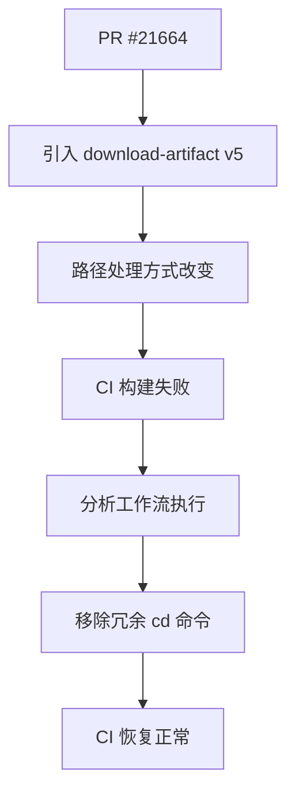

+++
title = "#21683 fix path when sending screenshots to pixeleagle"
date = "2025-10-28T00:00:00"
draft = false
template = "pull_request_page.html"
in_search_index = false

[extra]
current_language = "zh-cn"
available_languages = {"en" = { name = "English", url = "/pull_request/bevy/2025-10/pr-21683-en-20251028" }, "zh-cn" = { name = "中文", url = "/pull_request/bevy/2025-10/pr-21683-zh-cn-20251028" }}
labels = ["C-Bug", "A-Build-System"]
+++

# Title
fix path when sending screenshots to pixeleagle

## Basic Information
- **Title**: fix path when sending screenshots to pixeleagle
- **PR Link**: https://github.com/bevyengine/bevy/pull/21683
- **Author**: mockersf
- **Status**: MERGED
- **Labels**: C-Bug, A-Build-System, S-Ready-For-Final-Review
- **Created**: 2025-10-28T20:18:26Z
- **Merged**: 2025-10-28T21:20:55Z
- **Merged By**: cart

## Description Translation
# Objective

- #21664 破坏了 CI。这个 PR 没有触发失败，因为 CI 是从主分支运行的

## Solution

- download-artifact v5 改变了工件(artifacts)的处理方式。我们遇到了一个在他们的破坏性变更文档中没有记录的情况

## The Story of This Pull Request

这个 PR 解决了一个由 GitHub Actions 的 `download-artifact` 动作版本升级引发的构建系统问题。问题出现在 #21664 这个 PR 中，但由于 CI 是从主分支运行的，当时并没有立即发现构建失败。

问题的核心在于 `download-artifact` 从 v4 升级到 v5 版本时，对工件处理方式的改变。虽然官方提供了破坏性变更的文档，但开发团队遇到了一个文档中未明确说明的边缘情况。具体来说，新版本改变了工件的路径处理逻辑，导致后续步骤无法正确定位到下载的截图文件。

在原始的工作流配置中，脚本包含了一个 `cd ${{ inputs.artifact }}` 命令来切换到工件目录。这个操作在 v4 版本中是必要的，因为工件会被下载到指定的子目录中。但是在 v5 版本中，工件的处理方式发生了变化，这个目录切换操作反而导致了路径问题。

解决方案相当直接：移除这个不必要的目录切换命令。通过分析工作流的执行上下文，发现 `working-directory` 已经正确设置了工作目录，因此额外的 `cd` 命令是冗余的，并且在新版本中会破坏路径解析。

这个修复展示了在 CI/CD 流水线中处理第三方动作版本升级时的典型挑战。即使有官方迁移指南，实际使用中仍可能遇到未文档化的行为变化。在这种情况下，最有效的调试方法是仔细分析工作流的执行步骤，理解每个动作的输入输出和行为变化。

## Visual Representation



## Key Files Changed

### `.github/workflows/send-screenshots-to-pixeleagle.yml`

这个文件包含了发送截图到 pixeleagle 服务的工作流配置。修改移除了一个在 `download-artifact` v5 中变得冗余的目录切换命令。

**关键修改：**
```yaml
# 修改前：
          SAVEIFS=$IFS

          cd ${{ inputs.artifact }}

          # Read the hashes of the screenshot for fast comparison when they are equal

# 修改后：
          SAVEIFS=$IFS

          # Read the hashes of the screenshot for fast comparison when they are equal
```

**修改原因：**
- `download-artifact` v5 改变了工件的路径处理方式
- `working-directory` 参数已经正确设置了工作目录
- 额外的 `cd` 命令在新版本中会导致路径解析错误

## Further Reading

- [GitHub Actions: download-artifact v4 to v5 migration guide](https://github.com/actions/download-artifact/blob/main/docs/v1-v2-v3-v4-v5.md)
- [GitHub Actions workflow syntax](https://docs.github.com/en/actions/using-workflows/workflow-syntax-for-github-actions)
- [Bevy Engine CI/CD documentation](https://github.com/bevyengine/bevy/blob/main/docs/ci.md)