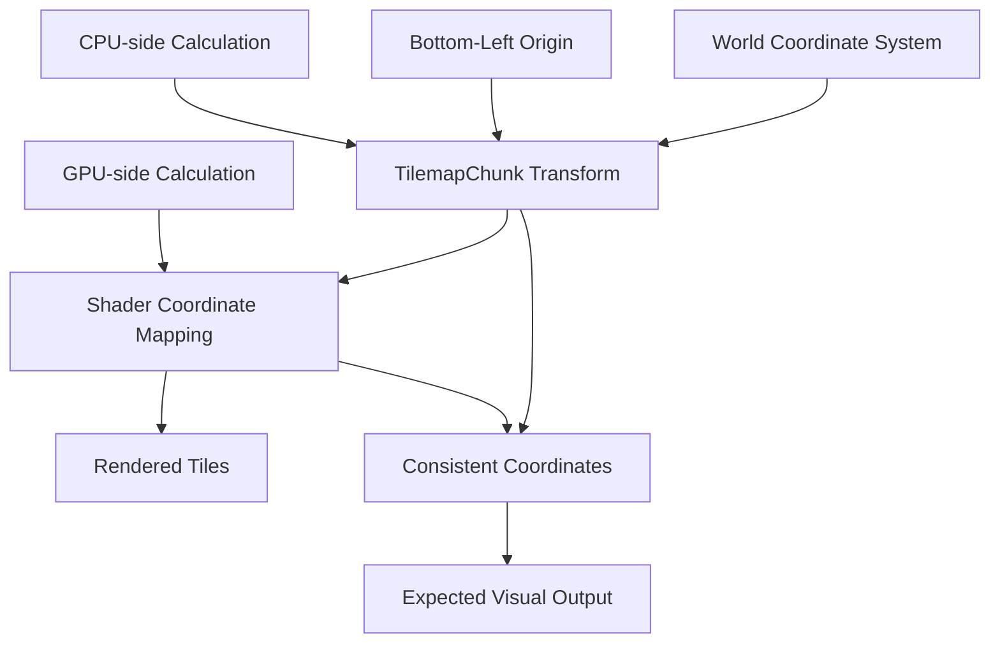

+++
title = "#21684 Change default tile chunk layout"
date = "2025-10-30T00:00:00"
draft = false
template = "pull_request_page.html"
in_search_index = true

[taxonomies]
list_display = ["show"]

[extra]
current_language = "en"
available_languages = {"en" = { name = "English", url = "/pull_request/bevy/2025-10/pr-21684-en-20251030" }, "zh-cn" = { name = "中文", url = "/pull_request/bevy/2025-10/pr-21684-zh-cn-20251030" }}
labels = ["A-Rendering", "M-Migration-Guide"]
+++

# Change default tile chunk layout

## Basic Information
- **Title**: Change default tile chunk layout
- **PR Link**: https://github.com/bevyengine/bevy/pull/21684
- **Author**: jamescarterbell
- **Status**: MERGED
- **Labels**: A-Rendering, S-Ready-For-Final-Review, M-Migration-Guide
- **Created**: 2025-10-28T20:22:51Z
- **Merged**: 2025-10-30T03:36:03Z
- **Merged By**: alice-i-cecile

## Description Translation
# Objective

Have the layout of the tile chunk map the world axis.

## Solution

Invert the calculated y index in the shader and transform calculation.

## Testing

Ran the example and saw 0,0 move to the bottom left instead of the top left.

## Migration

People manually calculating the tile index will have to invert the chunk relative y index from the current implementation.

For example, with a chunk size of (16, 16) today:
(5, 6) in world coords => (5, 9) in chunk coords 

Changes to:
(5, 6) in world coords => (5, 6) in chunk coords

## The Story of This Pull Request

This PR addresses a fundamental inconsistency in Bevy's tilemap coordinate system. The core issue was that tile chunks used a top-left origin coordinate system, while Bevy's world coordinate system uses a bottom-left origin. This mismatch created unnecessary complexity when mapping between world coordinates and tile coordinates.

The problem manifested in two key areas: the CPU-side coordinate transformation in Rust code and the GPU-side coordinate calculation in the shader. Developers working with tilemaps had to mentally invert the Y-axis when converting between world coordinates and tile coordinates, which was error-prone and counter-intuitive.

The solution involved coordinated changes across both the Rust code and the WGSL shader. In the Rust implementation, the coordinate transformation logic was rewritten to remove the Y-axis negation and adjust the offset calculations. This changed the origin from the top-left to bottom-left of the tile chunk. In the shader, a simple inversion operation was added to the Y-coordinate calculation to match the new coordinate system.

The implementation demonstrates a clean separation of concerns - the CPU-side code handles the high-level coordinate transformations while the GPU-side code handles the per-fragment coordinate adjustments. This maintains performance by keeping the heavy computation on the GPU while ensuring consistency across the entire rendering pipeline.

The migration impact is straightforward but important to note. Any code that was manually calculating tile indices using the old coordinate system will need to remove the Y-axis inversion. The example provided in the migration guide clearly illustrates this change: world coordinates (5, 6) now map directly to chunk coordinates (5, 6) instead of requiring the previous inversion to (5, 9).

This change aligns Bevy's tilemap system with established conventions in computer graphics and game development, where bottom-left origins are standard for coordinate systems that need to match world space. The consistency improvement reduces cognitive load for developers and eliminates a common source of bugs in tilemap implementations.

## Visual Representation



## Key Files Changed

### `crates/bevy_sprite_render/src/tilemap_chunk/mod.rs`

This file contains the core coordinate transformation logic for tile chunks. The changes removed the Y-axis negation and adjusted the offset calculations to shift the origin from top-left to bottom-left.

```rust
// Before:
position.y as f32
* (self.tile_display_size.y as f32).neg()
- self.tile_display_size.y as f32 / 2.
+ self.tile_display_size.y as f32 * self.chunk_size.y as f32 / 2.

// After:
position.y as f32
* self.tile_display_size.y as f32
+ self.tile_display_size.y as f32 / 2.
- self.tile_display_size.y as f32 * self.chunk_size.y as f32 / 2.
```

The key changes were:
- Removing the `Neg` import and the negation operation on `tile_display_size.y`
- Changing the offset from subtraction to addition for the half-tile correction
- Changing the chunk size offset from addition to subtraction to place the origin at the bottom

### `crates/bevy_sprite_render/src/tilemap_chunk/tilemap_chunk_material.wgsl`

The shader file was updated to invert the Y-coordinate calculation, matching the new coordinate system.

```wgsl
// Before:
let tile_coord = clamp(vec2<u32>(floor(tile_uv)), vec2<u32>(0), chunk_size - 1);

// After:
var tile_coord = clamp(vec2<u32>(floor(tile_uv)), vec2<u32>(0), chunk_size - 1);
tile_coord.y = chunk_size.y - 1 - tile_coord.y;
```

The shader now explicitly inverts the Y-coordinate by subtracting it from `chunk_size.y - 1`, ensuring that texture coordinates are sampled from the correct position in the new bottom-left coordinate system.

### `release-content/migration-guides/tilemap_chunk_layout_change.md`

This new migration guide documents the breaking change and provides clear guidance for developers updating their code.

```markdown
`TilemapChunk` and `TilemapChunkTileData`'s default layout has been changed from the origin being in the top left to the origin being in the bottom left.

The previous layout origin didn't align with Bevy's world coordinate system, so when mapping to and from chunk space (to map a world coordinate to a tile) you would have to account for the chunk y coordinate being inverted.

With the origin of the chunk being in the bottom left, you can simply mod world coordinates to get chunk coordinates.

Some other tiling tools have the convention of the origin being at the top left, but it's more important for Bevy's features to be internally consistent as it allows for better ease of use.
```

## Further Reading

- [Bevy Coordinate Systems Documentation](https://bevyengine.org/learn/coordinate-systems/)
- [WGSL Shader Language Specification](https://www.w3.org/TR/WGSL/)
- [Computer Graphics Coordinate Systems](https://en.wikipedia.org/wiki/Coordinate_system#In_computer_graphics)
- [Bevy Migration Guide Template](https://github.com/bevyengine/bevy/blob/main/docs/migration_guide_template.md)