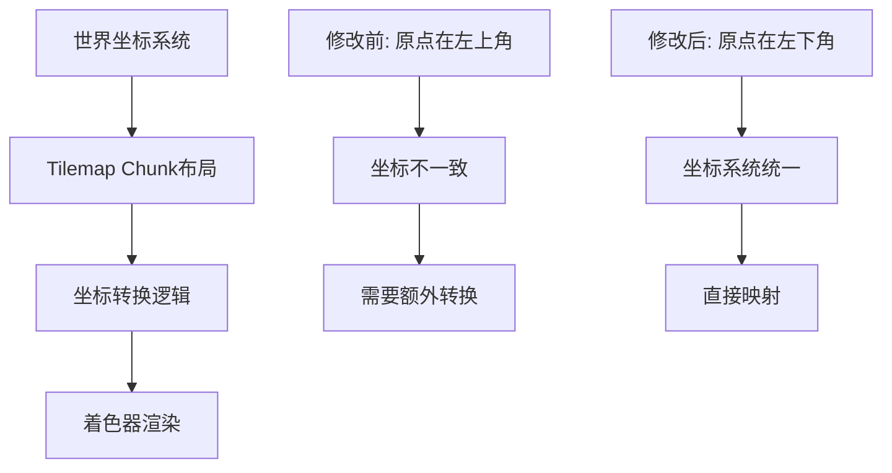

+++
title = "#21684 Change default tile chunk layout"
date = "2025-10-30T00:00:00"
draft = false
template = "pull_request_page.html"
in_search_index = false

[extra]
current_language = "zh-cn"
available_languages = {"en" = { name = "English", url = "/pull_request/bevy/2025-10/pr-21684-en-20251030" }, "zh-cn" = { name = "中文", url = "/pull_request/bevy/2025-10/pr-21684-zh-cn-20251030" }}
labels = ["A-Rendering", "M-Migration-Guide"]
+++

# 技术分析报告：Tilemap Chunk布局变更

## Basic Information
- **Title**: Change default tile chunk layout
- **PR Link**: https://github.com/bevyengine/bevy/pull/21684
- **Author**: jamescarterbell
- **Status**: MERGED
- **Labels**: A-Rendering, S-Ready-For-Final-Review, M-Migration-Guide
- **Created**: 2025-10-28T20:22:51Z
- **Merged**: 2025-10-30T03:36:03Z
- **Merged By**: alice-i-cecile

## Description Translation
# 目标

让瓦片区块(tile chunk)的布局与世界坐标轴对齐。

## 解决方案

在着色器和变换计算中反转y索引的计算。

## 测试

运行了示例，看到坐标(0,0)从左上角移动到了左下角。

## 迁移指南

手动计算瓦片索引的用户需要从当前实现中反转区块相关的y索引。

例如，在当前区块大小为(16, 16)的情况下：
世界坐标(5, 6) => 区块坐标(5, 9)

将变为：
世界坐标(5, 6) => 区块坐标(5, 6)

## The Story of This Pull Request

### 问题背景：坐标系统不一致
这个PR解决了一个基础但重要的问题：Bevy的tilemap chunk布局与引擎的世界坐标系统不一致。在原有的实现中，tilemap chunk的原点位于左上角，而Bevy的世界坐标系统通常使用左下角作为原点。这种不一致性导致开发者在处理坐标转换时需要额外的计算步骤，增加了代码复杂性和出错的可能性。

### 技术实现：协调坐标系统
开发者采用了直接而有效的解决方案：通过修改坐标计算逻辑来统一两个系统的原点位置。这个改动涉及两个关键文件：Rust代码中的坐标变换逻辑和WGSL着色器中的瓦片坐标计算。

在Rust端的修改中，开发者重写了`tile_position_to_world`方法中的y坐标计算逻辑。原来的实现使用了负的`tile_display_size.y`和复杂的偏移计算，现在改为更直观的正向计算：

```rust
// 修改前：
position.y as f32 * (self.tile_display_size.y as f32).neg()
- self.tile_display_size.y as f32 / 2.
+ self.tile_display_size.y as f32 * self.chunk_size.y as f32 / 2.

// 修改后：
position.y as f32 * self.tile_display_size.y as f32
+ self.tile_display_size.y as f32 / 2.
- self.tile_display_size.y as f32 * self.chunk_size.y as f32 / 2.
```

同时，在WGSL着色器中添加了一行关键代码来反转y坐标：
```wgsl
tile_coord.y = chunk_size.y - 1 - tile_coord.y;
```

### 工程考量：破坏性变更的处理
这是一个破坏性变更(breaking change)，因此开发者提供了详细的迁移指南。迁移指南清楚地说明了变更的影响和必要的适配工作，这对于向后兼容性至关重要。开发者明智地将迁移指南放在独立的文件中，遵循了Bevy项目的标准实践。

### 技术决策：一致性优先
虽然某些tiling工具使用左上角作为原点的约定，但开发者选择了与Bevy核心系统保持一致。这个决策体现了API设计的重要原则：内部一致性通常比与外部工具的兼容性更重要，特别是当这种一致性能够简化用户代码时。

### 测试验证
开发者通过运行示例验证了修改的正确性，确认坐标(0,0)确实从左上角移动到了左下角。这种直观的验证方法对于图形相关的变更特别有效。

## Visual Representation



## Key Files Changed

### 1. `crates/bevy_sprite_render/src/tilemap_chunk/mod.rs` (+4/-6)
这个文件包含了tilemap chunk的核心实现。主要修改了坐标转换逻辑：

```rust
// 关键修改：tile_position_to_world方法中的y坐标计算
// 从使用负值偏移改为正值偏移，将原点从左上角移动到左下角
position.y as f32 * self.tile_display_size.y as f32  // 改为正向计算
+ self.tile_display_size.y as f32 / 2.               // 符号从负改为正
- self.tile_display_size.y as f32 * self.chunk_size.y as f32 / 2.  // 符号从正改为负
```

### 2. `crates/bevy_sprite_render/src/tilemap_chunk/tilemap_chunk_material.wgsl` (+2/-1)
着色器文件中的关键修改：

```wgsl
// 添加了y坐标反转逻辑
var tile_coord = clamp(vec2<u32>(floor(tile_uv)), vec2<u32>(0), chunk_size - 1);
tile_coord.y = chunk_size.y - 1 - tile_coord.y;  // 新增：反转y坐标
```

### 3. `release-content/migration-guides/tilemap_chunk_layout_change.md` (+13/-0)
新增的迁移指南文件，提供了清晰的升级说明和示例。

## Further Reading

- [Bevy坐标系统文档](https://bevyengine.org/learn/coordinate-systems/)
- [WGSL着色语言规范](https://gpuweb.github.io/gpuweb/wgsl/)
- [图形编程中的坐标系统](https://learnopengl.com/Getting-started/Coordinate-Systems)