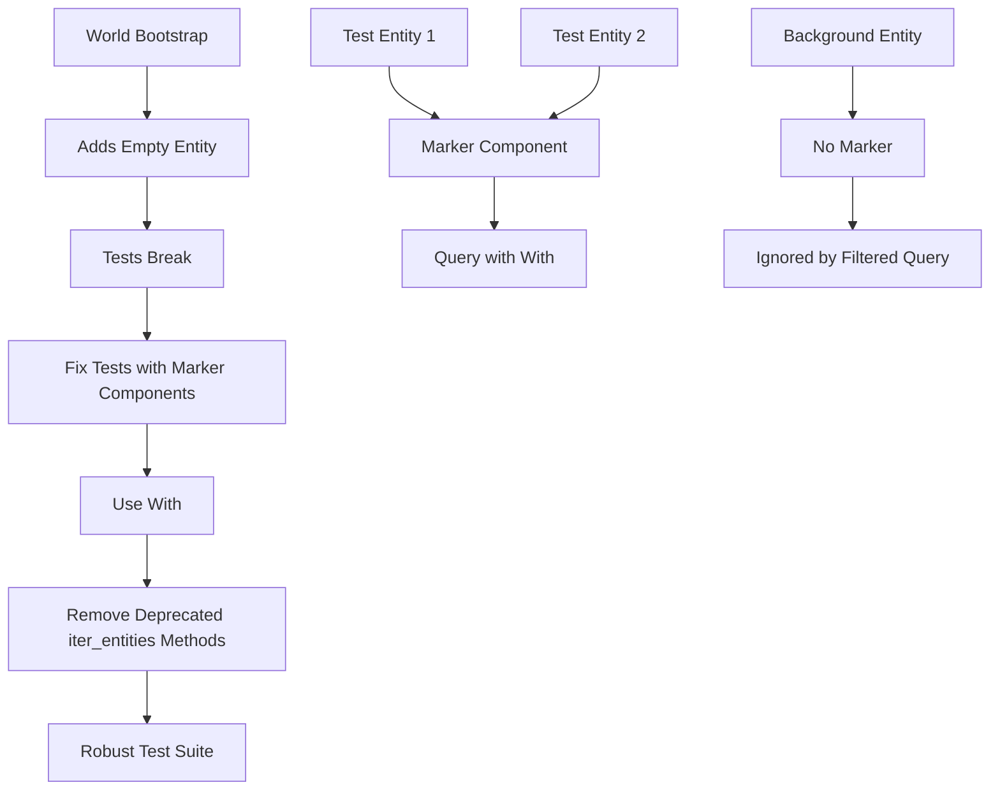

+++
title = "#21685 Improve tests using broad queries (`Query<Entity>`, `Query<()>`, etc)"
date = "2025-10-29T00:00:00"
draft = false
template = "pull_request_page.html"
in_search_index = true

[taxonomies]
list_display = ["show"]

[extra]
current_language = "en"
available_languages = {"en" = { name = "English", url = "/pull_request/bevy/2025-10/pr-21685-en-20251029" }, "zh-cn" = { name = "中文", url = "/pull_request/bevy/2025-10/pr-21685-zh-cn-20251029" }}
labels = ["D-Trivial", "A-ECS", "C-Testing"]
+++

# Title
Improve tests using broad queries (`Query<Entity>`, `Query<()>`, etc)

## Basic Information
- **Title**: Improve tests using broad queries (`Query<Entity>`, `Query<()>`, etc)
- **PR Link**: https://github.com/bevyengine/bevy/pull/21685
- **Author**: Trashtalk217
- **Status**: MERGED
- **Labels**: D-Trivial, A-ECS, S-Ready-For-Final-Review, C-Testing
- **Created**: 2025-10-29T02:08:27Z
- **Merged**: 2025-10-29T19:56:19Z
- **Merged By**: alice-i-cecile

## Description Translation
# Objective

Tests should be more resilient to entities added on `World` creation. This is necessary for resources-as-components to work without relying on `DefaultQueryFilters`.

## Solution

I've added an empty entity during `World::bootstrap()` and ran the test suite (and CI). I've gone and fixed every test, except for the ones where it's not possible / doesn't make sense. Both `iter_entities` and `iter_entities_mut` and their tests have been removed as they were deprecated in 0.17.

## The Story of This Pull Request

This PR addresses a fundamental testing challenge in Bevy's ECS system: making tests resilient to the presence of background entities that are automatically created during world initialization. The core issue emerged from the need to support resources-as-components without depending on `DefaultQueryFilters`, which would require tests to account for entities that exist outside of their explicit test setup.

The developer approached this problem systematically by first adding an empty entity during `World::bootstrap()` to simulate the real-world scenario where background entities might be present. This immediately revealed which tests were making assumptions about entity counts that would break in production environments. The solution wasn't about changing the production code's behavior, but rather making the test assertions more precise and robust.

The primary technical approach involved replacing broad queries like `Query<Entity>` and `Query<()>` with more specific queries that filter for test-specific entities using marker components. This pattern ensures tests only count entities they explicitly create, ignoring any background entities that might be present. For example:

```rust
// Before - counts all entities including background ones
let mut query = world.query::<Entity>();
assert_eq!(1, query.iter(&world).count());

// After - only counts entities with the test marker
let mut query = world.query_filtered::<Entity, With<Marker>>();
assert_eq!(1, query.iter(&world).count());
```

A significant part of this PR involved cleaning up deprecated code. The `iter_entities` and `iter_entities_mut` methods had been deprecated since Bevy 0.17, and this PR removed them along with their associated tests. This cleanup reduces maintenance burden and encourages using the more flexible query system.

The implementation required careful analysis of each test's intent. Some tests needed to verify they were working with exactly the entities they created, while others legitimately needed to consider all entities in the world. The developer made judgment calls about which approach was appropriate for each test case.

One notable technical insight from this work is the importance of test isolation. By using marker components, tests become self-contained and less likely to interfere with each other or be affected by framework changes. This pattern also makes test intentions clearer - when you see `With<Dummy>` in a test query, you immediately understand that this query is targeting test-specific entities.

The impact of these changes is significant for long-term test maintenance. Tests that rely on specific entity counts without proper filtering are brittle and can break when the framework evolves. By making tests more precise about which entities they care about, this PR reduces future maintenance burden and makes the test suite more reliable.

## Visual Representation



## Key Files Changed

### `crates/bevy_ecs/src/world/mod.rs` (+2/-172)
**What changed**: Removed deprecated `iter_entities` and `iter_entities_mut` methods and their associated tests.
**Why**: These methods were deprecated in 0.17 and were using broad entity iteration patterns that this PR aims to replace.

```rust
// Removed deprecated methods:
#[deprecated(since = "0.17.0", note = "use world.query::<EntityRef>()` instead")]
pub fn iter_entities(&self) -> impl Iterator<Item = EntityRef<'_>> + '_ { ... }

#[deprecated(since = "0.17.0", note = "use world.query::<EntityMut>()` instead")]
pub fn iter_entities_mut(&mut self) -> impl Iterator<Item = EntityMut<'_>> + '_ { ... }
```

### `crates/bevy_ecs/src/query/builder.rs` (+32/-23)
**What changed**: Added marker components and updated queries to use `With<D>` filters.
**Why**: To make tests resilient to background entities by only counting entities with test-specific markers.

```rust
// Before:
world.spawn((A(0), B(0)));
let mut query_a = QueryBuilder::<Entity>::new(&mut world)
    .or(|builder| {
        builder.with::<A>();
        builder.with::<B>();
    })
    .build();

// After:
world.spawn((A(0), B(0), D));
let mut query_a = QueryBuilder::<&D>::new(&mut world)
    .or(|builder| {
        builder.with::<A>();
        builder.with::<B>();
    })
    .build();
```

### `crates/bevy_ecs/src/query/state.rs` (+22/-16)
**What changed**: Updated query state tests to use marker components and filtered queries.
**Why**: To ensure tests only count entities they explicitly create, ignoring any background entities.

```rust
// Before:
let mut query = QueryState::<()>::new(&mut world);
assert_eq!(3, query.iter(&world).count());

// After:
let mut query = QueryState::<&Dummy>::new(&mut world);
assert_eq!(3, query.iter(&world).count());
```

### `crates/bevy_ecs/src/entity_disabling.rs` (+17/-14)
**What changed**: Added `Dummy` marker component and updated all queries to filter for it.
**Why**: To make entity disabling tests resilient to background entities while maintaining test accuracy.

```rust
// Added marker component:
#[derive(Component)]
struct Dummy;

// Updated spawn calls:
world.spawn(Dummy);
world.spawn_batch((0..2).map(|_| (Dummy, Disabled)));
```

### `crates/bevy_ecs/src/world/entity_access/mod.rs` (+17/-8)
**What changed**: Added `Marker` component and updated entity access tests to use filtered queries.
**Why**: To ensure entity access tests only operate on test-created entities.

```rust
// Before:
world.spawn(TestComponent(0)).insert(TestComponent2(0));
let mut query = world.query::<EntityRefExcept<TestComponent>>();

// After:
world.spawn((TestComponent(0), TestComponent2(0), Marker));
let mut query = world.query_filtered::<EntityRefExcept<TestComponent>, With<Marker>>();
```

## Further Reading

- [Bevy ECS Query Documentation](https://docs.rs/bevy_ecs/latest/bevy_ecs/system/struct.Query.html)
- [Component Filtering in Bevy](https://bevy-cheatbook.github.io/programming/queries.html)
- [Test Isolation Patterns in ECS Systems](https://github.com/bevyengine/bevy/discussions)

# Full Code Diff
*(The full code diff is provided in the original request and has been used for the analysis above)*