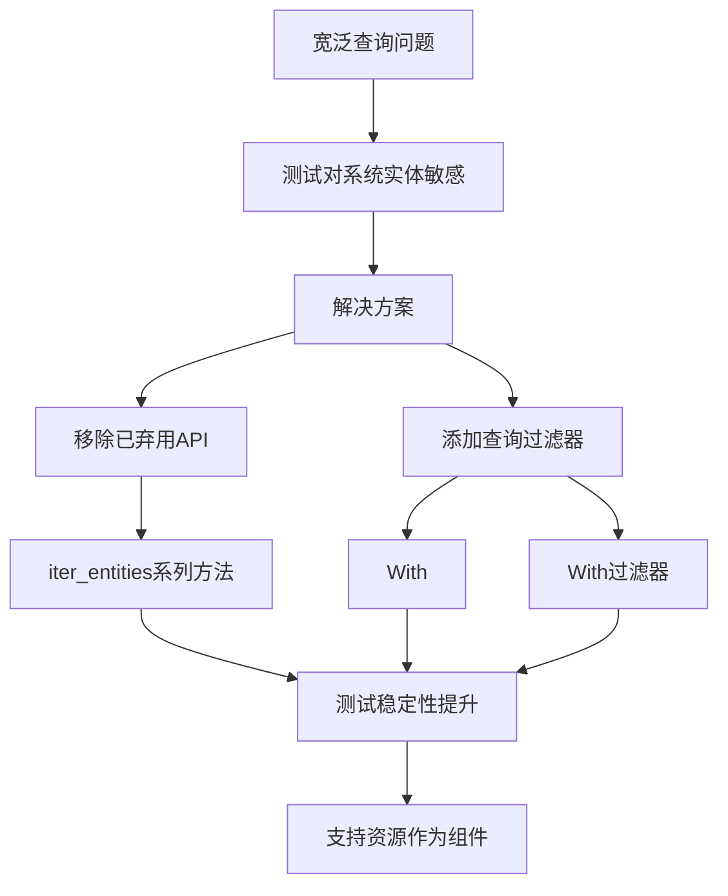

+++
title = "#21685 Improve tests using broad queries (`Query<Entity>`, `Query<()>`, etc)"
date = "2025-10-29T00:00:00"
draft = false
template = "pull_request_page.html"
in_search_index = false

[extra]
current_language = "zh-cn"
available_languages = {"en" = { name = "English", url = "/pull_request/bevy/2025-10/pr-21685-en-20251029" }, "zh-cn" = { name = "中文", url = "/pull_request/bevy/2025-10/pr-21685-zh-cn-20251029" }}
+++

# Improve tests using broad queries (`Query<Entity>`, `Query<()>`, etc)

## 基本信息
- **标题**: Improve tests using broad queries (`Query<Entity>`, `Query<()>`, etc)
- **PR链接**: https://github.com/bevyengine/bevy/pull/21685
- **作者**: Trashtalk217
- **状态**: 已合并
- **标签**: D-Trivial, A-ECS, S-Ready-For-Final-Review, C-Testing
- **创建时间**: 2025-10-29T02:08:27Z
- **合并时间**: 2025-10-29T19:56:19Z
- **合并者**: alice-i-cecile

## 描述翻译

# 目标

测试应该对在`World`创建时添加的实体更具弹性。这对于将资源作为组件(resources-as-components)在不依赖`DefaultQueryFilters`的情况下工作是必要的。

## 解决方案

我在`World::bootstrap()`期间添加了一个空实体并运行了测试套件（以及CI）。我已经修复了所有测试，除了那些不可能修复/没有意义的测试。`iter_entities`和`iter_entities_mut`以及它们的测试已被移除，因为它们在0.17版本中已被弃用。

## 这个PR的故事

这个PR的核心问题是关于测试的鲁棒性。在Bevy ECS中，当使用宽泛查询（如`Query<Entity>`或`Query<()>`）时，这些查询会匹配世界中的所有实体，包括那些在系统初始化期间可能被隐式创建的实体。

问题的根源在于，随着Bevy的发展，特别是为了支持"资源作为组件"(resources-as-components)的功能，世界在启动过程中会自动创建一些实体。这些隐式创建的实体会影响那些使用宽泛查询的测试，因为它们会意外地包含这些系统实体，导致测试断言失败。

开发者采取的解决方案相当系统化：首先在`World::bootstrap()`中添加一个空实体来模拟真实场景，然后运行整个测试套件来识别所有受影响的地方。通过CI的失败测试，他们能够准确定位需要修复的测试用例。

在实现层面，这个PR主要做了两件事：

1. **移除已弃用的API**：删除了在0.17版本中标记为弃用的`iter_entities`和`iter_entities_mut`方法及其相关测试
2. **改进测试查询**：将宽泛查询替换为更具体的查询，通过添加`With<Dummy>`或`With<Marker>`等过滤器来确保测试只关注相关的实体

例如，在实体禁用测试中：

```rust
// 之前：
let mut query = world.query::<()>();
assert_eq!(1, query.iter(&world).count());

// 之后：
let mut query = world.query_filtered::<&Dummy, With<Dummy>>();
assert_eq!(1, query.iter(&world).count());
```

这种改变确保了测试不会受到系统创建的隐式实体的影响，使测试更加可靠和可预测。

从技术角度来看，这个PR展示了几个重要的工程实践：

- **渐进式弃用**：按照计划移除已弃用的API，保持代码库的整洁
- **测试隔离**：通过更精确的查询确保测试只关注其真正需要测试的实体
- **前向兼容性**：为未来的功能（如资源作为组件）铺平道路

这个改动的影响是深远的。它不仅解决了当前的测试稳定性问题，还为Bevy未来的架构演进提供了基础。通过使测试不依赖于世界的隐式状态，代码库变得更加健壮，能够适应未来的变化。

## 可视化表示



## 关键文件变更

### `crates/bevy_ecs/src/world/mod.rs` (+2/-172)
这个文件移除了已弃用的`iter_entities`和`iter_entities_mut`方法及其相关测试。

**主要变更：**
```rust
// 移除了这两个已弃用的方法：
#[deprecated(since = "0.17.0", note = "use world.query::<EntityRef>()` instead")]
pub fn iter_entities(&self) -> impl Iterator<Item = EntityRef<'_>> + '_ { ... }

#[deprecated(since = "0.17.0", note = "use world.query::<EntityMut>()` instead")]
pub fn iter_entities_mut(&mut self) -> impl Iterator<Item = EntityMut<'_>> + '_ { ... }
```

### `crates/bevy_ecs/src/entity_disabling.rs` (+17/-14)
改进了实体禁用测试，使其对系统实体不敏感。

**关键代码示例：**
```rust
// 之前测试中使用宽泛查询：
let mut query = world.query::<()>();
assert_eq!(1, query.iter(&world).count());

// 改为使用过滤查询：
let mut query = world.query_filtered::<&Dummy, With<Dummy>>();
assert_eq!(1, query.iter(&world).count());
```

### `crates/bevy_ecs/src/query/builder.rs` (+32/-23)
更新了查询构建器测试，添加了`Dummy`组件来隔离测试实体。

**示例变更：**
```rust
// 之前：
world.spawn((A(0), B(0)));

// 之后：
world.spawn((A(0), B(0), D));
```

### `crates/bevy_ecs/src/query/state.rs` (+22/-16)
改进了查询状态测试，确保它们不受系统实体的影响。

**关键改进：**
```rust
// 之前使用宽泛查询：
let mut query = QueryState::<()>::new(&mut world);

// 改为使用具体组件查询：
let mut query = QueryState::<&Dummy>::new(&mut world);
```

### `crates/bevy_ecs/src/world/entity_access/mod.rs` (+17/-8)
更新了实体访问测试，添加了`Marker`组件来过滤测试实体。

**示例：**
```rust
// 之前：
world.spawn(TestComponent(0)).insert(TestComponent2(0));

// 之后：
world.spawn((TestComponent(0), TestComponent2(0), Marker));
```

## 进一步阅读

- [Bevy ECS查询文档](https://docs.rs/bevy_ecs/latest/bevy_ecs/query/index.html)
- [Bevy测试最佳实践](https://bevy-cheatbook.github.io/programming/testing.html)
- [实体组件系统模式](https://en.wikipedia.org/wiki/Entity_component_system)