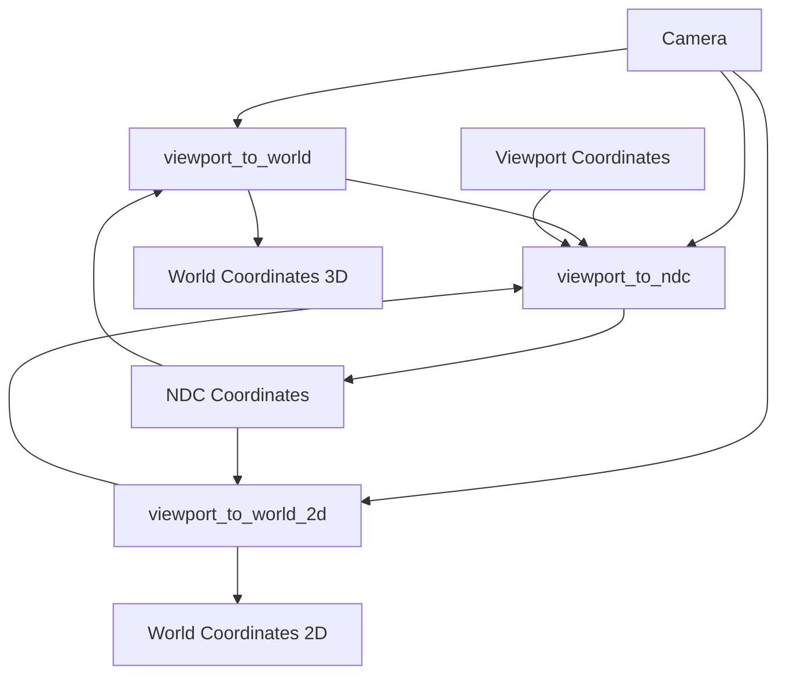

+++
title = "#21687 Add viewport_to_ndc"
date = "2025-10-29T00:00:00"
draft = false
template = "pull_request_page.html"
in_search_index = true

[taxonomies]
list_display = ["show"]

[extra]
current_language = "en"
available_languages = {"en" = { name = "English", url = "/pull_request/bevy/2025-10/pr-21687-en-20251029" }, "zh-cn" = { name = "中文", url = "/pull_request/bevy/2025-10/pr-21687-zh-cn-20251029" }}
labels = ["D-Trivial", "C-Usability", "A-Camera"]
+++

# Add viewport_to_ndc

## Basic Information
- **Title**: Add viewport_to_ndc
- **PR Link**: https://github.com/bevyengine/bevy/pull/21687
- **Author**: IceSentry
- **Status**: MERGED
- **Labels**: D-Trivial, C-Usability, S-Needs-Review, A-Camera
- **Created**: 2025-10-29T18:26:34Z
- **Merged**: 2025-10-29T20:32:55Z
- **Merged By**: mockersf

## Description Translation
# Objective

- Computing the ndc from a viewport coordinates is already done in a few places.
- It's can be useful for users, not just internally.

## Solution

- Extract it to a function

## Testing

- I'm using it in a currently unfinished PR for gpu picking and things worked as expected
- I also tested 3d_viewport_to_world and 2d_viewport_to_world

## The Story of This Pull Request

This PR addresses a straightforward but important code duplication issue in Bevy's camera system. The core problem was that viewport-to-NDC (Normalized Device Coordinates) conversion logic was duplicated across multiple methods in the Camera implementation, which violates the DRY (Don't Repeat Yourself) principle and makes maintenance more difficult.

The developer identified that two existing methods - `viewport_to_world` and `viewport_to_world_2d` - were both performing the same coordinate transformation steps internally. Both methods needed to convert from viewport coordinates to NDC space, but this conversion logic was implemented separately in each method, creating duplication.

The solution approach was clean and practical: extract the common coordinate transformation logic into a dedicated public method called `viewport_to_ndc`. This follows standard refactoring practices where repeated code blocks are identified and consolidated into reusable functions.

Looking at the implementation, the transformation involves several key steps:
1. Getting the camera's logical viewport rectangle
2. Calculating relative coordinates within the viewport
3. Converting to NDC range [-1, 1]
4. Flipping the Y-axis coordinate (from top-origin to bottom-origin)

Here's what the duplicated code looked like before extraction:

```rust
// In viewport_to_world:
let target_rect = self
    .logical_viewport_rect()
    .ok_or(ViewportConversionError::NoViewportSize)?;
let rect_relative = (viewport_position - target_rect.min) / target_rect.size();
let mut ndc_xy = rect_relative * 2. - Vec2::ONE;
// Flip the Y co-ordinate from the top to the bottom to enter NDC.
ndc_xy.y = -ndc_xy.y;

// In viewport_to_world_2d:
let target_rect = self
    .logical_viewport_rect()
    .ok_or(ViewportConversionError::NoViewportSize)?;
let mut rect_relative = (viewport_position - target_rect.min) / target_rect.size();
// Flip the Y co-ordinate origin from the top to the bottom.
rect_relative.y = 1.0 - rect_relative.y;
let ndc = rect_relative * 2. - Vec2::ONE;
```

The new implementation consolidates this into a single method:

```rust
pub fn viewport_to_ndc(
    &self,
    viewport_position: Vec2,
) -> Result<Vec2, ViewportConversionError> {
    let target_rect = self
        .logical_viewport_rect()
        .ok_or(ViewportConversionError::NoViewportSize)?;
    let rect_relative = (viewport_position - target_rect.min) / target_rect.size();
    let mut ndc = rect_relative * 2. - Vec2::ONE;
    // Flip the Y co-ordinate from the top to the bottom to enter NDC.
    ndc.y = -ndc.y;
    Ok(ndc)
}
```

The technical insight here is that by making this method public, the developer not only eliminates code duplication but also provides a useful utility for other developers working with camera coordinate systems. This is particularly valuable for features like GPU picking, which the author mentions they're working on in another PR.

The impact of this change is threefold:
1. **Reduced code duplication**: The coordinate transformation logic now exists in one place
2. **Improved maintainability**: Future changes to the coordinate transformation only need to be made once
3. **Enhanced API**: External developers can now use this utility method for their own camera-related calculations

The testing approach was practical - the author verified that the refactored methods (`viewport_to_world` and `viewport_to_world_2d`) still work correctly, and they're already using the new method in another feature they're developing.

## Visual Representation



## Key Files Changed

**File**: `crates/bevy_camera/src/camera.rs` (+17/-16)

This file contains the core Camera implementation in Bevy. The changes involved:

1. **Extracted viewport_to_ndc method**: Created a new public method that handles the coordinate transformation
2. **Refactored existing methods**: Updated `viewport_to_world` and `viewport_to_world_2d` to use the new utility method

Key code changes:

```rust
// Before in viewport_to_world:
let target_rect = self
    .logical_viewport_rect()
    .ok_or(ViewportConversionError::NoViewportSize)?;
let rect_relative = (viewport_position - target_rect.min) / target_rect.size();
let mut ndc_xy = rect_relative * 2. - Vec2::ONE;
// Flip the Y co-ordinate from the top to the bottom to enter NDC.
ndc_xy.y = -ndc_xy.y;

// After in viewport_to_world:
let ndc_xy = self.viewport_to_ndc(viewport_position)?;
```

```rust
// Before in viewport_to_world_2d:
let target_rect = self
    .logical_viewport_rect()
    .ok_or(ViewportConversionError::NoViewportSize)?;
let mut rect_relative = (viewport_position - target_rect.min) / target_rect.size();
// Flip the Y co-ordinate origin from the top to the bottom.
rect_relative.y = 1.0 - rect_relative.y;
let ndc = rect_relative * 2. - Vec2::ONE;

// After in viewport_to_world_2d:
let ndc = self.viewport_to_ndc(viewport_position)?;
```

```rust
// New method added:
pub fn viewport_to_ndc(
    &self,
    viewport_position: Vec2,
) -> Result<Vec2, ViewportConversionError> {
    let target_rect = self
        .logical_viewport_rect()
        .ok_or(ViewportConversionError::NoViewportSize)?;
    let rect_relative = (viewport_position - target_rect.min) / target_rect.size();
    let mut ndc = rect_relative * 2. - Vec2::ONE;
    // Flip the Y co-ordinate from the top to the bottom to enter NDC.
    ndc.y = -ndc.y;
    Ok(ndc)
}
```

## Further Reading

- [Bevy Camera Documentation](https://docs.rs/bevy_camera/latest/bevy_camera/)
- [Coordinate Systems in Computer Graphics](https://learnopengl.com/Getting-started/Coordinate-Systems)
- [Normalized Device Coordinates](https://www.khronos.org/opengl/wiki/Vertex_Post-Processing#Coordinate_systems)
- [DRY Principle](https://en.wikipedia.org/wiki/Don%27t_repeat_yourself)

# Full Code Diff
diff --git a/crates/bevy_camera/src/camera.rs b/crates/bevy_camera/src/camera.rs
index 31d2913b97510..aa6733b427b1d 100644
--- a/crates/bevy_camera/src/camera.rs
+++ b/crates/bevy_camera/src/camera.rs
@@ -614,13 +614,7 @@ impl Camera {
         camera_transform: &GlobalTransform,
         viewport_position: Vec2,
     ) -> Result<Ray3d, ViewportConversionError> {
-        let target_rect = self
-            .logical_viewport_rect()
-            .ok_or(ViewportConversionError::NoViewportSize)?;
-        let rect_relative = (viewport_position - target_rect.min) / target_rect.size();
-        let mut ndc_xy = rect_relative * 2. - Vec2::ONE;
-        // Flip the Y co-ordinate from the top to the bottom to enter NDC.
-        ndc_xy.y = -ndc_xy.y;
+        let ndc_xy = self.viewport_to_ndc(viewport_position)?;
 
         let ndc_point_near = ndc_xy.extend(1.0).into();
         // Using EPSILON because an ndc with Z = 0 returns NaNs.
@@ -682,15 +676,7 @@ impl Camera {
         camera_transform: &GlobalTransform,
         viewport_position: Vec2,
     ) -> Result<Vec2, ViewportConversionError> {
-        let target_rect = self
-            .logical_viewport_rect()
-            .ok_or(ViewportConversionError::NoViewportSize)?;
-        let mut rect_relative = (viewport_position - target_rect.min) / target_rect.size();
-
-        // Flip the Y co-ordinate origin from the top to the bottom.
-        rect_relative.y = 1.0 - rect_relative.y;
-
-        let ndc = rect_relative * 2. - Vec2::ONE;
+        let ndc = self.viewport_to_ndc(viewport_position)?;
 
         let world_near_plane = self
             .ndc_to_world(camera_transform, ndc.extend(1.))
@@ -773,6 +759,21 @@ impl Camera {
         -(self.clip_from_view().w_axis.z - ndc_depth) / self.clip_from_view().z_axis.z
         //                       [3][2]                                         [2][2]
     }
+
+    /// Converts a position in viewport coordinates to NDC.
+    pub fn viewport_to_ndc(
+        &self,
+        viewport_position: Vec2,
+    ) -> Result<Vec2, ViewportConversionError> {
+        let target_rect = self
+            .logical_viewport_rect()
+            .ok_or(ViewportConversionError::NoViewportSize)?;
+        let rect_relative = (viewport_position - target_rect.min) / target_rect.size();
+        let mut ndc = rect_relative * 2. - Vec2::ONE;
+        // Flip the Y co-ordinate from the top to the bottom to enter NDC.
+        ndc.y = -ndc.y;
+        Ok(ndc)
+    }
 }
 
 /// Control how this [`Camera`] outputs once rendering is completed.