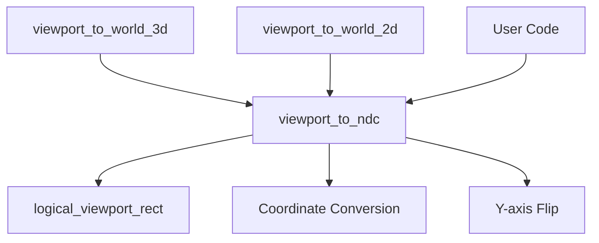

+++
title = "#21687 Add viewport_to_ndc"
date = "2025-10-29T00:00:00"
draft = false
template = "pull_request_page.html"
in_search_index = false

[extra]
current_language = "zh-cn"
available_languages = {"en" = { name = "English", url = "/pull_request/bevy/2025-10/pr-21687-en-20251029" }, "zh-cn" = { name = "中文", url = "/pull_request/bevy/2025-10/pr-21687-zh-cn-20251029" }}
labels = ["D-Trivial", "C-Usability", "A-Camera"]
+++

# Add viewport_to_ndc

## Basic Information
- **Title**: Add viewport_to_ndc
- **PR Link**: https://github.com/bevyengine/bevy/pull/21687
- **Author**: IceSentry
- **Status**: MERGED
- **Labels**: D-Trivial, C-Usability, S-Needs-Review, A-Camera
- **Created**: 2025-10-29T18:26:34Z
- **Merged**: 2025-10-29T20:32:55Z
- **Merged By**: mockersf

## Description Translation
# 目标

- 将视口坐标转换为NDC（标准化设备坐标）的计算已经在几个地方重复实现
- 这个功能对用户也有用，而不仅仅是内部使用

## 解决方案

- 将其提取为一个函数

## 测试

- 我在一个尚未完成的GPU拾取PR中使用了这个函数，功能符合预期
- 我还测试了3d_viewport_to_world和2d_viewport_to_world

## The Story of This Pull Request

这个PR源于一个常见的代码优化场景：当相同的功能在多个地方重复实现时，将其提取为可重用的函数。在Bevy的相机系统中，将视口坐标转换为NDC坐标的计算逻辑在`viewport_to_world_3d`和`viewport_to_world_2d`两个方法中都有实现。

问题在于代码重复。两个方法都包含了相同的坐标转换逻辑：
1. 获取视口矩形
2. 将视口坐标转换为相对坐标
3. 将相对坐标映射到NDC范围[-1, 1]
4. 翻转Y轴坐标

这种重复不仅违反了DRY原则，还增加了维护成本。如果转换逻辑需要修改，开发者必须在多个地方进行相同的更改。

解决方案很直接：将重复的代码提取到一个新的公共方法`viewport_to_ndc`中。这个新方法封装了完整的视口到NDC的转换逻辑，包括错误处理。提取后的方法签名清晰表明了其功能：

```rust
pub fn viewport_to_ndc(
    &self,
    viewport_position: Vec2,
) -> Result<Vec2, ViewportConversionError>
```

在实现过程中，作者面临的一个技术决策是如何处理Y轴翻转。在原始代码中，两个方法对Y轴的处理略有不同：
- `viewport_to_world_3d`在转换为NDC后翻转Y轴
- `viewport_to_world_2d`在相对坐标阶段就翻转Y轴

作者选择了`viewport_to_world_3d`的实现方式，在NDC转换完成后进行Y轴翻转，这样保持了与现有3D处理的一致性。

提取后的代码显著简化了原有的两个方法。以`viewport_to_world_3d`为例：

**重构前：**
```rust
let target_rect = self
    .logical_viewport_rect()
    .ok_or(ViewportConversionError::NoViewportSize)?;
let rect_relative = (viewport_position - target_rect.min) / target_rect.size();
let mut ndc_xy = rect_relative * 2. - Vec2::ONE;
// Flip the Y co-ordinate from the top to the bottom to enter NDC.
ndc_xy.y = -ndc_xy.y;
```

**重构后：**
```rust
let ndc_xy = self.viewport_to_ndc(viewport_position)?;
```

这种重构不仅减少了代码重复，还提高了代码的可测试性和可维护性。现在开发者可以直接测试视口到NDC的转换逻辑，而不需要构造完整的相机变换。

从架构角度看，这个变更遵循了单一职责原则。`viewport_to_ndc`方法专注于坐标转换，而原有的世界坐标转换方法专注于它们各自的领域逻辑。这种分离使得每个方法的职责更加清晰。

对于Bevy用户来说，这个新增的公共API提供了直接访问NDC转换的能力，这在实现自定义渲染效果、拾取系统或其他需要精确坐标映射的功能时非常有用。正如作者在PR描述中提到的，这个功能已经在GPU拾取的实现中得到了实际验证。

## Visual Representation



## Key Files Changed

### `crates/bevy_camera/src/camera.rs` (+17/-16)

这个文件包含了所有的核心变更。主要的修改包括：

1. **新增`viewport_to_ndc`方法**：
```rust
/// Converts a position in viewport coordinates to NDC.
pub fn viewport_to_ndc(
    &self,
    viewport_position: Vec2,
) -> Result<Vec2, ViewportConversionError> {
    let target_rect = self
        .logical_viewport_rect()
        .ok_or(ViewportConversionError::NoViewportSize)?;
    let rect_relative = (viewport_position - target_rect.min) / target_rect.size();
    let mut ndc = rect_relative * 2. - Vec2::ONE;
    // Flip the Y co-ordinate from the top to the bottom to enter NDC.
    ndc.y = -ndc.y;
    Ok(ndc)
}
```

2. **重构`viewport_to_world_3d`方法**：
```rust
// 重构前包含完整的转换逻辑
// 重构后：
let ndc_xy = self.viewport_to_ndc(viewport_position)?;
```

3. **重构`viewport_to_world_2d`方法**：
```rust
// 重构前包含完整的转换逻辑  
// 重构后：
let ndc = self.viewport_to_ndc(viewport_position)?;
```

这些变更将重复的坐标转换逻辑统一到一个地方，提高了代码的可维护性和可重用性。

## Further Reading

- [Bevy Camera Documentation](https://docs.rs/bevy_camera/latest/bevy_camera/) - Bevy相机系统的官方文档
- [Coordinate Systems in Computer Graphics](https://learnopengl.com/Getting-started/Coordinate-Systems) - 计算机图形学中的坐标系统概述
- [DRY Principle](https://en.wikipedia.org/wiki/Don%27t_repeat_yourself) - 不要重复自己原则的详细解释
- [Refactoring: Improving the Design of Existing Code](https://martinfowler.com/books/refactoring.html) - 代码重构的最佳实践