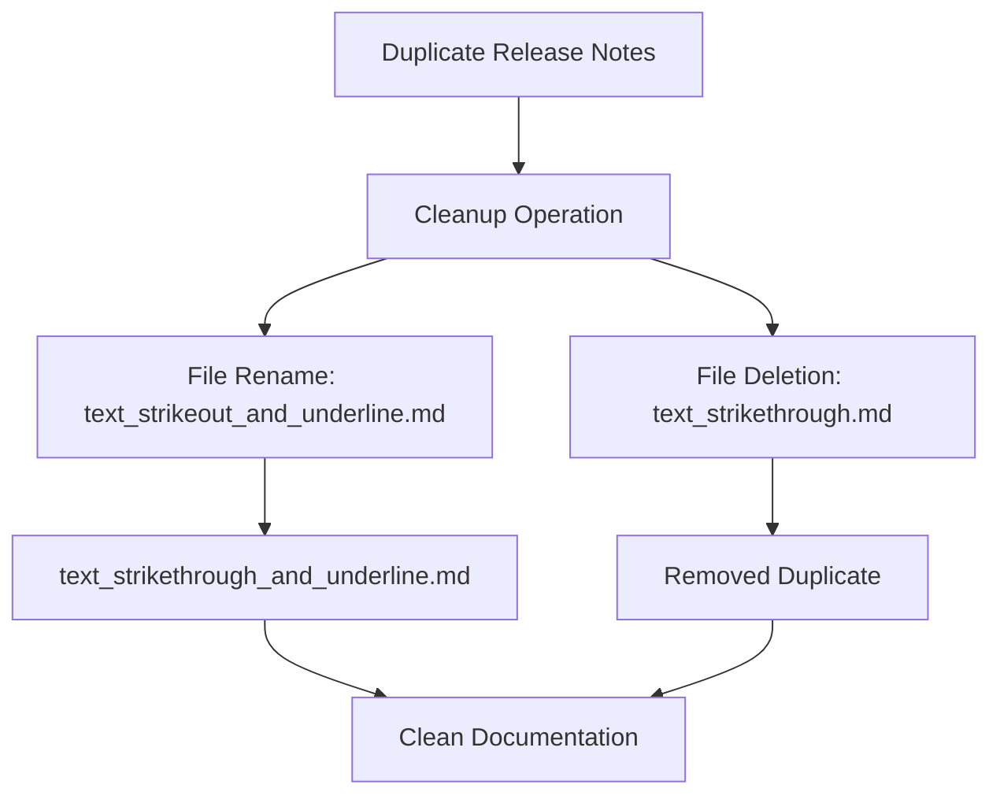

+++
title = "#21688 Strikethrough release note clean up"
date = "2025-10-29T00:00:00"
draft = false
template = "pull_request_page.html"
in_search_index = true

[taxonomies]
list_display = ["show"]

[extra]
current_language = "en"
available_languages = {"en" = { name = "English", url = "/pull_request/bevy/2025-10/pr-21688-en-20251029" }, "zh-cn" = { name = "中文", url = "/pull_request/bevy/2025-10/pr-21688-zh-cn-20251029" }}
labels = ["D-Trivial"]
+++

# Title

## Basic Information
- **Title**: Strikethrough release note clean up
- **PR Link**: https://github.com/bevyengine/bevy/pull/21688
- **Author**: ickshonpe
- **Status**: MERGED
- **Labels**: D-Trivial, S-Ready-For-Final-Review
- **Created**: 2025-10-29T20:27:44Z
- **Merged**: 2025-10-29T21:19:08Z
- **Merged By**: alice-i-cecile

## Description Translation
# Objective

Ended up with two release notes for strikethrough somehow after the merges or whatever. 

## Solution

Rename one, delete the other.  

## The Story of This Pull Request

This pull request addresses a simple but important issue in the Bevy engine's release documentation - duplicate release notes for the strikethrough text feature. The problem emerged after multiple merges in the codebase, where two separate files were created to document what appears to be the same feature.

The core issue was straightforward: the release documentation system contained two files that both appeared to cover strikethrough text functionality. This kind of duplication can cause confusion for users reading the release notes and creates maintenance overhead for the documentation team.

The solution implemented a clean, two-step approach: first, the file `text_strikeout_and_underline.md` was renamed to `text_strikethrough_and_underline.md` to maintain consistency in naming conventions. Second, the duplicate file `text_strikethrough.md` was completely removed from the codebase.

This cleanup operation demonstrates an important principle in software maintenance: keeping documentation synchronized with code changes. When multiple developers work on related features, documentation duplication can easily occur, and proactive cleanup prevents confusion down the line.

The technical implementation was minimal but effective - a file rename operation and a file deletion. The rename operation preserved the file's content and git history while updating its name to better reflect its purpose and maintain naming consistency with other documentation files.

## Visual Representation



## Key Files Changed

### `release-content/release-notes/text_strikethrough.md` (Deleted)
This file was completely removed as it contained duplicate documentation for strikethrough text support.

**Content before deletion:**
```markdown
---
title: Text strikethrough support
authors: ["@ickshonpe"]
pull_requests: [21555]
---

`bevy_text` now supports strikethrough. To display text with strikethrough, just add the `Strikethrough` component to any `Text`, `Text2d`, or `TextSpan` entity.
```

### `release-content/release-notes/text_strikeout_and_underline.md` (Renamed)
This file was renamed from `text_strikeout_and_underline.md` to `text_strikethrough_and_underline.md` without any content changes. The rename operation maintained the file's git history while updating the name for consistency.

**Operation:**
```
rename from: release-content/release-notes/text_strikeout_and_underline.md
rename to: release-content/release-notes/text_strikethrough_and_underline.md
```

## Further Reading

- [Git Documentation on File Renaming](https://git-scm.com/docs/git-mv)
- [Bevy Engine Documentation Guidelines](https://github.com/bevyengine/bevy/blob/main/docs/DOCUMENTATION_GUIDELINES.md)
- [Semantic Versioning and Release Notes Best Practices](https://semver.org/)

# Full Code Diff
```
diff --git a/release-content/release-notes/text_strikethrough.md b/release-content/release-notes/text_strikethrough.md
deleted file mode 100644
index d322442200106..0000000000000
--- a/release-content/release-notes/text_strikethrough.md
+++ /dev/null
@@ -1,7 +0,0 @@
----
-title: Text strikethrough support
-authors: ["@ickshonpe"]
-pull_requests: [21555]
----
-
-`bevy_text` now supports strikethrough. To display text with strikethrough, just add the `Strikethrough` component to any `Text`, `Text2d`, or `TextSpan` entity.
diff --git a/release-content/release-notes/text_strikeout_and_underline.md b/release-content/release-notes/text_strikethrough_and_underline.md
similarity index 100%
rename from release-content/release-notes/text_strikeout_and_underline.md
rename to release-content/release-notes/text_strikethrough_and_underline.md
```