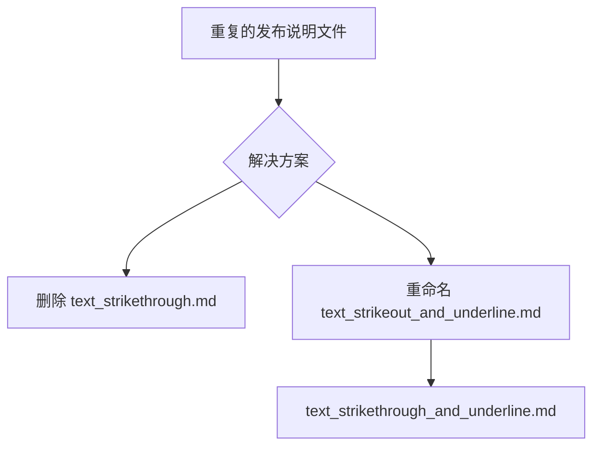

+++
title = "#21688 Strikethrough release note clean up"
date = "2025-10-29T00:00:00"
draft = false
template = "pull_request_page.html"
in_search_index = false

[extra]
current_language = "zh-cn"
available_languages = {"en" = { name = "English", url = "/pull_request/bevy/2025-10/pr-21688-en-20251029" }, "zh-cn" = { name = "中文", url = "/pull_request/bevy/2025-10/pr-21688-zh-cn-20251029" }}
+++

# Strikethrough release note clean up

## Basic Information
- **Title**: Strikethrough release note clean up
- **PR Link**: https://github.com/bevyengine/bevy/pull/21688
- **作者**: ickshonpe
- **状态**: 已合并
- **标签**: D-Trivial, S-Ready-For-Final-Review
- **创建时间**: 2025-10-29T20:27:44Z
- **合并时间**: 2025-10-29T21:19:08Z
- **合并者**: alice-i-cecile

## 描述翻译

# 目标

在合并或其他操作后，不知道为什么出现了两个关于删除线的发布说明。

## 解决方案

重命名一个，删除另一个。

## 本次 Pull Request 的故事

这个 PR 处理了一个简单的文档维护问题。开发者在合并过程中意外创建了两个关于删除线功能的发布说明，造成了内容重复。

问题的根本原因是文件命名不一致和重复创建。在之前的开发过程中，开发者可能在不同时间点创建了功能相似的发布说明文件，或者在合并分支时发生了文件冲突但没有妥善解决。

解决方案采用了直接而有效的方法：删除重复的文件并统一命名规范。具体来说，开发者选择了保留包含更全面功能说明的文件（同时包含删除线和下划线支持），并删除了功能范围较窄的单独文件。

从技术角度看，这个修改体现了良好的项目管理实践：
- 保持发布说明的简洁性和唯一性
- 统一术语使用（strikethrough vs strikeout）
- 避免用户混淆和文档重复

虽然这个修改本身很简单，但它展示了维护大型开源项目时需要注意的细节问题。即使是文档管理，也需要保持一致性以确保项目的整体质量。

## 视觉表示



## 关键文件变更

### `release-content/release-notes/text_strikethrough.md` (删除)

这个文件被完全删除，因为它与另一个文件内容重复：

```markdown
---
title: Text strikethrough support
authors: ["@ickshonpe"]
pull_requests: [21555]
---

`bevy_text` now supports strikethrough. To display text with strikethrough, just add the `Strikethrough` component to any `Text`, `Text2d`, or `TextSpan` entity.
```

### `release-content/release-notes/text_strikeout_and_underline.md` (重命名)

这个文件从 `text_strikeout_and_underline.md` 重命名为 `text_strikethrough_and_underline.md`，保持了内容的完整性：

```bash
# 重命名操作
rename from release-content/release-notes/text_strikeout_and_underline.md
rename to release-content/release-notes/text_strikethrough_and_underline.md
```

## 进一步阅读

- [Git 文件重命名文档](https://git-scm.com/docs/git-mv)
- [Bevy 引擎文档维护指南](https://github.com/bevyengine/bevy/blob/main/docs/CONTRIBUTING.md)
- [开源项目管理最佳实践](https://opensource.guide/)

# 完整代码差异

```diff
diff --git a/release-content/release-notes/text_strikethrough.md b/release-content/release-notes/text_strikethrough.md
deleted file mode 100644
index d322442200106..0000000000000
--- a/release-content/release-notes/text_strikethrough.md
+++ /dev/null
@@ -1,7 +0,0 @@
----
-title: Text strikethrough support
-authors: ["@ickshonpe"]
-pull_requests: [21555]
----
-
-`bevy_text` now supports strikethrough. To display text with strikethrough, just add the `Strikethrough` component to any `Text`, `Text2d`, or `TextSpan` entity.
diff --git a/release-content/release-notes/text_strikeout_and_underline.md b/release-content/release-notes/text_strikethrough_and_underline.md
similarity index 100%
rename from release-content/release-notes/text_strikeout_and_underline.md
rename to release-content/release-notes/text_strikethrough_and_underline.md
```