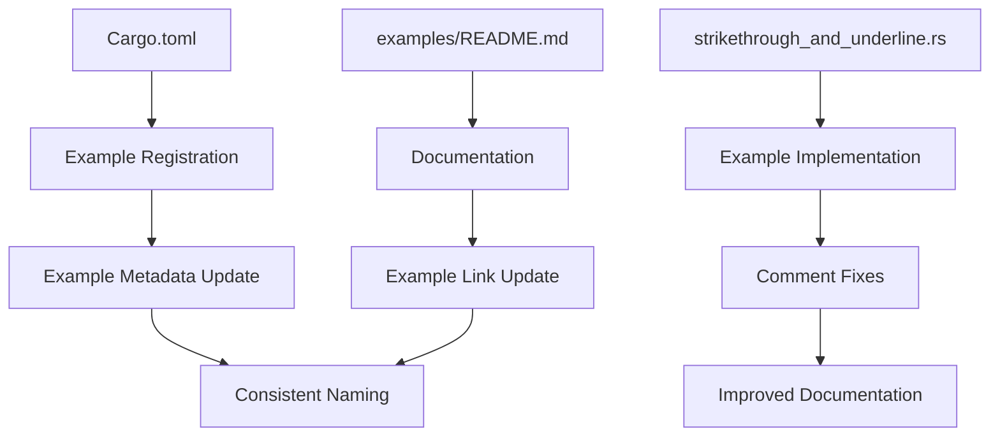

+++
title = "#21689 Rename the `strikethrough` example to `strikethrough_and_underline`"
date = "2025-10-29T00:00:00"
draft = false
template = "pull_request_page.html"
in_search_index = true

[taxonomies]
list_display = ["show"]

[extra]
current_language = "en"
available_languages = {"en" = { name = "English", url = "/pull_request/bevy/2025-10/pr-21689-en-20251029" }, "zh-cn" = { name = "中文", url = "/pull_request/bevy/2025-10/pr-21689-zh-cn-20251029" }}
labels = ["D-Trivial", "C-Examples", "A-UI"]
+++

# Title

## Basic Information
- **Title**: Rename the `strikethrough` example to `strikethrough_and_underline`
- **PR Link**: https://github.com/bevyengine/bevy/pull/21689
- **Author**: ickshonpe
- **Status**: MERGED
- **Labels**: D-Trivial, C-Examples, A-UI, S-Ready-For-Final-Review
- **Created**: 2025-10-29T20:41:26Z
- **Merged**: 2025-10-29T21:30:34Z
- **Merged By**: alice-i-cecile

## Description Translation
# Objective

Rename the example, fix a typo in its ("it's") comments.

## The Story of This Pull Request

This PR addresses a straightforward but important documentation and naming consistency issue in the Bevy engine's UI examples. The core problem was that an example file demonstrating both strikethrough and underline text decorations was only named after one of these features, creating a mismatch between the example's actual functionality and its naming.

The developer identified that the `strikethrough.rs` example file contained demonstrations for both strikethrough and underline text decorations, but the file name and associated metadata only referenced strikethrough. This naming inconsistency could confuse users looking for examples of underline functionality and made the example's purpose unclear at a glance.

The solution approach was systematic and comprehensive. Instead of just renaming the file, the developer updated all references to maintain consistency across the codebase. This included:

1. Renaming the example in `Cargo.toml` to reflect both features
2. Updating the file path reference in `Cargo.toml`
3. Modifying the example metadata description to accurately describe both features
4. Updating the documentation in `examples/README.md`
5. Actually renaming the source file itself
6. Fixing a grammatical error in the example comments

The implementation demonstrates good software engineering practices for maintaining project consistency. By updating all references simultaneously, the developer ensured there would be no broken links or build errors. The changes are minimal but comprehensive, touching exactly the files that needed updating without affecting unrelated code.

One technical insight from this PR is the importance of example naming in large open-source projects. Clear, descriptive example names help users quickly find the functionality they need to reference. The original name "strikethrough" was technically incomplete since the example also demonstrated underline text decorations.

The impact of these changes is primarily on developer experience and documentation clarity. Users searching for underline examples will now find this file through the updated naming, and the corrected documentation provides more accurate guidance. The typo fix, while minor, improves the professionalism of the codebase comments.

## Visual Representation



## Key Files Changed

**Cargo.toml** (+5/-5)
- Updated example registration and metadata to reflect the new name
- Changed both the example name and path references

```toml
# Before:
[[example]]
name = "strikethrough"
path = "examples/ui/strikethrough.rs"

[package.metadata.example.strikethrough]
name = "Strikethrough"
description = "Demonstrates how to display text with strikethrough."

# After:
[[example]]
name = "strikethrough_and_underline"
path = "examples/ui/strikethrough_and_underline.rs"

[package.metadata.example.strikethrough_and_underline]
name = "Strikethrough and Underline"
description = "Demonstrates how to display text with strikethrough and underline."
```

**examples/ui/strikethrough_and_underline.rs** (+3/-2)
- File renamed from `strikethrough.rs` to `strikethrough_and_underline.rs`
- Updated module-level documentation comment
- Fixed grammatical error ("it's" → "its")
- Added comment explaining underline functionality

```rust
// Before:
//! This example illustrates UI text with strikethrough

// Just add the `Strikethrough` component to any `Text`, `Text2d` or `TextSpan` and it's text will be struck through.

// After:
//! This example illustrates UI text with strikethrough and underline decorations

// Just add the `Strikethrough` component to any `Text`, `Text2d` or `TextSpan` and its text will be struck through

// Text entities with the `Underline` component will drawn with underline
```

**examples/README.md** (+1/-1)
- Updated the documentation link and description to match the new example name

```markdown
# Before:
[Strikethrough](../examples/ui/strikethrough.rs) | Demonstrates how to display text with strikethrough.

# After:
[Strikethrough and Underline](../examples/ui/strikethrough_and_underline.rs) | Demonstrates how to display text with strikethrough and underline.
```

## Further Reading

- [Bevy UI Documentation](https://bevyengine.org/learn/quick-start/ui/) - Official Bevy UI guide
- [Rust Cargo Manifest Format](https://doc.rust-lang.org/cargo/reference/manifest.html) - Documentation for Cargo.toml structure
- [Bevy Text Components](https://docs.rs/bevy/latest/bevy/text/struct.Text.html) - API documentation for Bevy's text system