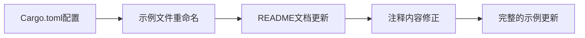

+++
title = "#21689 Rename the `strikethrough` example to `strikethrough_and_underline"
date = "2025-10-29T00:00:00"
draft = false
template = "pull_request_page.html"
in_search_index = false

[extra]
current_language = "zh-cn"
available_languages = {"en" = { name = "English", url = "/pull_request/bevy/2025-10/pr-21689-en-20251029" }, "zh-cn" = { name = "中文", url = "/pull_request/bevy/2025-10/pr-21689-zh-cn-20251029" }}
+++

# 重命名 `strikethrough` 示例为 `strikethrough_and_underline`

## 基本信息
- **标题**: Rename the `strikethrough` example to `strikethrough_and_underline`
- **PR链接**: https://github.com/bevyengine/bevy/pull/21689
- **作者**: ickshonpe
- **状态**: 已合并
- **标签**: D-Trivial, C-Examples, A-UI, S-Ready-For-Final-Review
- **创建时间**: 2025-10-29T20:41:26Z
- **合并时间**: 2025-10-29T21:30:34Z
- **合并者**: alice-i-cecile

## 描述翻译
# 目标

重命名示例，修复其注释中的一个拼写错误。

## 这个PR的故事

这个PR主要解决了一个示例命名不准确的问题。原来的`strikethrough`示例实际上展示了两种文本装饰效果：删除线(strikethrough)和下划线(underline)，但名称只反映了其中一种功能。这种情况可能会给开发者带来困惑，当他们寻找下划线功能的示例时，可能不会想到查看名为`strikethrough`的文件。

从技术角度看，这个PR涉及三个关键方面的修改：

首先，在`Cargo.toml`配置文件中，需要更新示例的注册信息。原来的配置只提到了删除线功能：

```toml
[[example]]
name = "strikethrough"
path = "examples/ui/strikethrough.rs"
doc-scrape-examples = true

[package.metadata.example.strikethrough]
name = "Strikethrough"
description = "Demonstrates how to display text with strikethrough."
```

修改后准确反映了示例的实际功能：

```toml
[[example]]
name = "strikethrough_and_underline"
path = "examples/ui/strikethrough_and_underline.rs"
doc-scrape-examples = true

[package.metadata.example.strikethrough_and_underline]
name = "Strikethrough and Underline"
description = "Demonstrates how to display text with strikethrough and underline."
```

其次，需要更新示例文档索引。在`examples/README.md`中，将对应的条目从：
```
[Strikethrough](../examples/ui/strikethrough.rs) | Demonstrates how to display text with strikethrough.
```
改为：
```
[Strikethrough and Underline](../examples/ui/strikethrough_and_underline.rs) | Demonstrates how to display text with strikethrough and underline.
```

第三，对示例文件本身进行了两处重要的文本修正。文件顶部的模块注释从：
```rust
//! This example illustrates UI text with strikethrough
```
更新为：
```rust
//! This example illustrates UI text with strikethrough and underline decorations
```

同时修复了一个常见的英语语法错误，将注释中的：
```rust
// Just add the `Strikethrough` component to any `Text`, `Text2d` or `TextSpan` and it's text will be struck through.
```
修正为：
```rust
// Just add the `Strikethrough` component to any `Text`, `Text2d` or `TextSpan` and its text will be struck through
```

这个修改将物主代词"its"从错误的缩写形式"it's"修正为正确形式。在编程文档中保持语法准确性很重要，因为这会影响代码的可读性和专业性。

从工程实践的角度看，这个PR展示了良好的代码维护习惯。准确的命名约定和文档对于大型开源项目如Bevy至关重要，因为它们帮助开发者快速找到需要的示例代码。虽然这个修改本身很简单，但它体现了对代码质量和开发者体验的关注。

## 可视化表示



## 关键文件变更

### 1. Cargo.toml
**变更描述**: 更新示例注册信息以反映实际功能
```toml
# 之前:
[[example]]
name = "strikethrough"
path = "examples/ui/strikethrough.rs"

[package.metadata.example.strikethrough]
name = "Strikethrough"
description = "Demonstrates how to display text with strikethrough."

# 之后:
[[example]]
name = "strikethrough_and_underline"
path = "examples/ui/strikethrough_and_underline.rs"

[package.metadata.example.strikethrough_and_underline]
name = "Strikethrough and Underline"
description = "Demonstrates how to display text with strikethrough and underline."
```

### 2. examples/README.md
**变更描述**: 更新文档索引中的示例名称和描述
```markdown
# 之前:
[Strikethrough](../examples/ui/strikethrough.rs) | Demonstrates how to display text with strikethrough.

# 之后:
[Strikethrough and Underline](../examples/ui/strikethrough_and_underline.rs) | Demonstrates how to display text with strikethrough and underline.
```

### 3. examples/ui/strikethrough_and_underline.rs
**变更描述**: 文件重命名并更新注释内容
```rust
// 模块注释更新:
// 之前: //! This example illustrates UI text with strikethrough
// 之后: //! This example illustrates UI text with strikethrough and underline decorations

// 语法修正:
// 之前: // ... and it's text will be struck through.
// 之后: // ... and its text will be struck through
```

## 进一步阅读

- [Bevy UI 文本系统文档](https://docs.rs/bevy/latest/bevy/text/index.html)
- [Rust 代码风格指南](https://doc.rust-lang.org/1.0.0/style/README.html)
- [Bevy 示例代码库](https://github.com/bevyengine/bevy/tree/main/examples)