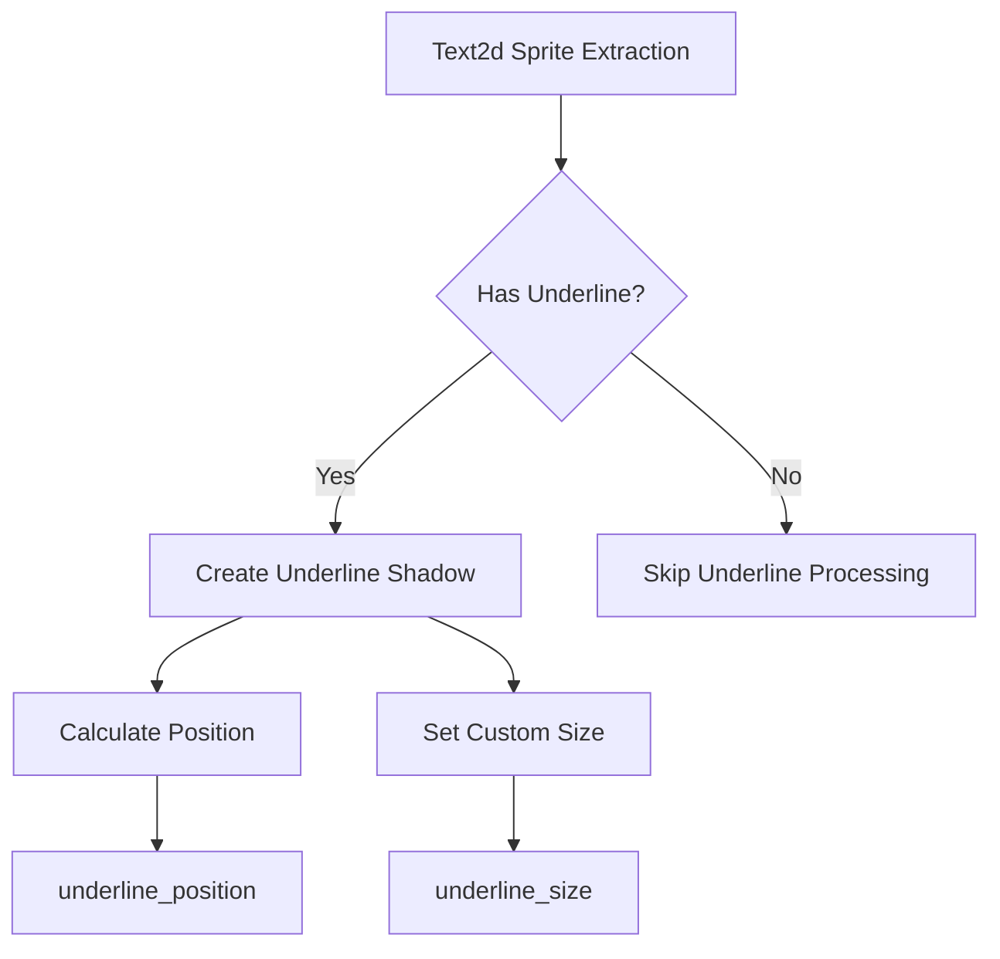

+++
title = "#21695 Text2d underline shadows fix"
date = "2025-10-30T00:00:00"
draft = false
template = "pull_request_page.html"
in_search_index = false

[extra]
current_language = "zh-cn"
available_languages = {"en" = { name = "English", url = "/pull_request/bevy/2025-10/pr-21695-en-20251030" }, "zh-cn" = { name = "中文", url = "/pull_request/bevy/2025-10/pr-21695-zh-cn-20251030" }}
+++

# Text2d underline shadows fix

## Basic Information
- **标题**: Text2d underline shadows fix
- **PR 链接**: https://github.com/bevyengine/bevy/pull/21695
- **作者**: ickshonpe
- **状态**: 已合并
- **标签**: C-Bug, D-Trivial, A-Rendering, S-Ready-For-Final-Review, A-Text
- **创建时间**: 2025-10-30T13:31:22Z
- **合并时间**: 2025-10-30T16:19:00Z
- **合并者**: alice-i-cecile

## 描述翻译

# 目标

Text2d 下划线阴影正在使用删除线的位置和大小值进行绘制。使用正确的几何形状绘制它。

## 解决方案

使用下划线值。

## 这个 Pull Request 的故事

这个 PR 解决了一个在 Bevy 引擎的文本渲染系统中存在的简单但明显的 bug。问题出现在 Text2d 组件的下划线阴影渲染功能中。

在 Bevy 的文本渲染管线中，当处理带有文本装饰（如下划线）的文本时，系统需要为这些装饰元素创建单独的 sprite 进行渲染。在 `extract_text2d_sprite` 函数中，存在一个明显的逻辑错误：当下划线需要渲染阴影时，代码错误地使用了删除线的位置和尺寸参数，而不是下划线本身的参数。

具体来说，问题出现在两个地方：
1. 位置计算使用了 `run.strikethrough_position()` 而不是 `run.underline_position()`
2. 尺寸设置使用了 `run.strikethrough_size()` 而不是 `run.underline_size()`

这导致下划线阴影被绘制在错误的位置，并且具有错误的尺寸，与实际的文本下划线不匹配。

修复方案很直接：将两个错误的函数调用替换为正确的下划线相关函数。这种类型的 bug 属于典型的"复制粘贴错误"，开发者在实现下划线阴影功能时可能参考了删除线的实现，但忘记更新相应的函数调用。

从技术角度来看，这个修复确保了：
- 下划线阴影与下划线本体的位置一致
- 下划线阴影的粗细与下划线本体一致
- 文本渲染的视觉一致性

这个修改虽然简单，但对于依赖文本装饰功能的应用程序来说很重要，因为它确保了渲染结果的准确性。

## 视觉表示



## 关键文件变更

### `crates/bevy_sprite_render/src/text2d/mod.rs` (+2/-2)

这个文件包含了 Text2d sprite 提取的核心逻辑。修改涉及下划线阴影的几何计算。

```rust
// 文件: crates/bevy_sprite_render/src/text2d/mod.rs
// 修改前:
let offset = run.strikethrough_position() * Vec2::new(1., -1.);
// ...
custom_size: Some(run.strikethrough_size()),

// 修改后:
let offset = run.underline_position() * Vec2::new(1., -1.);
// ...
custom_size: Some(run.underline_size()),
```

修改说明：
- 将位置计算从使用 `strikethrough_position()` 改为 `underline_position()`
- 将尺寸设置从使用 `strikethrough_size()` 改为 `underline_size()`
- 这些修改确保了下划线阴影使用正确的几何参数

## 进一步阅读

- [Bevy 文本渲染文档](https://docs.rs/bevy/latest/bevy/text/index.html)
- [Bevy Sprite 渲染系统](https://docs.rs/bevy/latest/bevy/sprite/index.html)
- [2D 文本渲染基础概念](https://learnopengl.com/In-Practice/Text-Rendering)

# 完整代码差异

```diff
diff --git a/crates/bevy_sprite_render/src/text2d/mod.rs b/crates/bevy_sprite_render/src/text2d/mod.rs
index 2cb857e502c48..e01faab25063a 100644
--- a/crates/bevy_sprite_render/src/text2d/mod.rs
+++ b/crates/bevy_sprite_render/src/text2d/mod.rs
@@ -189,7 +189,7 @@ pub fn extract_text2d_sprite(
 
                 if has_underline {
                     let render_entity = commands.spawn(TemporaryRenderEntity).id();
-                    let offset = run.strikethrough_position() * Vec2::new(1., -1.);
+                    let offset = run.underline_position() * Vec2::new(1., -1.);
                     let transform =
                         shadow_transform * GlobalTransform::from_translation(offset.extend(0.));
                     extracted_sprites.sprites.push(ExtractedSprite {
@@ -204,7 +204,7 @@ pub fn extract_text2d_sprite(
                             anchor: Vec2::ZERO,
                             rect: None,
                             scaling_mode: None,
-                            custom_size: Some(run.strikethrough_size()),
+                            custom_size: Some(run.underline_size()),
                         },
                     });
                 }
```