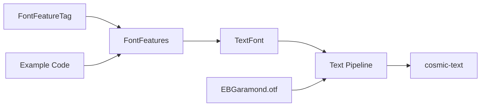

+++
title = "#19020 Add support for OpenType features in text (e.g. ligatures, smallcaps)"
date = "2025-11-06T00:00:00"
draft = false
template = "pull_request_page.html"
in_search_index = true

[taxonomies]
list_display = ["show"]

[extra]
current_language = "en"
available_languages = {"en" = { name = "English", url = "/pull_request/bevy/2025-11/pr-19020-en-20251106" }, "zh-cn" = { name = "中文", url = "/pull_request/bevy/2025-11/pr-19020-zh-cn-20251106" }}
labels = ["C-Feature", "A-Text", "M-Release-Note", "D-Straightforward"]
+++

# Add support for OpenType features in text (e.g. ligatures, smallcaps)

## Basic Information
- **Title**: Add support for OpenType features in text (e.g. ligatures, smallcaps)
- **PR Link**: https://github.com/bevyengine/bevy/pull/19020
- **Author**: hansler
- **Status**: MERGED
- **Labels**: C-Feature, S-Ready-For-Final-Review, A-Text, M-Release-Note, D-Straightforward
- **Created**: 2025-05-01T22:34:12Z
- **Merged**: 2025-11-06T18:49:09Z
- **Merged By**: alice-i-cecile

## Description Translation
# Objective

OpenType features include things like smallcaps, lined vs old-style numbers, ligatures, stylistic alternate characters, fractional numbers (numerator placed above the denominator), forced monospacing for numbers, and more. There are >100 possible OpenType feature tags; see https://learn.microsoft.com/en-us/typography/opentype/spec/featurelist for the up-to-date list. This provides a way for Bevy users to use these features when using .otf fonts that support them.

## Solution

OpenType features are now supported in cosmic-text, so this just provides a way to pass them through. A few notes:

- I extended the existing "text" example to showcase a few different OpenType features.
- OpenType features are only available for .otf fonts. Since there weren't any existing .otf fonts in the asset/ folder, I've added an SIL-licenced font so that we can showcase this in example code.
- I added a "FontFeatures" struct. cosmic-text does already include its own FontFeatures struct, but 1) it does not implement Reflect, which is required by TextFont, and 2) the one I added has a couple ergonomics improvements for the builder methods compared to cosmic-text's.
- OpenType font features are four characters strings, e.g. "liga". I considered representing these within an enum, but decided against this since there are hundreds of possible features, and more get added frequently, so this would require quite a bit of ongoing maintenance. Since these features are typically referred to by their four-letter name in documentation, I think the [u8; 4] representation is appropriate, and this mirrors what cosmic-text does as well. I added some consts for commonly used features.

## Testing

I extended the "text" example. Run:

`cargo run --example text`

---

## Showcase

Screenshot:


## The Story of This Pull Request

This PR addresses a gap in Bevy's text rendering capabilities by adding support for OpenType font features. The core problem was that while modern fonts support advanced typographic features like ligatures, small caps, and stylistic alternates, Bevy had no mechanism to expose these features to developers.

The solution leverages cosmic-text's existing OpenType support, creating a clean API layer that integrates with Bevy's existing text system. The implementation required careful consideration of how to represent OpenType feature tags - the developer chose a `[u8; 4]` representation rather than an enum due to the large and growing number of possible features (over 100 and counting). This approach mirrors cosmic-text's implementation while providing better ergonomics through a builder pattern.

The key insight was that OpenType features are essentially four-character ASCII tags that control specific font behaviors. For example, "liga" enables standard ligatures, "smcp" enables small caps, and "frac" enables true fractions. The implementation needed to balance type safety with flexibility, since fonts can support arbitrary feature combinations.

The implementation follows a straightforward architectural pattern: define the data structures, provide conversion to cosmic-text's format, and integrate with the existing text pipeline. The `FontFeatures` struct was designed with both simplicity and extensibility in mind, supporting both simple boolean features and numeric parameters for features like font weight variation.

```rust
// Example usage from the implementation
let font_features = FontFeatures::builder()
    .enable(FontFeatureTag::STANDARD_LIGATURES)
    .set(FontFeatureTag::WEIGHT, 300)
    .build();
```

One notable engineering decision was the addition of a new OTF font to the assets. Since OpenType features only work with .otf fonts and Bevy's existing fonts were primarily TTF, the PR includes the EB Garamond font under an SIL Open Font License. This provides a practical demonstration vehicle without licensing complications.

The integration point is minimal - a single line in the text pipeline passes the font features to cosmic-text:

```rust
// In pipeline.rs
.font_features((&text_font.font_features).into())
```

This clean separation means the core text rendering logic remains unchanged, with OpenType features being an optional enhancement that builds on existing infrastructure.

The impact is significant for applications requiring sophisticated typography. Features like ligatures improve text readability, small caps provide professional typography options, and specialized number forms (oldstyle vs lining figures) enable proper typesetting for different contexts. For international text, this support becomes even more critical as many non-Latin scripts rely heavily on OpenType features for correct rendering.

## Visual Representation



## Key Files Changed

### `crates/bevy_text/src/text.rs` (+190/-0)
This file contains the core implementation of OpenType feature support. It defines the `FontFeatureTag` and `FontFeatures` types that enable developers to configure typographic features.

```rust
// Key addition: FontFeatureTag definition
#[derive(Copy, Clone, PartialEq, Eq, PartialOrd, Ord, Hash, Reflect)]
pub struct FontFeatureTag([u8; 4]);

impl FontFeatureTag {
    pub const STANDARD_LIGATURES: FontFeatureTag = FontFeatureTag::new(b"liga");
    pub const SMALL_CAPS: FontFeatureTag = FontFeatureTag::new(b"smcp");
    // ... many more feature constants
}
```

The `FontFeatures` struct provides a builder pattern for easy configuration:

```rust
#[derive(Clone, Debug, Default, Reflect, PartialEq)]
pub struct FontFeatures {
    features: Vec<(FontFeatureTag, u32)>,
}

impl FontFeatures {
    pub fn builder() -> FontFeaturesBuilder {
        FontFeaturesBuilder::default()
    }
}
```

### `examples/ui/text.rs` (+63/-1)
The text example was extended to demonstrate various OpenType features in action:

```rust
// Example usage showing multiple features
let text_rows = [
    ("Smallcaps: ", FontFeatureTag::SMALL_CAPS, "Hello World"),
    ("Ligatures: ", FontFeatureTag::STANDARD_LIGATURES, "fi fl ff ffi ffl"),
    ("Fractions: ", FontFeatureTag::FRACTIONS, "12/134"),
    // ... more examples
];

for (title, feature, text) in text_rows {
    parent.spawn((
        TextSpan::new(format!("{text}\n")),
        TextFont {
            font: opentype_font_handle.clone(),
            font_size: 24.0,
            font_features: FontFeatures::builder().enable(feature).build(),
            ..default()
        },
    ));
}
```

### `crates/bevy_text/src/pipeline.rs` (+1/-0)
A single line addition integrates the font features into the text rendering pipeline:

```rust
// Before:
// No font feature support

// After:
.font_features((&text_font.font_features).into())
```

### `assets/fonts/EBGaramond12-Regular.otf` and `assets/fonts/EBGaramond-LICENSE` (+93/-0)
Added a properly licensed OTF font to demonstrate OpenType features, since existing Bevy fonts were primarily TTF format which doesn't support these features.

### `release-content/release-notes/opentype_font_features.md` (+41/-0)
Comprehensive release notes documenting the new feature with usage examples and explanations.

## Further Reading

- [OpenType Feature List Specification](https://learn.microsoft.com/en-us/typography/opentype/spec/featurelist) - Complete reference of all OpenType features
- [cosmic-text Documentation](https://docs.rs/cosmic-text) - The underlying text layout engine used by Bevy
- [Practical Typography](https://practicaltypography.com/) - General resource on typography principles
- [Butterick's Practical Typography](https://practicaltypography.com/ligatures.html) - Detailed explanation of ligatures and other typographic features