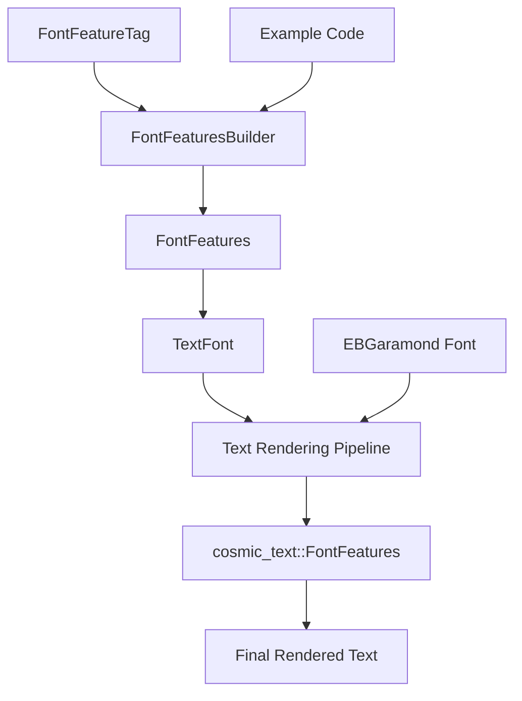

+++
title = "#19020 Add support for OpenType features in text (e.g. ligatures, smallcaps)"
date = "2025-11-06T00:00:00"
draft = false
template = "pull_request_page.html"
in_search_index = false

[extra]
current_language = "zh-cn"
available_languages = {"en" = { name = "English", url = "/pull_request/bevy/2025-11/pr-19020-en-20251106" }, "zh-cn" = { name = "中文", url = "/pull_request/bevy/2025-11/pr-19020-zh-cn-20251106" }}
+++

# Add support for OpenType features in text (e.g. ligatures, smallcaps)

## 基本信息
- **标题**: Add support for OpenType features in text (e.g. ligatures, smallcaps)
- **PR链接**: https://github.com/bevyengine/bevy/pull/19020
- **作者**: hansler
- **状态**: 已合并
- **标签**: C-Feature, S-Ready-For-Final-Review, A-Text, M-Release-Note, D-Straightforward
- **创建时间**: 2025-05-01T22:34:12Z
- **合并时间**: 2025-11-06T18:49:09Z
- **合并者**: alice-i-cecile

## 描述翻译

### 目标

OpenType 功能包括小型大写字母、衬线数字与旧式数字、连字、风格替代字符、分数数字（分子在分母上方）、数字的等宽强制等。有超过100种可能的OpenType功能标签；完整列表请参阅：https://learn.microsoft.com/en-us/typography/opentype/spec/featurelist。这为Bevy用户在使用支持这些功能的.otf字体时提供了一种使用这些功能的方式。

### 解决方案

OpenType 功能现在在 cosmic-text 中已经支持，因此这个PR只是提供了一种传递这些功能的方式。几点说明：

- 我扩展了现有的"text"示例来展示一些不同的OpenType功能。
- OpenType 功能仅适用于.otf字体。由于asset/文件夹中原本没有.otf字体，我添加了一个SIL许可的字体，以便我们可以在示例代码中展示这个功能。
- 我添加了一个"FontFeatures"结构体。cosmic-text已经包含了自己的FontFeatures结构体，但是1）它没有实现Reflect，而TextFont需要这个特性，2）我添加的结构体在构建器方法上相比cosmic-text的有一些人性化的改进。
- OpenType字体功能是四个字符的字符串，例如"liga"。我考虑过用枚举来表示这些功能，但决定不这样做，因为有可能有数百种功能，而且经常有新的功能添加，所以这会需要相当多的持续维护工作。由于这些功能在文档中通常以它们的四个字母名称来引用，我认为[u8; 4]表示是合适的，这也与cosmic-text的做法一致。我为一些常用的功能添加了常量。

### 测试

我扩展了"text"示例。运行：

`cargo run --example text`

---

### 展示

截图：


## 这个PR的故事

### 问题和背景

在PR之前，Bevy的文本渲染不支持OpenType功能，这意味着用户无法使用字体中可能包含的高级排版功能，比如连字、小型大写字母、分数等。这些功能对于提升文本的视觉质量和专业性非常重要，尤其是在需要精细排版的应用中。

开发者面临的主要技术限制是：
- cosmic-text库已经支持OpenType功能，但Bevy没有暴露这个接口
- 需要设计一个既能保持类型安全又易于使用的API
- 需要处理OpenType功能的动态特性（有数百种可能的功能）

### 解决方案方法

开发者选择利用cosmic-text库已经支持的OpenType功能，并在Bevy的文本系统中暴露这些功能。他们设计了一个新的`FontFeatures`结构体来代表OpenType功能，并提供了构建器模式来方便用户启用和设置这些功能。

关键的工程决策包括：
- 使用`[u8; 4]`来表示OpenType标签，而不是枚举，因为功能数量庞大且经常更新
- 创建自定义的`FontFeatures`结构体而不是直接使用cosmic-text的版本，以便实现Reflect trait并提供更好的构建器API
- 为常用功能提供预定义的常量，如`FontFeatureTag::STANDARD_LIGATURES`

### 实现细节

核心实现集中在几个关键组件上：

1. **FontFeatureTag类型**：使用四字节数组表示OpenType标签，并提供人类可读的Debug输出
```rust
#[derive(Copy, Clone, PartialEq, Eq, PartialOrd, Ord, Hash, Reflect)]
pub struct FontFeatureTag([u8; 4]);

impl Debug for FontFeatureTag {
    fn fmt(&self, f: &mut Formatter<'_>) -> core::fmt::Result {
        match from_utf8(&self.0) {
            Ok(s) => write!(f, "FontFeatureTag(\"{}\")", s),
            Err(_) => write!(f, "FontFeatureTag({:?})", self.0),
        }
    }
}
```

2. **FontFeatures构建器模式**：提供流畅的API来配置字体功能
```rust
pub fn builder() -> FontFeaturesBuilder {
    FontFeaturesBuilder::default()
}

pub fn enable(self, feature_tag: FontFeatureTag) -> Self {
    self.set(feature_tag, 1)
}

pub fn set(mut self, feature_tag: FontFeatureTag, value: u32) -> Self {
    self.features.push((feature_tag, value));
    self
}
```

3. **与cosmic-text的集成**：在文本渲染管道中添加了字体功能的应用
```rust
// 在 pipeline.rs 中
.font_features((&text_font.font_features).into())
```

### 技术见解

这个实现展示了几个重要的软件工程模式：

- **适配器模式**：通过`From<&FontFeatures> for cosmic_text::FontFeatures` trait实现，将Bevy的字体功能转换为cosmic-text期望的格式
- **构建器模式**：为复杂配置提供流畅的API，特别是当需要设置多个功能时
- **类型安全与灵活性的平衡**：使用`[u8; 4]`而不是枚举，既保持了类型安全，又允许使用任意OpenType功能

性能考虑方面，实现是轻量级的，只在需要时构造字体功能列表，并且转换开销很小。

### 影响

这个PR为Bevy带来了重要的排版功能，使得：
- 开发者可以在游戏UI中使用高级排版特性
- 支持复杂文字系统（如阿拉伯语、梵文）的正确渲染
- 提供了更专业的文本外观控制

从技术债务的角度看，实现选择了维护成本较低的方法，避免了需要持续更新的大型枚举。

## 视觉表示



## 关键文件更改

### `crates/bevy_text/src/text.rs` (+190/-0)
这是核心实现文件，添加了OpenType功能支持的主要类型。

```rust
// 新增的FontFeatureTag类型
#[derive(Copy, Clone, PartialEq, Eq, PartialOrd, Ord, Hash, Reflect)]
pub struct FontFeatureTag([u8; 4]);

// 常用功能的预定义常量
impl FontFeatureTag {
    pub const STANDARD_LIGATURES: FontFeatureTag = FontFeatureTag::new(b"liga");
    pub const SMALL_CAPS: FontFeatureTag = FontFeatureTag::new(b"smcp");
    pub const FRACTIONS: FontFeatureTag = FontFeatureTag::new(b"frac");
    // ... 更多常量
}

// 在TextFont结构体中添加新字段
pub struct TextFont {
    pub font: Handle<Font>,
    pub font_size: f32,
    pub font_smoothing: FontSmoothing,
    pub font_features: FontFeatures,  // 新增字段
}
```

### `assets/fonts/EBGaramond12-Regular.otf` (新文件)
添加了支持OpenType功能的测试字体，使用SIL Open Font License许可证。

### `examples/ui/text.rs` (+63/-1)
扩展了文本示例来展示各种OpenType功能：

```rust
// 展示小型大写字母
parent.spawn((
    TextSpan::new(format!("{text}\n")),
    TextFont {
        font: opentype_font_handle.clone(),
        font_size: 24.0,
        font_features: FontFeatures::builder().enable(feature).build(),
        ..default()
    },
));
```

### `crates/bevy_text/src/pipeline.rs` (+1/-0)
在渲染管道中集成字体功能：

```rust
// 在get_attrs函数中添加
.font_features((&text_font.font_features).into())
```

### `release-content/release-notes/opentype_font_features.md` (+41/-0)
添加了发布说明文档，解释新功能的使用方法。

## 进一步阅读

- [OpenType特性列表](https://learn.microsoft.com/en-us/typography/opentype/spec/featurelist) - 完整的OpenType功能规范
- [cosmic-text库](https://github.com/pop-os/cosmic-text) - Bevy使用的文本渲染后端
- [SIL Open Font License](http://scripts.sil.org/OFL) - 新增字体使用的许可证
- [构建器模式](https://doc.rust-lang.org/1.0.0/style/ownership/builders.html) - Rust中的构建器模式最佳实践