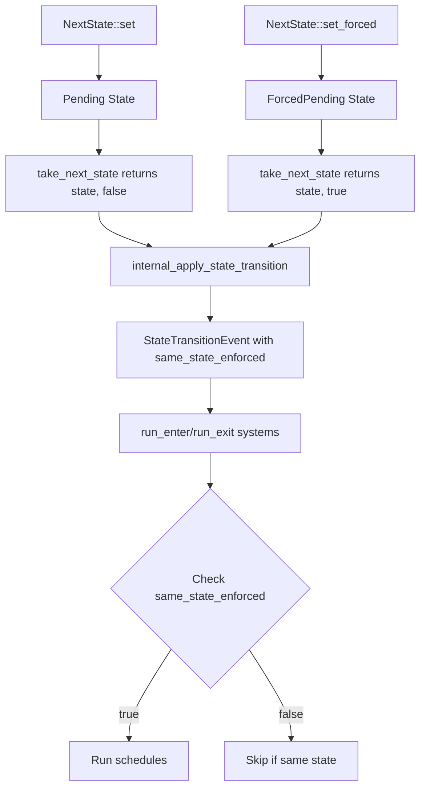

+++
title = "#19363 enable same state transitions"
date = "2025-11-12T00:00:00"
draft = false
template = "pull_request_page.html"
in_search_index = true

[taxonomies]
list_display = ["show"]

[extra]
current_language = "en"
available_languages = {"en" = { name = "English", url = "/pull_request/bevy/2025-11/pr-19363-en-20251112" }, "zh-cn" = { name = "中文", url = "/pull_request/bevy/2025-11/pr-19363-zh-cn-20251112" }}
labels = ["M-Migration-Guide", "X-Contentious", "A-States"]
+++

# Title
enable same state transitions

## Basic Information
- **Title**: enable same state transitions
- **PR Link**: https://github.com/bevyengine/bevy/pull/19363
- **Author**: mockersf
- **Status**: MERGED
- **Labels**: S-Ready-For-Final-Review, M-Migration-Guide, X-Contentious, A-States
- **Created**: 2025-05-25T22:01:41Z
- **Merged**: 2025-11-09T18:18:33Z
- **Merged By**: alice-i-cecile

## Description Translation
# Objective

- Same state transitions have their uses but are not currently possible

## Solution

- Add a `set_forced` method on `NextState` that will trigger `OnEnter` and `OnExit`
- Rerun state transitions when `set_forced` has been used
- Rerun them is `set` is called *after* `set_forced` with the same state


## The Story of This Pull Request

### The Problem and Context
In Bevy's state management system, state transitions were designed to only trigger `OnEnter` and `OnExit` schedules when moving between different states. This was an intentional optimization to avoid unnecessary system runs when the state didn't actually change. However, this design prevented legitimate use cases where developers needed to re-run state transition logic even when remaining in the same state.

Common scenarios where same-state transitions are useful include:
- Resetting a game level while staying in the same gameplay state
- Reinitializing UI components without changing the overall UI state
- Reloading configuration or assets associated with a particular state

The existing `NextState::set()` method would silently ignore requests to transition to the current state, making these use cases impossible to implement cleanly.

### The Solution Approach
The developer approached this problem by introducing a new forced transition mechanism that preserves the existing optimization by default while providing an escape hatch for when same-state transitions are needed. The key insight was to distinguish between "optimized" transitions (the default behavior) and "forced" transitions (the new capability).

Rather than modifying the existing `set()` method's behavior, which could break existing code, the solution introduced a new `set_forced()` method that explicitly opts into same-state transitions. This maintains backward compatibility while enabling the new functionality.

### The Implementation
The implementation required changes across multiple layers of the state system:

1. **Extended NextState Enum**: Added a new `ForcedPending` variant alongside the existing `Pending` variant:
```rust
pub enum NextState<S: FreelyMutableState> {
    Unchanged,
    Pending(S),
    ForcedPending(S),
}
```

2. **New Public API**: Added the `set_forced()` method that creates forced transitions:
```rust
pub fn set_forced(&mut self, state: S) {
    *self = Self::ForcedPending(state);
}
```

3. **Enhanced Transition Logic**: Modified the state transition system to track whether a transition was forced and respect this flag throughout the transition pipeline:
```rust
pub(crate) fn take_next_state<S: FreelyMutableState>(
    next_state: Option<ResMut<NextState<S>>>,
) -> Option<(S, bool)> {
    // Returns both the state and whether it was forced
}
```

4. **Updated Event System**: Extended `StateTransitionEvent` to include a `same_state_enforced` field, allowing downstream systems to react differently to forced transitions:
```rust
pub struct StateTransitionEvent<S: States> {
    pub exited: Option<S>,
    pub entered: Option<S>,
    pub same_state_enforced: bool,
}
```

5. **Modified Schedule Execution**: Updated the `run_enter` and `run_exit` systems to check the forced flag before skipping same-state transitions:
```rust
if transition.entered == transition.exited && !transition.same_state_enforced {
    return;
}
```

### Technical Insights
The implementation demonstrates several important software engineering principles:

**Backward Compatibility**: By introducing a new method rather than changing existing behavior, the change is non-breaking. Existing code using `set()` continues to work exactly as before.

**Explicit vs Implicit**: The design forces developers to explicitly opt into same-state transitions using `set_forced()`, making the intent clear in the code and preventing accidental performance regressions.

**Data Flow Preservation**: The solution maintains the existing data flow patterns by simply extending them with additional context (the forced flag) rather than restructuring the entire system.

**Comprehensive Coverage**: The changes propagate the forced flag through all the different state management patterns in Bevy, including `StateSet`, `FreelyMutableState`, and the various state transition systems.

### The Impact
This change enables several previously impossible patterns:

- **State Reset**: Games can now completely reset a level or scene while remaining in the same gameplay state
- **Hot Reloading**: Development tools can force state systems to reinitialize when assets or configurations change
- **Debug Utilities**: Developers can manually trigger state transition logic for testing and debugging purposes

The performance characteristics remain optimal by default - regular `set()` calls continue to skip unnecessary transitions, while `set_forced()` provides the escape hatch when needed.

## Visual Representation



## Key Files Changed

### `crates/bevy_state/src/state/resources.rs` (+26/-3)
This file contains the core `NextState` resource implementation.

**Key Changes:**
- Added `ForcedPending` variant to the `NextState` enum
- Implemented `set_forced()` method
- Modified `take_next_state()` to return both state and forced flag

```rust
// Before:
pub enum NextState<S: FreelyMutableState> {
    Unchanged,
    Pending(S),
}

// After:
pub enum NextState<S: FreelyMutableState> {
    Unchanged,
    Pending(S),
    ForcedPending(S),
}

// New method:
pub fn set_forced(&mut self, state: S) {
    *self = Self::ForcedPending(state);
}
```

### `crates/bevy_state/src/state/transitions.rs` (+8/-2)
This file handles the actual state transition logic.

**Key Changes:**
- Added `same_state_enforced` field to `StateTransitionEvent`
- Modified transition logic to respect the forced flag
- Updated `run_enter` and `run_exit` systems to check forced transitions

```rust
// Before:
if transition.entered == transition.exited {
    return;
}

// After:
if transition.entered == transition.exited && !transition.same_state_enforced {
    return;
}
```

### `crates/bevy_state/src/state/state_set.rs` (+36/-7)
This file handles state sets and their transitions.

**Key Changes:**
- Updated multiple state transition functions to pass through the forced flag
- Modified macro-generated code to handle forced transitions

```rust
// Example of updated function call:
internal_apply_state_transition(
    event,
    commands, 
    current_state_res,
    new_state,
    same_state_enforced,  // New parameter
);
```

### `release-content/migration-guides/same_state_transitions.md` (+13/-0)
**Key Changes:**
- Added comprehensive migration guide
- Provided clear code examples showing before/after usage

```markdown
It is now possible to change to the same state, triggering state transitions.

```rust
// Before: did nothing if the state was already `State::Menu`
next_state.set(State::Menu);
// After: trigger state transitions even if the state is already `State::Menu`
next_state.set_forced(State::Menu);
```
```

### `crates/bevy_dev_tools/src/states.rs` (+9/-2)
**Key Changes:**
- Updated debug logging to include the forced transition flag
- Enhanced transition event formatting

```rust
// Updated logging to show forced transitions:
info!(
    "{} transition: {:?} => {:?} | same state enforced: {:?}",
    name, exited, entered, same_state_enforced
);
```

## Further Reading

- [Bevy States Documentation](https://bevyengine.org/learn/quick-start/states/)
- [State Transition Systems in Bevy](https://bevy-cheatbook.github.io/programming/states.html)
- [Entity Component System Patterns](https://github.com/bevyengine/bevy/discussions/3406)

# Full Code Diff
*(Note: This is a subset of the most relevant changes)*

```diff
diff --git a/crates/bevy_state/src/state/resources.rs b/crates/bevy_state/src/state/resources.rs
index 4bbe6d1b1f24e..0f5f0246289c7 100644
--- a/crates/bevy_state/src/state/resources.rs
+++ b/crates/bevy_state/src/state/resources.rs
@@ -127,12 +127,31 @@ pub enum NextState<S: FreelyMutableState> {
     Unchanged,
     /// There is a pending transition for state `S`
     Pending(S),
+    /// There is a pending transition for state `S`
+    ///
+    /// This will trigger state transitions schedules even if the target state is the same as the current one.
+    ForcedPending(S),
 }
 
 impl<S: FreelyMutableState> NextState<S> {
     /// Tentatively set a pending state transition to `Some(state)`.
+    ///
+    /// If `state` is the same as the current state, this will *not* trigger state
+    /// transition [`OnEnter`](crate::state::OnEnter) and [`OnExit`](crate::state::OnExit) schedules.
+    ///
+    /// If [`set_forced`](Self::set_forced) has already been called in the same frame with the same state, its behavior is kept.
     pub fn set(&mut self, state: S) {
-        *self = Self::Pending(state);
+        if !matches!(self, Self::ForcedPending(s) if s == &state) {
+            *self = Self::Pending(state);
+        }
+    }
+
+    /// Tentatively set a pending state transition to `Some(state)`.
+    ///
+    /// If `state` is the same as the current state, this will trigger state
+    /// transition [`OnEnter`](crate::state::OnEnter) and [`OnExit`](crate::state::OnExit) schedules.
+    pub fn set_forced(&mut self, state: S) {
+        *self = Self::ForcedPending(state);
     }
 
     /// Remove any pending changes to [`State<S>`]
@@ -143,13 +162,17 @@ impl<S: FreelyMutableState> NextState<S> {
 
 pub(crate) fn take_next_state<S: FreelyMutableState>(
     next_state: Option<ResMut<NextState<S>>>,
-) -> Option<S> {
+) -> Option<(S, bool)> {
     let mut next_state = next_state?;
 
     match core::mem::take(next_state.bypass_change_detection()) {
         NextState::Pending(x) => {
             next_state.set_changed();
-            Some(x)
+            Some((x, false))
+        }
+        NextState::ForcedPending(x) => {
+            next_state.set_changed();
+            Some((x, true))
         }
         NextState::Unchanged => None,
     }
diff --git a/crates/bevy_state/src/state/transitions.rs b/crates/bevy_state/src/state/transitions.rs
index c22ab855abf30..35d421bf0f711 100644
--- a/crates/bevy_state/src/state/transitions.rs
+++ b/crates/bevy_state/src/state/transitions.rs
@@ -67,6 +67,8 @@ pub struct StateTransitionEvent<S: States> {
     pub exited: Option<S>,
     /// The state being entered.
     pub entered: Option<S>,
+    /// Enforce this transition even if `exited` and `entered` are the same
+    pub same_state_enforced: bool,
 }
 
 /// Applies state transitions and runs transitions schedules in order.
@@ -135,6 +137,7 @@ pub(crate) fn internal_apply_state_transition<S: States>(
     mut commands: Commands,
     current_state: Option<ResMut<State<S>>>,
     new_state: Option<S>,
+    same_state_enforced: bool,
 ) {
     match new_state {
         Some(entered) => {
@@ -153,6 +156,7 @@ pub(crate) fn internal_apply_state_transition<S: States>(
                     event.write(StateTransitionEvent {
                         exited: Some(exited.clone()),
                         entered: Some(entered.clone()),
+                        same_state_enforced,
                     });
                 }
                 None => {
@@ -162,6 +166,7 @@ pub(crate) fn internal_apply_state_transition<S: States>(
                     event.write(StateTransitionEvent {
                         exited: None,
                         entered: Some(entered.clone()),
+                        same_state_enforced,
                     });
                 }
             };
@@ -174,6 +179,7 @@ pub(crate) fn internal_apply_state_transition<S: States>(
                 event.write(StateTransitionEvent {
                     exited: Some(resource.get().clone()),
                     entered: None,
+                    same_state_enforced,
                 });
             }
         }
@@ -217,7 +223,7 @@ pub(crate) fn run_enter<S: States>(
     let Some(transition) = transition.0 else {
         return;
     };
-    if transition.entered == transition.exited {
+    if transition.entered == transition.exited && !transition.same_state_enforced {
         return;
     }
     let Some(entered) = transition.entered else {
@@ -234,7 +240,7 @@ pub(crate) fn run_exit<S: States>(
     let Some(transition) = transition.0 else {
         return;
     };
-    if transition.entered == transition.exited {
+    if transition.entered == transition.exited && !transition.same_state_enforced {
         return;
     }
     let Some(exited) = transition.exited else {
```