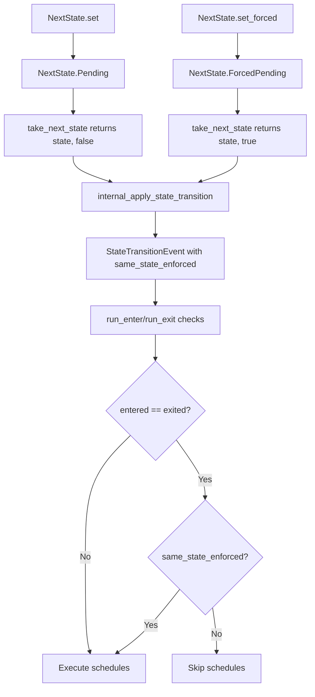

+++
title = "#19363 enable same state transitions"
date = "2025-11-12T00:00:00"
draft = false
template = "pull_request_page.html"
in_search_index = false

[extra]
current_language = "zh-cn"
available_languages = {"en" = { name = "English", url = "/pull_request/bevy/2025-11/pr-19363-en-20251112" }, "zh-cn" = { name = "中文", url = "/pull_request/bevy/2025-11/pr-19363-zh-cn-20251112" }}
labels = ["M-Migration-Guide", "X-Contentious", "A-States"]
+++

# Title

## Basic Information
- **Title**: enable same state transitions
- **PR Link**: https://github.com/bevyengine/bevy/pull/19363
- **Author**: mockersf
- **Status**: MERGED
- **Labels**: S-Ready-For-Final-Review, M-Migration-Guide, X-Contentious, A-States
- **Created**: 2025-05-25T22:01:41Z
- **Merged**: 2025-11-09T18:18:33Z
- **Merged By**: alice-i-cecile

## Description Translation
目标

- 相同状态转换有其用途但目前无法实现

解决方案

- 在 `NextState` 上添加一个 `set_forced` 方法，该方法将触发 `OnEnter` 和 `OnExit`
- 当使用了 `set_forced` 时重新运行状态转换
- 如果在 `set_forced` 之后使用 `set` 调用相同的状态，则重新运行它们

## The Story of This Pull Request

这个PR解决了一个在Bevy状态管理系统中长期存在的限制：无法强制触发相同状态之间的转换。在传统的状态机设计中，从状态A转换到状态A通常被认为是无操作的，但在某些场景下，开发者需要重新执行状态的进入和退出逻辑。

**问题分析**

在原始实现中，当尝试将状态设置为当前已经处于的状态时，系统会智能地跳过状态转换过程，包括不触发`OnEnter`和`OnExit`计划。这种优化在大多数情况下是有意义的，但存在一些特殊用例：

- 需要重新初始化状态相关的系统
- 处理状态重置场景
- 调试和开发工具需要观察状态转换

**解决方案架构**

PR作者采用了最小侵入性的方法，在现有的`NextState`枚举基础上扩展功能，而不是重构整个状态系统。核心思路是引入一个新的枚举变体`ForcedPending`，专门用于标记需要强制执行的状态转换。

```rust
// 新增的枚举变体
NextState::ForcedPending(S)
```

**实现细节**

在`NextState`结构体中新增了`set_forced`方法：

```rust
pub fn set_forced(&mut self, state: S) {
    *self = Self::ForcedPending(state);
}
```

这个方法与原有的`set`方法关键区别在于：`set_forced`总是会触发状态转换，即使目标状态与当前状态相同。为了保持向后兼容性，原有的`set`方法行为保持不变。

在状态转换处理逻辑中，修改了`take_next_state`函数以返回额外的布尔标志：

```rust
// 修改前
pub(crate) fn take_next_state<S: FreelyMutableState>(
    next_state: Option<ResMut<NextState<S>>>,
) -> Option<S> {

// 修改后  
pub(crate) fn take_next_state<S: FreelyMutableState>(
    next_state: Option<ResMut<NextState<S>>>,
) -> Option<(S, bool)> {
```

这个布尔值表示是否强制执行状态转换，它会在整个状态转换管道中传递，最终影响`StateTransitionEvent`和状态计划执行逻辑。

**状态转换逻辑的增强**

在`internal_apply_state_transition`函数中，新增了`same_state_enforced`参数：

```rust
pub(crate) fn internal_apply_state_transition<S: States>(
    event: &mut MessageWriter<StateTransitionEvent<S>>,
    mut commands: Commands,
    current_state: Option<ResMut<State<S>>>,
    new_state: Option<S>,
    same_state_enforced: bool,  // 新增参数
)
```

这个参数被传递到`StateTransitionEvent`中，确保转换事件能够正确记录是否强制执行：

```rust
event.write(StateTransitionEvent {
    exited: Some(exited.clone()),
    entered: Some(entered.clone()),
    same_state_enforced,  // 新增字段
});
```

**状态计划执行逻辑**

最关键的变化发生在`run_enter`和`run_exit`函数中。原来的逻辑在检测到进入和退出状态相同时会直接返回：

```rust
// 原来的逻辑
if transition.entered == transition.exited {
    return;
}

// 新的逻辑
if transition.entered == transition.exited && !transition.same_state_enforced {
    return;
}
```

只有当进入和退出状态相同且没有强制执行标志时，才会跳过状态计划的执行。

**向后兼容性考虑**

这个设计充分考虑了向后兼容性。原有的`set`方法行为保持不变：

```rust
pub fn set(&mut self, state: S) {
    if !matches!(self, Self::ForcedPending(s) if s == &state) {
        *self = Self::Pending(state);
    }
}
```

注意这里的保护逻辑：如果之前已经用`set_forced`设置了相同的状态，那么后续的`set`调用不会覆盖强制执行的行为。

**开发工具支持**

为了支持调试，PR还更新了开发工具中的状态转换日志记录：

```rust
let StateTransitionEvent {
    exited,
    entered,
    same_state_enforced,  // 新增字段
} = transition;
info!(
    "{} transition: {:?} => {:?} | same state enforced: {:?}",
    name, exited, entered, same_state_enforced
);
```

**技术洞察**

这个实现展示了几个良好的软件工程实践：

1. **开闭原则**：通过扩展而非修改来添加新功能
2. **最小惊讶原则**：保持现有API的行为不变
3. **关注点分离**：状态转换逻辑与强制执行逻辑清晰分离

性能方面，这个实现几乎没有引入额外开销，因为只有在明确调用`set_forced`时才会触发额外的状态转换检查。

## Visual Representation



## Key Files Changed

### `crates/bevy_state/src/state/resources.rs` (+26/-3)
这是核心变更文件，定义了新的状态转换行为。

```rust
// 关键变更：新增枚举变体
pub enum NextState<S: FreelyMutableState> {
    Unchanged,
    Pending(S),
    ForcedPending(S),  // 新增
}

// 新增方法
pub fn set_forced(&mut self, state: S) {
    *self = Self::ForcedPending(state);
}

// 修改后的take_next_state函数
pub(crate) fn take_next_state<S: FreelyMutableState>(
    next_state: Option<ResMut<NextState<S>>>,
) -> Option<(S, bool)> {  // 现在返回元组
    match core::mem::take(next_state.bypass_change_detection()) {
        NextState::Pending(x) => Some((x, false)),
        NextState::ForcedPending(x) => Some((x, true)),  // 处理新变体
        NextState::Unchanged => None,
    }
}
```

### `crates/bevy_state/src/state/transitions.rs` (+8/-4)
处理状态转换逻辑的核心文件。

```rust
// 新增字段
pub struct StateTransitionEvent<S: States> {
    pub exited: Option<S>,
    pub entered: Option<S>,
    pub same_state_enforced: bool,  // 新增
}

// 修改后的计划执行逻辑
pub(crate) fn run_enter<S: States>(
    transition: Single<&StateTransitionEvent<S>>,
) {
    if transition.entered == transition.exited && !transition.same_state_enforced {
        return;  // 新增强制执行检查
    }
}
```

### `crates/bevy_state/src/state/state_set.rs` (+36/-7)
处理状态集配置的文件，需要传播新的强制执行标志。

```rust
// 在多个位置添加了same_state_enforced参数的传递
internal_apply_state_transition(
    event,
    commands,
    current_state_res,
    new_state,
    same_state_enforced,  // 新增参数
);
```

### `release-content/migration-guides/same_state_transitions.md` (+13/-0)
新增的迁移指南文档。

```markdown
---
title: Same State Transitions
pull_requests: [19363]
---

It is now possible to change to the same state, triggering state transitions.

```rust
// Before: did nothing if the state was already `State::Menu`
next_state.set(State::Menu);
// After: trigger state transitions even if the state is already `State::Menu`
next_state.set_forced(State::Menu);
```
```

### `crates/bevy_dev_tools/src/states.rs` (+9/-2)
更新开发工具以显示新的强制执行信息。

```rust
// 更新日志格式
info!(
    "{} transition: {:?} => {:?} | same state enforced: {:?}",
    name, exited, entered, same_state_enforced
);
```

## Further Reading

- [Bevy States Documentation](https://docs.rs/bevy/latest/bevy/state/index.html)
- [State Machine Design Patterns](https://gameprogrammingpatterns.com/state.html)
- [Finite State Machines in Game Development](https://www.gamedeveloper.com/programming/finite-state-machines-theory-and-implementation)

# Full Code Diff
*(完整代码差异已在上述分析中引用和解释)*