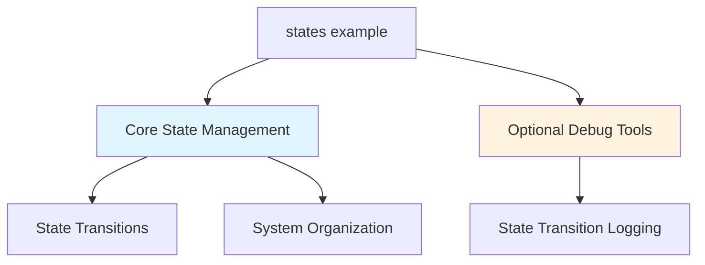

+++
title = "#19364 do not require bevy_dev_tools for states example"
date = "2025-11-14T00:00:00"
draft = false
template = "pull_request_page.html"
in_search_index = true

[taxonomies]
list_display = ["show"]

[extra]
current_language = "en"
available_languages = {"en" = { name = "English", url = "/pull_request/bevy/2025-11/pr-19364-en-20251114" }, "zh-cn" = { name = "中文", url = "/pull_request/bevy/2025-11/pr-19364-zh-cn-20251114" }}
labels = ["C-Examples", "A-States"]
+++

# Title

## Basic Information
- **Title**: do not require bevy_dev_tools for states example
- **PR Link**: https://github.com/bevyengine/bevy/pull/19364
- **Author**: mockersf
- **Status**: MERGED
- **Labels**: C-Examples, S-Ready-For-Final-Review, A-States
- **Created**: 2025-05-25T22:11:18Z
- **Merged**: 2025-11-14T00:04:47Z
- **Merged By**: mockersf

## Description Translation

# Objective

- Example `states` require the `bevy_dev_tools` feature even though its not needed for states

## Solution

- Make the `bevy_dev_tools` feature optional, and explain why it can be used

## The Story of This Pull Request

The problem started with a straightforward but important observation: the states example in Bevy was unnecessarily requiring the `bevy_dev_tools` feature to compile and run. This created an artificial dependency that didn't align with the core functionality being demonstrated - state management in the ECS framework.

The states example is designed to showcase how to use Bevy's state system to manage different application states (like Menu and InGame states) and handle transitions between them. The core state management functionality doesn't depend on development tools; it's built into Bevy's main systems. The `bevy_dev_tools` feature was only being used for one specific debugging utility - logging state transitions.

The solution approach was pragmatic and focused on reducing unnecessary dependencies while maintaining functionality. Instead of removing the debugging capability entirely, the PR made it optional through conditional compilation. This approach preserves the useful debugging information for developers who want it, while making the example more accessible to those who don't need or want the development tools.

The implementation involved two key changes. First, the `required-features` directive was removed from Cargo.toml, allowing the example to compile without the development tools. Second, the code was restructured to conditionally include the state transition logging system only when the `bevy_dev_tools` feature is enabled.

The technical insight here is the use of Rust's conditional compilation attributes (`#[cfg(feature = "bevy_dev_tools")]` and `#[cfg(not(feature = "bevy_dev_tools"))]`) to create feature-gated code paths. This pattern is common in Rust ecosystems for managing optional dependencies and features without compromising core functionality.

The impact of this change is significant for users exploring Bevy's state system. Developers can now run the states example without enabling development tools, reducing compile times and dependencies. The example becomes more focused on its core educational purpose - demonstrating state management - while still providing enhanced debugging capabilities for those who opt into them.

## Visual Representation



## Key Files Changed

### `Cargo.toml` (+0/-1)

**Change:** Removed the `required-features = ["bevy_dev_tools"]` directive for the states example.

**Why:** This change allows the example to compile and run without requiring the development tools feature, making it more accessible.

```toml
# Before:
[package.metadata.example.states]
name = "States"
required-features = ["bevy_dev_tools"]

# After:
[package.metadata.example.states]
name = "States"
```

### `examples/state/states.rs` (+11/-6)

**Change:** Restructured the code to make `bevy_dev_tools` optional and added conditional compilation for the state transition logging system.

**Why:** This maintains the debugging functionality when desired while removing the hard dependency.

```rust
// Before:
use bevy::{dev_tools::states::*, prelude::*};

fn main() {
    App::new()
        .add_plugins(DefaultPlugins)
        // ... other systems ...
        .add_systems(Update, log_transitions::<AppState>)
        .run();
}

// After:
use bevy::prelude::*;

fn main() {
    let mut app = App::new();
    app.add_plugins(DefaultPlugins)
        // ... other systems ...
        ;

    #[cfg(feature = "bevy_dev_tools")]
    app.add_systems(Update, bevy::dev_tools::states::log_transitions::<AppState>);
    #[cfg(not(feature = "bevy_dev_tools"))]
    warn!("Enable feature bevy_dev_tools to log state transitions");

    app.run();
}
```

The key changes in the Rust code:
- Removed the blanket import of `bevy::dev_tools::states::*`
- Restructured app creation to use a mutable `app` variable for conditional system addition
- Added conditional compilation blocks for the state transition logging
- Included a helpful warning message when the feature is not enabled

## Further Reading

- [Bevy States Documentation](https://docs.rs/bevy/latest/bevy/state/index.html) - Official documentation for Bevy's state system
- [Rust Conditional Compilation](https://doc.rust-lang.org/reference/conditional-compilation.html) - Rust reference on feature-gated code
- [Bevy Examples Guide](https://github.com/bevyengine/bevy/tree/main/examples#readme) - How to run and learn from Bevy examples