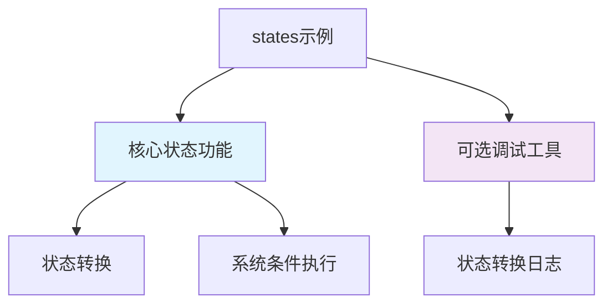

+++
title = "#19364 do not require bevy_dev_tools for states example"
date = "2025-11-14T00:00:00"
draft = false
template = "pull_request_page.html"
in_search_index = false

[extra]
current_language = "zh-cn"
available_languages = {"en" = { name = "English", url = "/pull_request/bevy/2025-11/pr-19364-en-20251114" }, "zh-cn" = { name = "中文", url = "/pull_request/bevy/2025-11/pr-19364-zh-cn-20251114" }}
labels = ["C-Examples", "A-States"]
+++

# Title

## Basic Information
- **Title**: do not require bevy_dev_tools for states example
- **PR Link**: https://github.com/bevyengine/bevy/pull/19364
- **Author**: mockersf
- **Status**: MERGED
- **Labels**: C-Examples, S-Ready-For-Final-Review, A-States
- **Created**: 2025-05-25T22:11:18Z
- **Merged**: 2025-11-14T00:04:47Z
- **Merged By**: mockersf

## Description Translation
# 目标

- 示例 `states` 需要 `bevy_dev_tools` 功能，尽管状态本身并不需要它

## 解决方案

- 使 `bevy_dev_tools` 功能变为可选，并解释为什么可以使用它

## The Story of This Pull Request

这个PR解决了一个关于Bevy引擎状态示例的依赖问题。问题的核心在于`states`示例强制依赖于`bevy_dev_tools`功能，但实际上这个功能对于状态系统的基本演示并不是必需的。

**问题识别**：在原始的`states.rs`示例中，代码直接导入了`bevy::dev_tools::states::*`，并使用了`log_transitions`系统来记录状态转换。这导致整个示例必须启用`bevy_dev_tools`功能才能编译和运行，即使状态管理的核心功能并不依赖于此。

**解决方案设计**：开发者采用了条件编译的方法来优雅地解决这个问题。具体来说：

1. 移除了对`bevy_dev_tools`的硬性依赖
2. 使用`#[cfg(feature = "bevy_dev_tools")]`属性来条件性地包含调试工具
3. 当调试工具不可用时，提供清晰的警告信息

这种方法的优势在于：
- 保持了示例的核心功能完整性
- 为开发者提供了可选的调试能力
- 当调试工具不可用时，示例仍然能够正常运行

**实现细节**：在代码层面，这个PR做了几个关键修改。首先，它移除了对`bevy::dev_tools::states::*`的直接导入，改为在需要时条件性地使用。其次，应用程序构建过程被重构为使用可变引用，以便在运行时条件性地添加系统。

```rust
// 修改前：直接导入和使用调试工具
use bevy::{dev_tools::states::*, prelude::*};

// 修改后：条件性地使用调试工具
#[cfg(feature = "bevy_dev_tools")]
app.add_systems(Update, bevy::dev_tools::states::log_transitions::<AppState>);
#[cfg(not(feature = "bevy_dev_tools"))]
warn!("Enable feature bevy_dev_tools to log state transitions");
```

这种条件编译模式是Rust生态系统中处理可选功能的常见做法，它确保了代码在功能启用和禁用时都能正确编译和运行。

**架构影响**：这个修改展示了如何在Bevy中正确处理可选依赖。通过将调试功能与核心功能分离，示例现在更加清晰地展示了状态系统的本质，而不被调试工具的实现细节所干扰。

**工程考虑**：这个解决方案体现了几个重要的软件工程原则：
- 最小化依赖：只引入真正必要的依赖
- 渐进增强：基础功能始终可用，高级功能可选
- 清晰的错误信息：当可选功能不可用时，提供明确的指导

## Visual Representation



## Key Files Changed

### `examples/state/states.rs` (+11/-6)

这个文件包含了主要的逻辑修改，将硬性依赖改为条件依赖。

**关键修改：**

```rust
// 修改前：
use bevy::{dev_tools::states::*, prelude::*};

fn main() {
    App::new()
        .add_plugins(DefaultPlugins)
        // ... 其他系统
        .add_systems(Update, log_transitions::<AppState>)
        .run();
}

// 修改后：
use bevy::prelude::*;

fn main() {
    let mut app = App::new();
    app.add_plugins(DefaultPlugins)
        // ... 其他系统
        ;

    #[cfg(feature = "bevy_dev_tools")]
    app.add_systems(Update, bevy::dev_tools::states::log_transitions::<AppState>);
    #[cfg(not(feature = "bevy_dev_tools"))]
    warn!("Enable feature bevy_dev_tools to log state transitions");

    app.run();
}
```

### `Cargo.toml` (+0/-1)

移除了对`bevy_dev_tools`功能的强制要求。

**修改：**
```toml
# 修改前：
[package.metadata.example.states]
name = "States"
required-features = ["bevy_dev_tools"]

# 修改后：
[package.metadata.example.states]
name = "States"
# required-features 行被移除
```

## Further Reading

- [Bevy States Documentation](https://bevyengine.org/learn/quick-start/next-steps/states/) - Bevy状态系统的官方文档
- [Rust Conditional Compilation](https://doc.rust-lang.org/reference/conditional-compilation.html) - Rust条件编译的官方指南
- [Cargo Features Guide](https://doc.rust-lang.org/cargo/reference/features.html) - Cargo功能系统的详细说明

# Full Code Diff
diff --git a/Cargo.toml b/Cargo.toml
index 0c023fb96b200..88ae83d1861ea 100644
--- a/Cargo.toml
+++ b/Cargo.toml
@@ -2400,7 +2400,6 @@ wasm = false
 name = "states"
 path = "examples/state/states.rs"
 doc-scrape-examples = true
-required-features = ["bevy_dev_tools"]
 
 [package.metadata.example.states]
 name = "States"
diff --git a/examples/state/states.rs b/examples/state/states.rs
index 699e38d7248e6..38dc80173e0b4 100644
--- a/examples/state/states.rs
+++ b/examples/state/states.rs
@@ -5,11 +5,11 @@
 //!
 //! In this case, we're transitioning from a `Menu` state to an `InGame` state.
 
-use bevy::{dev_tools::states::*, prelude::*};
+use bevy::prelude::*;
 
 fn main() {
-    App::new()
-        .add_plugins(DefaultPlugins)
+    let mut app = App::new();
+    app.add_plugins(DefaultPlugins)
         .init_state::<AppState>() // Alternatively we could use .insert_state(AppState::Menu)
         .add_systems(Startup, setup)
         // This system runs when we enter `AppState::Menu`, during the `StateTransition` schedule.
@@ -24,9 +24,14 @@ fn main() {
         .add_systems(
             Update,
             (movement, change_color).run_if(in_state(AppState::InGame)),
-        )
-        .add_systems(Update, log_transitions::<AppState>)
-        .run();
+        );
+
+    #[cfg(feature = "bevy_dev_tools")]
+    app.add_systems(Update, bevy::dev_tools::states::log_transitions::<AppState>);
+    #[cfg(not(feature = "bevy_dev_tools"))]
+    warn!("Enable feature bevy_dev_tools to log state transitions");
+
+    app.run();
 }
 
 #[derive(Debug, Clone, Copy, Default, Eq, PartialEq, Hash, States)]