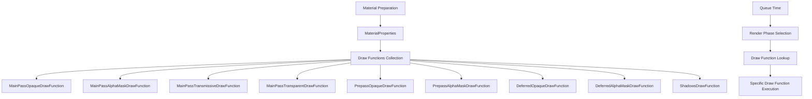

+++
title = "#21021 make material draw functions instance independent"
date = "2025-11-04T00:00:00"
draft = false
template = "pull_request_page.html"
in_search_index = true

[taxonomies]
list_display = ["show"]

[extra]
current_language = "en"
available_languages = {"en" = { name = "English", url = "/pull_request/bevy/2025-11/pr-21021-en-20251104" }, "zh-cn" = { name = "中文", url = "/pull_request/bevy/2025-11/pr-21021-zh-cn-20251104" }}
labels = ["A-Rendering", "C-Code-Quality", "M-Migration-Guide"]
+++

# Title

## Basic Information
- **Title**: make material draw functions instance independent
- **PR Link**: https://github.com/bevyengine/bevy/pull/21021
- **Author**: ecoskey
- **Status**: MERGED
- **Labels**: A-Rendering, C-Code-Quality, S-Ready-For-Final-Review, M-Migration-Guide
- **Created**: 2025-09-13T21:26:53Z
- **Merged**: 2025-11-04T21:09:58Z
- **Merged By**: alice-i-cecile

## Description Translation
# Objective

#19667 introduced a type-erased material system that effectively puts all material instances through a single cache: during asset preparation (`ErasedRenderAssetPlugin`), materials are processed into a set of `MaterialProperties` that contains all the data needed to render them, and these are all cached and deduplicated as needed. 

This allows for maximal flexibility (every single material instance could have a different "type") but complicates the logic and makes cache keys really big. So, one goal for the material revamp I have (and I think @tychedelia is on board) is to cache materials at two levels: material "types" and material "instances", where material types roughly map to the rust types that currently implement `Material`. Without getting into implementation details, storing mostly static data separate from instance data would let us simplify a lot of the logic, while only requiring a little more work for fully-dynamic use cases.

This PR is a first step in that direction, which stores *all* the available draw functions in `MaterialProperties`, and pushes the decision for "what draw function should I use for this material?" to queue time, where before it was split between there and asset preparation. This makes the list of available draw functions instance-independent, and will later allow us to store it with other "static" material data.

## Solution

- Make draw function labels 1:1 with render phases, and include all of them in the list in `MaterialProperties`

## Testing

- Ran `3d_scene`
- Ran `manual_material`

## The Story of This Pull Request

The Bevy rendering system was facing a challenge with its material caching architecture. PR #19667 had introduced a type-erased material system that processed all material instances through a single unified cache during asset preparation. While this provided maximum flexibility by allowing each material instance to potentially have a different "type," it came with significant complexity costs. The cache keys were becoming large, and the logic for managing material instances was growing increasingly complex.

The long-term vision for the material system involves implementing a two-level caching strategy that separates material "types" from material "instances." Material types would roughly correspond to the Rust types implementing the `Material` trait, containing mostly static data, while instances would hold the per-instance variations. This architectural shift would simplify the system while maintaining support for fully dynamic use cases.

This PR represents the first concrete step toward that vision by addressing how draw functions are managed. Previously, the system made decisions about which draw function to use for a material at both asset preparation time and queue time. This mixed approach meant that draw function selection was partially tied to material instances, complicating the separation of static and instance data.

The solution involved refactoring the draw function system to make it instance-independent. Instead of having generic draw function labels that could vary per instance, the system now uses specific draw function labels that correspond directly to render phases. All available draw functions are now stored in `MaterialProperties`, and the decision about which one to use is deferred until queue time when the specific render phase is known.

The implementation required changes across multiple components of the rendering system. In the material preparation phase, instead of conditionally adding draw functions based on the material's render phase type, the system now collects all possible draw functions upfront. This includes draw functions for main pass rendering (opaque, alpha mask, transmissive, transparent), prepass rendering (opaque, alpha mask), deferred rendering (opaque, alpha mask), and shadow rendering.

During queue time, the rendering systems now look up the specific draw function needed for each render phase directly from the material properties. This eliminates the need for complex conditional logic that was previously spread across both preparation and queueing phases.

The key technical insight here is that by making draw functions instance-independent and storing them all upfront, the system becomes more predictable and easier to reason about. This approach also paves the way for future optimizations where static material data (including draw functions) can be cached separately from instance-specific data.

## Visual Representation



## Key Files Changed

### `crates/bevy_pbr/src/material.rs` (+66/-45)
This file contains the core material system implementation. The changes refactored how draw functions are defined and managed:

**Key changes:**
- Replaced generic draw function labels with specific per-render-phase labels
- Modified material preparation to collect all draw functions upfront
- Updated queueing logic to look up specific draw functions per render phase

```rust
// Before: Single generic draw function
#[derive(DrawFunctionLabel, Debug, Hash, PartialEq, Eq, Clone, Default)]
pub struct MaterialDrawFunction;

// After: Specific draw functions per render phase
#[derive(DrawFunctionLabel, Debug, Hash, PartialEq, Eq, Clone, Default)]
pub struct MainPassOpaqueDrawFunction;
#[derive(DrawFunctionLabel, Debug, Hash, PartialEq, Eq, Clone, Default)]
pub struct MainPassAlphaMaskDrawFunction;
// ... and several others

// Queue time lookup changes:
// Before:
let Some(draw_function) = material.properties.get_draw_function(MaterialDrawFunction)
else {
    continue;
};

// After:
let Some(draw_function) = material
    .properties
    .get_draw_function(MainPassOpaqueDrawFunction)
else {
    continue;
};
```

### `crates/bevy_pbr/src/prepass/mod.rs` (+35/-22)
This file handles prepass rendering. The changes updated the prepass queueing system to use the new per-render-phase draw function labels:

```rust
// Before:
draw_function: material
    .properties
    .get_draw_function(PrepassDrawFunction)
    .unwrap(),

// After:
let Some(draw_function) = material
    .properties
    .get_draw_function(PrepassOpaqueDrawFunction)
else {
    continue;
};
```

### `examples/shader_advanced/manual_material.rs` (+3/-3)
Updated the manual material example to use the new draw function labeling system:

```rust
// Before:
properties.add_draw_function(MaterialDrawFunction, draw_function_id);

// After:
properties.add_draw_function(MainPassOpaqueDrawFunction, draw_function_id);
```

### `release-content/migration-guides/draw_functions.md` (+24/-0)
Added a comprehensive migration guide explaining the changes for users of the low-level manual material API:

```markdown
- Removed `MaterialDrawFunction` in favor of:
  - `MainPassOpaqueDrawFunction`
  - `MainPassAlphaMaskDrawFunction`
  - `MainPassTransmissiveDrawFunction`
  - `MainPassTransparentDrawFunction`
```

## Further Reading

- [Bevy Material System Documentation](https://bevyengine.org/learn/book/next-steps/materials/) - Official documentation on Bevy's material system
- [Render Phases in Bevy](https://bevyengine.org/learn/book/next-steps/rendering/#render-phases) - Explanation of how render phases work in the Bevy engine
- [Type Erasure Patterns in Rust](https://doc.rust-lang.org/book/ch17-02-trait-objects.html) - Background on type erasure techniques used in the material system